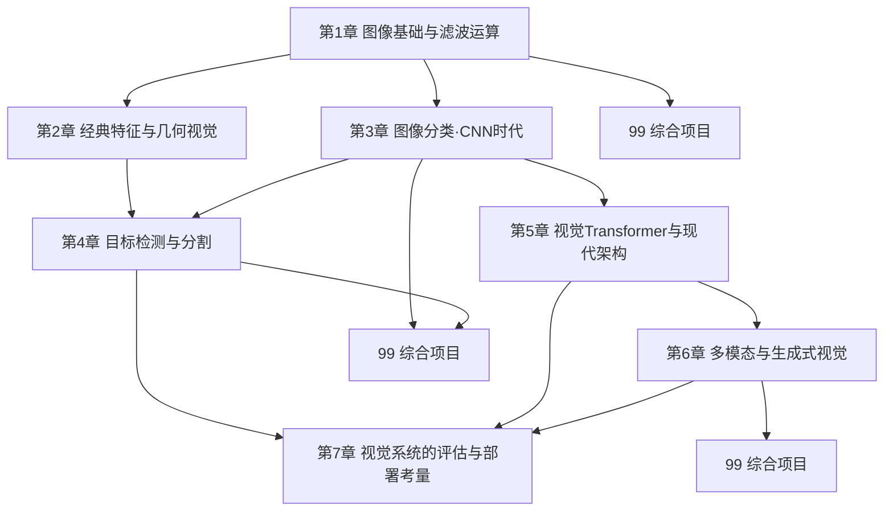

# 09 计算机视觉 · 课程导览

> **本课程定位**：计算机视觉是"让机器看懂世界"的学科，也是整个 AI 版图中感知（perception）问题的核心。本课程承接《深度学习》的 CNN、Transformer 与预训练三大支柱，向上连接多模态与生成式 AI，向下支撑《模型部署与 MLOps》的工程闭环。

## 一、为什么视觉是感知的核心问题

人类大脑约有三分之一的皮层参与视觉信息处理——视觉是我们与物理世界交互的主要信道。对人工智能而言，视觉的地位同样特殊，原因有三：

1. **信息密度最高的输入模态**。一张 $1024\times1024$ 的 RGB 图像含约 $3\times10^6$ 个数值，一段视频每秒就有近 $10^8$ 个数值。如何在如此高维、强相关的输入上提取语义，是对表示学习能力的终极检验。
2. **深度学习的"成名战场"**。2012 年 AlexNet 在 ImageNet 上的突破点燃了深度学习革命；ResNet、BatchNorm、Transformer（ViT）、扩散模型（Stable Diffusion）、对比学习（CLIP）等里程碑技术，几乎都是在视觉问题上首次或最有力地得到验证。
3. **从感知到行动的桥梁**。自动驾驶、机器人、医学影像、工业质检——视觉系统的输出直接决定决策与控制。这使视觉比许多纯文本任务更早面对"分布偏移、鲁棒性、端侧算力"等真实工程约束。

## 二、一条技术史主线：从"手工特征"到"端到端学习"

本课程刻意采用**技术史视角**组织内容，因为视觉是理解"特征从哪里来"这一问题最完整的学科：

| 时代 | 核心思想 | 代表方法 | 本课程位置 |
|---|---|---|---|
| 1960s–1990s | 图像即信号：滤波、边缘、几何 | 卷积、高斯滤波、Canny、Hough 变换 | 第 1 章 |
| 1990s–2012 | 局部不变特征 + 几何：手工设计特征 | Harris、SIFT、HOG、RANSAC、SVM 分类器 | 第 2 章 |
| 2012–2016 | 端到端表示学习：数据 + 算力 + CNN | AlexNet、VGG、ResNet、迁移学习 | 第 3 章 |
| 2014–2020 | 从"看见"到"定位与理解"：结构化预测 | Faster R-CNN、YOLO、U-Net、Mask R-CNN | 第 4 章 |
| 2020– | 全局注意力与统一架构 | ViT、DeiT、Swin | 第 5 章 |
| 2021– | 跨模态与生成：视觉 + 语言 | CLIP、Stable Diffusion、NeRF | 第 6 章 |
| 贯穿始终 | 系统与现实：评测、鲁棒、部署 | 分布偏移、对抗攻击、端侧优化 | 第 7 章 |

这条主线的深刻之处在于一个**辩证的回归**：深度学习的卷积层，本质上是第 1 章手工滤波运算的可学习版本；ViT 的 patch embedding，与第 1 章的图像分块、第 2 章的局部 patch 描述一脉相承。手工特征时代积累的**先验知识**（局部性、平移不变、多尺度、几何约束）并没有消失，而是转化为网络架构的**归纳偏置（inductive bias）**——理解这一点，是读懂现代视觉架构设计的钥匙。

## 三、知识地图（章节结构）



各章一句话摘要：

1. **图像基础与滤波运算**：图像的数字表示；卷积与相关的严格定义；高斯滤波、边缘检测（Sobel/Canny）、金字塔与尺度空间、形态学。滤波是 CNN 的历史起点与数学起点。
2. **经典特征与几何视觉**：Harris 角点完整推导、SIFT/HOG 思想、RANSAC 与图像配准、针孔相机模型与齐次坐标、光流简介。经典方法至今支撑 SLAM 与三维重建。
3. **图像分类·CNN 时代**：分类任务与 Top-1/Top-5 指标、数据增强、预训练 ResNet 迁移学习实战、CAM/Grad-CAM 可视化、标签噪声与数据集偏差。
4. **目标检测与分割**：两阶段与单阶段检测、ROI Pooling/Align 推导、mAP 的精确计算、U-Net 语义分割、Mask R-CNN、NMS 从零实现。
5. **视觉 Transformer 与现代架构**：ViT 完整架构、CNN 与 ViT 的归纳偏置之争、DeiT 蒸馏、Swin 层次化设计、骨干网络选型。
6. **多模态与生成式视觉**：CLIP 对比学习与零样本分类、Stable Diffusion 的 latent diffusion 架构、视觉-语言任务、立体匹配与 NeRF 入门。
7. **视觉系统的评估与部署考量**：数据集构建与标注质量、分布偏移与长尾问题、公平性、对抗攻击（FGSM）、模型效率与端侧部署。
8. **综合项目**：三个贯穿式项目，把前七章的知识拧成一个完整闭环。

## 四、与其他课程的依赖关系

### 前置课程（必须先修）

| 前置内容 | 具体用到什么 | 在本课程哪里使用 |
|---|---|---|
| [线性代数·第3章 SVD](/xiaoshus-blog/textbooks/ai/math-foundations/linear-algebra/03/) | 最小二乘、低秩近似 | Harris 的特征值分析、RANSAC 中的单应估计、第 2 章配准 |
| [概率论·第1章](/xiaoshus-blog/textbooks/ai/math-foundations/probability-statistics/01/) | 条件概率、贝叶斯 | Canny 的检测/定位折中思想、第 7 章分布偏移 |
| [最优化·梯度法](/xiaoshus-blog/textbooks/ai/math-foundations/optimization/00/) | 梯度、链式法则 | FGSM 对抗攻击、Grad-CAM、光流 |
| [机器学习·第1章 泛化](/xiaoshus-blog/textbooks/ai/ai-core/machine-learning/01/) | 过拟合、偏差-方差 | 迁移学习、数据增强的作用机理 |
| [机器学习·第7章 评估](/xiaoshus-blog/textbooks/ai/ai-core/machine-learning/07/) | 混淆矩阵、P/R、交叉验证 | Top-1/Top-5、mAP、长尾评估 |
| [深度学习·第2章 训练科学](/xiaoshus-blog/textbooks/ai/ai-core/deep-learning/02/) | 学习率调度、正则化、初始化 | 第 3 章微调实战、各章代码 |
| **[深度学习·第3章 CNN](/xiaoshus-blog/textbooks/ai/ai-core/deep-learning/03/)** | 卷积、池化、感受野、ResNet 残差结构 | 全课程基石，第 1、3、4 章直接依赖 |
| [深度学习·第5章 Transformer](/xiaoshus-blog/textbooks/ai/ai-core/deep-learning/05/) | 自注意力、多头机制、位置编码 | 第 5 章 ViT、第 6 章 CLIP/扩散交叉注意力 |
| [深度学习·第6章 生成模型](/xiaoshus-blog/textbooks/ai/ai-core/deep-learning/06/) | VAE、DDPM 前向/反向过程 | 第 6 章 Stable Diffusion |
| [深度学习·第7章 预训练与迁移](/xiaoshus-blog/textbooks/ai/ai-core/deep-learning/07/) | 预训练-微调范式 | 第 3 章迁移学习实战、第 5 章 DeiT、第 6 章 CLIP |

### 后续课程（本课程的内容将被谁使用）

| 本课程内容 | 后续去向 |
|---|---|
| 第 3 章 Grad-CAM、第 7 章分布偏移监控 | [《实验设计与评估》](/xiaoshus-blog/textbooks/ai/engineering/experiment-design/00/)：模型诊断与消融实验的可视化证据 |
| 第 7 章模型效率、量化与端侧部署 | **[《模型部署与 MLOps》](/xiaoshus-blog/textbooks/ai/engineering/mlops/00/)**："推理优化"一节直接展开本章的量化/剪枝/蒸馏思想；"监控与持续训练"一节使用本章的分布偏移概念 |
| 第 7 章数据集构建与标注质量 | [《数据工程》](/xiaoshus-blog/textbooks/ai/engineering/data-engineering/00/)：数据采集、清洗、标注平台与质量控制的视觉特化版 |
| 第 6 章多模态 | 《自然语言处理》：文本编码器一侧的深化 |
| 第 4 章检测/分割 | 强化学习课程中的视觉导航、机器人感知案例 |

## 五、建议学时（约 64 学时）

按"讲授 + 实验"混合组织，每周 4 学时，共 16 周：

| 周 | 内容 | 学时 |
|---|---|---|
| 1 | 课程导览 + 第 1 章前半（图像表示、卷积） | 4 |
| 2 | 第 1 章后半（滤波、边缘、金字塔、形态学） | 4 |
| 3–4 | 第 2 章 经典特征与几何视觉（含 RANSAC 编程实验） | 8 |
| 5–6 | 第 3 章 图像分类与迁移学习（含微调实战实验） | 8 |
| 7–8 | 第 4 章 目标检测与分割（含 NMS/mAP 编程实验） | 8 |
| 9 | 综合项目 A：完整分类项目 | 4 |
| 10–11 | 第 5 章 视觉 Transformer（含简化 ViT 实验） | 8 |
| 12–13 | 第 6 章 多模态与生成式视觉 | 8 |
| 14 | 第 7 章 评估与部署考量 | 4 |
| 15–16 | 综合项目 B/C + 项目答辩 | 8 |

> 若学时压缩到 48：可将第 1、2 章各压缩 2 学时（以实验课代讲授），项目 B/C 二选一。若扩展到 80：可增加 Szeliski 书中多视角几何（第 7–8 章）与视频理解专题。

## 六、学习方法

1. **每章先跑代码，再看推导，最后回头重跑代码**。视觉是高度可视化的学科，一张边缘图或一张 Grad-CAM 热力图胜过千言。建议所有代码实验都用一张你手机拍的图（而非仅用标准数据集），观察算法在真实数据上的行为。
2. **坚持"从零实现 + 库调用"双轨**。第 1 章的卷积、第 2 章的 Harris/RANSAC、第 4 章的 NMS/mAP 都有从零实现要求——这是理解机制的唯一途径；同时必须掌握 OpenCV、torchvision 的工程用法。
3. **建立视觉直觉的"三问"习惯**：遇到任何新方法问三个问题——它对图像做了什么**几何/物理假设**？它的**计算瓶颈**在哪（空间分辨率？通道数？匹配次数）？它在**什么分布偏移下会失效**？
4. **连接前序课程**。每章"与前后章节的联系"一节请务必阅读并自行验证：例如读 ViT 前重写一遍《深度学习》第 5 章的自注意力代码，你会发现 ViT 只是"换了 token 来源的 Transformer"。
5. **关注失败案例而非成功案例**。本课程第 6 章 CLIP 项目与第 7 章整章都在教你看模型的失败模式。真实工作中，理解"模型什么时候错"比刷高 0.5 个点更有价值。

## 七、环境与工具准备

```bash
# 核心依赖（建议 Python >= 3.10）
pip install torch torchvision   # 深度学习框架（CPU 版亦可跑通全部示例）
pip install numpy scipy matplotlib opencv-python  # 科学计算与经典视觉
pip install scikit-learn scikit-image             # 评估工具与附加算法
```

- **OpenCV**（`cv2`）：第 1、2 章主力，注意其坐标系约定为 $(x, y) = (\text{列}, \text{行})$、BGR 通道顺序。
- **torch / torchvision**：第 3–7 章主力，提供预训练模型、数据集与增强算子。
- 硬件要求：全部示例在 CPU 上可运行；第 3、4 章实战部分若用 GPU（任意 4GB 显存卡即可）训练时间可缩短约 10 倍。
