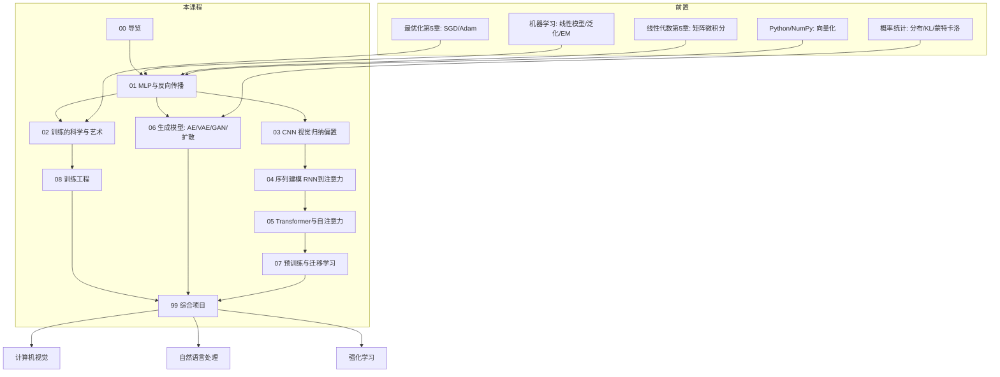

# 深度学习 · 课程导览

> **课程定位**：本课程是《机器学习》的直接续篇，也是《计算机视觉》《自然语言处理》《强化学习》乃至大模型时代一切技术的共同地基。如果说机器学习教会你"如何从数据中学习"，深度学习则回答"如何用多层神经网络表示任意复杂的函数，并把它训练到真实的规模"。现代 AI 的每个方向——ViT、GPT、扩散模型、AlphaGo——都是同一台通用引擎上的不同变速箱。

## 0.0 课程学习目标

学完本课程，你能够：

1. 从数学上完整推导并从代码上实现反向传播，能解释任何深度模型梯度的来源（先纯 numpy，后框架）；
2. 诊断并解决深度网络训练中的典型问题（梯度消失/爆炸、过拟合、学习率失配、数值不稳定）；
3. 理解 CNN、RNN/LSTM、Transformer 三大骨干架构的归纳偏置（inductive bias）与适用边界，并能用 PyTorch 从头搭建与训练它们；
4. 阐述生成模型（VAE/GAN/扩散模型）的概率原理与权衡；
5. 掌握预训练—微调范式与参数高效微调（LoRA）——大模型时代的方法论；
6. 具备工程能力：显存预算、混合精度、分布式数据并行、系统化的调试与实验管理。

## 0.1 课程定位：现代 AI 的通用引擎

在《机器学习》中你已经学过：线性模型、核方法、决策树与集成学习，以及"偏差—方差权衡""经验风险最小化"这些统一语言。你会发现那条主线有一个隐含瓶颈——**特征是人工设计的**。SIFT、HOG、TF-IDF 都是把领域知识手工编码进表示，学习的只是最后一级决策。

深度学习的核心主张只有一句话：**用端到端可微的多层参数化变换替代手工特征，让表示本身也被梯度下降学习**。这个主张为何现在才成立？三个前提在 2010 年前后同时到位：

- **算力**：GPU 大规模并行矩阵乘法（本课程第 8 章的工程主题）；
- **数据**：互联网规模的数据集使过拟合不再是最致命的问题；
- **算法**：ReLU 激活、更好的初始化、批归一化、残差连接、Adam——每个都拆掉了训练深网络的一块路障（第 2 章）。

由此，一套架构承担了所有感知与序列任务：卷积网络看图像（第 3 章），循环网络/注意力读序列（第 4–5 章），生成模型创造内容（第 6 章），预训练范式把这一切规模化（第 7 章）。**学完本课，CV/NLP/RL 三门方向课对你而言将只是"换数据集与损失函数"**——这正是把它安排在第 5 学期主线位置的原因。

## 0.2 知识地图

各章职责一览：

| 章 | 核心问题 | 关键概念 | 对应代码能力 |
|---|---|---|---|
| 01 | 如何训练任意深度的可微复合函数？ | 万能逼近、计算图、反向传播 | 纯 numpy 手写 MNIST 分类器 |
| 02 | 如何把它**训练好**？ | 初始化方差理论、归一化、正则、调度 | 训练曲线诊断 |
| 03 | 图像的结构先验如何写进架构？ | 卷积、感受野、参数共享、残差 | PyTorch CIFAR-10 全流程 |
| 04 | 变长序列如何建模？ | BPTT、门控、编码器—解码器、注意力 | seq2seq 思想 |
| 05 | 为什么注意力是终极接口？ | QKV、多头、位置编码、$O(n^2)$ 复杂度 | 手写 Transformer 块 |
| 06 | 机器如何"创造"？ | ELBO、对抗博弈、去噪目标 | VAE/GAN/扩散原理 |
| 07 | 如何复用与规模化？ | 自监督、对比学习、LoRA | 大模型方法论 |
| 08 | 如何把实验变成工程？ | 显存、混合精度、DDP、调试方法论 | 训练千万人次级模型 |
| 99 | 综合运用 | autograd 引擎、mini-GPT、生成对比 | 三个毕设级项目 |

## 0.3 与其他课程的依赖关系

**前置（必须先修）**：

- [《线性代数》第 5 章](/xiaoshus-blog/textbooks/ai/math-foundations/linear-algebra/05/)：矩阵微积分、链式法则 $\nabla_x L = J_f^\top \nabla_y L$、批量公式 $\frac{\partial L}{\partial W} = \Delta^\top X$——第 1 章反向传播的直接数学工具；第 3 章 SVD 与低秩近似——第 7 章 LoRA 的理论基础；第 6 章浮点数系统——第 8 章混合精度的理论基础；
- [《最优化方法》第 5 章](/xiaoshus-blog/textbooks/ai/math-foundations/optimization/05/)：SGD 收敛、动量、AdaGrad/RMSProp/Adam 家族——第 2 章直接继承，不再重复推导；
- [《概率论与数理统计》](/xiaoshus-blog/textbooks/ai/math-foundations/probability-statistics/00/)：期望、KL 散度、重参数化与蒙特卡洛——第 6 章 VAE/扩散模型的概率语言；
- [《机器学习》](/xiaoshus-blog/textbooks/ai/ai-core/machine-learning/00/)：经验风险最小化、正则化与泛化、交叉熵与 softmax、生成/判别模型之辩——本课程全程复用的词汇表；
- [《Python 程序设计》第 4 章](/xiaoshus-blog/textbooks/ai/programming/python/04/)：NumPy 广播与向量化——所有"从零实现"代码的载体；[《数据结构与算法》第 1 章](/xiaoshus-blog/textbooks/ai/programming/data-structures/01/)：复杂度分析——第 5 章 $O(n^2)$ 注意力分析的工具。

**后继（本章知识将被这样使用）**：

- [《计算机视觉》](/xiaoshus-blog/textbooks/ai/ai-core/computer-vision/00/)：检测/分割直接复用第 3 章 CNN 组件；ViT 直接复用第 5 章 Transformer 块；
- [《自然语言处理》](/xiaoshus-blog/textbooks/ai/ai-core/nlp/00/)：预训练语言模型、指令微调与 RLHF 建立在第 5 章 Transformer 与第 7 章预训练范式之上；
- [《强化学习》](/xiaoshus-blog/textbooks/ai/ai-core/reinforcement-learning/00/)：DQN 的价值网络是第 1 章 MLP，策略梯度与 Actor-Critic 依赖第 1 章反向传播，深度 RL 的训练稳定性技巧是第 2 章方法的再运用；
- [《模型部署与 MLOps》](/xiaoshus-blog/textbooks/ai/engineering/mlops/00/)：推理优化与量化以第 8 章的数值与显存知识为前提。

## 0.4 建议学时（约 72 学时）

| 单元 | 章节 | 讲授 | 实验 | 合计 |
|---|---|---|---|---|
| 一、基础机制 | 00 + 01 | 8 | 4 | 12 |
| 二、训练科学 | 02 | 6 | 2 | 8 |
| 三、视觉架构 | 03 | 6 | 4 | 10 |
| 四、序列建模 | 04 + 05 | 10 | 6 | 16 |
| 五、生成模型 | 06 | 6 | 2 | 8 |
| 六、范式与工程 | 07 + 08 | 8 | 4 | 12 |
| 七、综合项目 | 99 | 2 | 4 | 6 |

**配套节奏建议**：每章"示例与案例"中的代码必须亲手运行一遍；三道以上课后练习必须真的做；第 1 章的 numpy 实现与第 99 章的 autograd 引擎是全课程的两次"淬火"，不可用框架调用替代。

## 0.5 学习方法：先 numpy 手写，再用框架

1. **"从零实现以理解机制，调用框架以掌握工程"双轨并行**。每个核心算法（反向传播、BatchNorm、注意力、LoRA）都先给 numpy/纯手写版，再给 PyTorch 版。手写一遍得到的理解深度，是读十遍论文换不来的——这延续了全书"从零实现"的方法论主线。
2. **每次训练都看曲线**。loss/accuracy 曲线是深度学习的"听诊器"，第 2 章会系统训练你读曲线的能力；从第 1 章起就养成 `matplotlib` 画训练日志的习惯。
3. **对每个新架构问三个问题**：它引入了什么归纳偏置？参数与计算复杂度是多少？梯度沿哪条路回传？这三个问题能穿透一切新模型（包括你未来遇到的任何"新架构"）。
4. **数学先行，但不过度先行**。遇到推导卡壳时，先跑通代码建立直觉，再回头啃推导——两条通路互相解锁。
5. **建立实验记录**。随机种子、超参、结果曲线都留存（第 8 章的实验管理规范从第一次实验就执行）。

## 0.6 常见误区（课程层面的忠告）

1. **"框架黑箱化"**：只会 `model.fit()` 而从未手写反向传播，遇到 loss 不降将束手无策。本课程强制第 1 章、第 99 章两次手写。
2. **"调参玄学化"**：把训练失败归咎于运气。绝大多数失败有系统原因（初始化、归一化、学习率、数据泄漏），第 2 章与第 8 章给出诊断决策树。
3. **"架构崇拜"**：追逐最新模型而忽视基础。Transformer 之后再无根本性新骨干，而它是第 4 章注意力思想的一步延伸。
4. **"重模型轻数据"**：深度学习不是免特征工程，数据质量与增强（第 2 章）往往比换架构收益更大。
5. **跳章**：本课程各章是严格递进的（注意力依赖 RNN 的痛点、扩散模型依赖 VAE 的 ELBO、LoRA 依赖 SVD），跳读会留下隐性缺口。

## 0.7 拓展阅读

- **Ian Goodfellow, Yoshua Bengio, Aaron Courville, *Deep Learning*, MIT Press, 2016（"花书"，免费在线）**——本课程的理论母本；想补概率视角或深度生成模型历史时读其第 1–5、20 章。
- **Aston Zhang et al., *Dive into Deep Learning* (d2l.ai)，2023（免费在线，中英双语）**——与本课程理念最接近的书：数学 + 从零实现 + 框架三合一；每章学完对照读对应章节。
- **Andrej Karpathy, "Neural Networks: Zero to Hero" 视频系列（YouTube，2022–2023）**——从 micrograd 到 GPT 的全程手写；与本课程第 1、5、99 章完美互锁，适合"看别人怎么写"的学习者。
- **PyTorch 官方教程（pytorch.org/tutorials）**——工程事实标准；第 3 章起随用随查。

## 0.8 进阶方向

- **大模型（LLM）体系**：从本课第 5、7 章出发，补 tokenization、缩放法则（scaling laws）、RLHF——《自然语言处理》课程的主线；
- **深度学习理论**：神经正切核（NTK）、损失景观、双下降现象——需《最优化方法》第 6 章非凸优化与泛化理论；
- **高效训练与推理**：量化、剪枝、蒸馏、FlashAttention——需第 8 章工程基础 + 《模型部署与 MLOps》；
- **多模态与具身智能**：CLIP 式对比对齐、扩散策略——需第 5、6、7 章全部内容 + 方向课。

## 0.9 课后思考与练习

1. 用你自己的话（不超过 200 字）解释"端到端学习"相对手工特征的本质区别，并举一个《机器学习》中手工特征的例子说明其局限。
2. 查阅资料：为什么 1998 年 LeNet 就已发明卷积网络，深度学习革命却发生在 2012 年之后？从算力、数据、算法三方面各举一个证据。
3. 画出你学完《机器学习》后仍无法解决的问题类型清单（如：变长输入、原始像素输入、生成任务），并标注它们分别会被本课程哪一章解决。
4. 浏览 d2l.ai 目录，对照本课程知识地图，找出两者的一处顺序差异并分析原因。
5. （开放思考）"每章先 numpy 后框架"的学习法会多花约 30% 时间。结合你自己的学习目标，判断哪些章你值得这么做、哪些章读框架实现即可，写出取舍清单。
6. （挑战题）浏览 Karpathy 的 micrograd 仓库结构（约 100 行核心代码），预判：一个标量自动微分引擎需要实现哪些方法？把你的预判与第 99 章项目一的分解对照，学完第 1 章后再回来评估。
