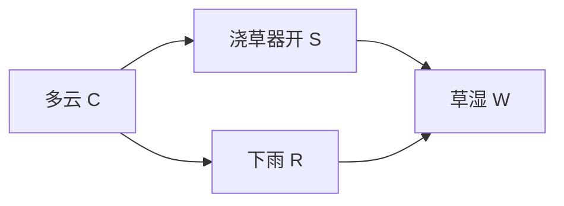

# 第 4 章 概率图模型：贝叶斯网络与马尔可夫网络

> **本章定位**：第 1 章的逻辑知识"非真即假"，第 2、3 章的知识图谱默认每条三元组同等可信——真实世界的知识却是**不确定**的（"发烧通常暗示感染"）。本章用图编码概率联合分布，是"结构化知识"与"概率推理"的桥梁：图来自第 1、2 章（结构），概率来自[《概率统计》](/xiaoshus-blog/textbooks/ai/math-foundations/probability-statistics/00/)与[《机器学习·第 5 章》](/xiaoshus-blog/textbooks/ai/ai-core/machine-learning/05/)（信念）。第 5 章 Agent 的"规划在不确定性下"直接依赖本章。

## 4.0 本章学习目标

完成本章后，你应当能够：

1. 解释"用图编码联合分布"的动机：条件独立结构如何把 $O(2^n)$ 的联合表压缩成局部条件概率表（CPT）；
2. 陈述贝叶斯网络的链式分解定理，并对给定网络写出联合分布；
3. 对任意 $(X, Y, Z)$ 三元组完成 d-分离判定（手画道德图 + 实现判定算法），并解释链、叉、汇三种基本结构的阻塞条件；
4. 手算一个 4 变量网络的变量消元（variable elimination）推断，并实现枚举法精确推断与似然加权采样；
5. 陈述马尔可夫网络与 Hammersley-Clifford 定理的思想，并说明有向/无向两种编码各自的适用场景。

## 4.1 用图编码联合分布的动机

$n$ 个二值变量的联合分布需要 $2^n - 1$ 个独立参数——$n=30$ 时已超 10 亿。但真实世界的变量几乎不"两两相关"：知道了"下雨"，"浇草器是否开过"与"草是否湿"的关系就弱了。**条件独立（conditional independence）**是压缩的钥匙：

$$
X \perp Y \mid Z \iff P(X, Y \mid Z) = P(X \mid Z)\,P(Y \mid Z)
$$

[《概率统计·第 1 章》](/xiaoshus-blog/textbooks/ai/math-foundations/probability-statistics/01/)给了你条件概率的语言，[《机器学习·第 5 章》](/xiaoshus-blog/textbooks/ai/ai-core/machine-learning/05/)的朴素贝叶斯与混合模型已经是你见过的第一批"用独立性假设省参数"的模型。概率图模型（probabilistic graphical model, PGM）把这件事系统化：**用图的拓扑显式声明全部独立性假设**——图是知识的"模式层"，CPT 是"数据层"，这正好接续第 2 章的本体/实例二分。

## 4.2 贝叶斯网络

### 4.2.1 定义与链式分解

**定义**：贝叶斯网络（Bayesian network, BN）是有向无环图（DAG），节点是随机变量 $X_1, \dots, X_n$，每个节点附条件概率表 $\theta_i = P(X_i \mid \mathrm{Pa}(X_i))$，且联合分布按**链式法则分解**：

$$
P(X_1, \dots, X_n) = \prod_{i=1}^{n} P\big(X_i \mid \mathrm{Pa}(X_i)\big)
$$

这不是恒等式而是**假设**：每个变量在给定父节点后与所有非后代条件独立。参数量从 $O(2^n)$ 降到 $O(n \cdot 2^{k})$（$k$ 为最大父节点数）——图结构就是知识工程的核心投入。

**经典例：浇草器网络**（Russell & Norvig 的标准教学例）：



$$
P(C,S,R,W) = P(C)\,P(S \mid C)\,P(R \mid C)\,P(W \mid S, R)
$$

### 4.2.2 条件独立与 d-分离

**d-分离（d-separation，directional separation）**是"从图上读出条件独立"的判定理论：若图中 $X$ 与 $Y$ 被 $Z$ d-分离，则 $X \perp Y \mid Z$ 在该网络编码的一切分布中成立（可靠性）；反之不成立的独立性叫"隐匿独立性"，BN 不保证（故 BN 是独立性假设的充分不必要表示）。

判定基于三种基本"接点"模式，设考察路径 $X \leadsto Y$ 上某中间节点 $M$、证据集 $Z$：

| 模式 | 形状 | 激活条件（路径未被阻断） | 直觉 |
|---|---|---|---|
| 链（chain） | $X \to M \to Y$ | $M \notin Z$ | 中介未观察，影响可以流动 |
| 叉（fork） | $X \leftarrow M \to Y$ | $M \notin Z$ | 共因未观察，混杂关联存在 |
| 汇（collider，V 结构） | $X \to M \leftarrow Y$ | **$M$ 或其后代在 $Z$ 中** | 观察共同结果"解锁"两因（解释消去/explaining away） |

汇结构的反向直觉是初学者最大陷阱：**观察会打开碰撞路径**。知道"草湿"后，"浇草器开"与"下雨"从独立变为负相关——证据本身解释了结果，两者互为替代解释。

**完整判定算法（道德图法）**：判定 $X \perp Y \mid Z$ 是否成立——

1. 取 $X \cup Y \cup Z$ 的**祖先闭包**（加入所有祖先）；
2. **道德化（moralize）**：把每个节点的父节点两两连边（"结为夫妻"），然后去掉所有方向；
3. 删去 $Z$ 中节点及其边；
4. 若 $X$ 与 $Y$ 仍连通，则**不** d-分离；连通则为 d-分离。

第 2 步正是"链与叉阻断、汇打开"的机械化身：道德化给汇结构补上"配偶边"，删除 $Z$ 后若配偶边仍在且配偶连通两侧，路径就通。算法与实现见 4.6 案例 2。

### 4.2.3 经典案例一：朴素贝叶斯是 BN 的特例

[《机器学习·第 2 章》](/xiaoshus-blog/textbooks/ai/ai-core/machine-learning/02/)的朴素贝叶斯假设"给定类别，各特征独立"，其图结构是**叉**：类 $Y$ 指向每个特征 $X_i$：

$$
P(Y, X_1, \dots, X_m) = P(Y) \prod_i P(X_i \mid Y)
$$

在 BN 语言里它只是"1 个根节点、$m$ 个叶子"的最浅网络。朴素贝叶斯的"朴素之罪"（特征间实际相关）在 BN 语言中一目了然：特征之间被 $Y$ d-分离当且仅当 $Y$ 被观察——而分类时 $Y$ 恰恰未观察，特征相关性被硬性忽略。BN 提供的改进路径：允许特征间加边（树增广朴素贝叶斯，TAN）。

### 4.2.4 经典案例二：诊断推理（手算）

浇草器网络取 CPT：$P(C{=}t)=0.5$；$P(S{=}t \mid C{=}t)=0.1$，$P(S{=}t \mid C{=}f)=0.5$；$P(R{=}t \mid C{=}t)=0.8$，$P(R{=}t \mid C{=}f)=0.2$；$P(W{=}t \mid S,R)$：$(t,t){:}0.99$，$(t,f){:}0.90$，$(f,t){:}0.90$，$(f,f){:}0$。求 $P(R{=}t \mid W{=}t)$（"看到草湿，下了雨的概率"）——贝叶斯规则直接算要枚举 3 个隐变量：

$$
P(R{=}t \mid W{=}t) = \frac{P(R{=}t, W{=}t)}{P(W{=}t)} = \frac{0.4581}{0.4581 + 0.1890} \approx 0.708
$$

（分子分母由枚举 8 种 $(C,S,R)$ 组合得到；4.6 案例 1 用变量消元重算一遍并展示每一步。）注意推理方向与因果箭头**相反**——"由果溯因"的诊断（diagnostic inference）正是 BN 的看家本领，第 1 章逻辑里根本没有这种梯度式的信念更新。

## 4.3 推断：精确、消元与近似

推断任务：给定证据 $E = e$，求后验 $P(Q \mid E{=}e)$。所有精确算法本质都是"巧妙的边际化求和"。

### 4.3.1 枚举法与变量消元

**枚举法**：对全部隐变量组合求和，复杂度 $O(2^n)$——3.2 节代码用了它，但它是指数起点。

**变量消元（variable elimination, VE）**：按"因子（factor）"组织求和，逐个消去隐变量，复杂度取决于**消元顺序产生的最大中间因子宽度**（tree-width），通常是指数的、但好顺序下指数很小：

$$
P(Q \mid e) = \frac{1}{Z} \sum_{\text{隐变量}} \prod_i P(X_i \mid \mathrm{Pa}(X_i)) \Big|_{E=e}
$$

VE 把"求和"内移到"乘积"之间（分配律），等价于[《数据结构与算法·第 6 章》](/xiaoshus-blog/textbooks/ai/programming/data-structures/06/)动态规划的"子问题复用"：相同的部分和只算一次。4.6 案例 1 手算演示。

### 4.3.2 近似推断一：采样法（衔接概率统计·第 6 章）

当网络大且稠密（真实医疗网络数百节点），精确推断不可行。[《概率统计·第 6 章》](/xiaoshus-blog/textbooks/ai/math-foundations/probability-statistics/06/)的蒙特卡洛工具箱在此全面上岗：

- **拒绝采样**：按拓扑序前向采样，丢弃与证据不符的样本。证据概率小时效率崩溃（$O(1/P(e))$ 样本）；
- **似然加权（likelihood weighting, LW）**：证据变量**不采样**而固定取值，用其 CPT 概率累积权重 $w = \prod_{e \in E} P(e \mid \mathrm{pa}(e))$——把"生成证据"的概率转嫁为权重，专治稀有证据；
- **吉布斯采样**：从任意一致状态出发，每轮按满条件分布 $P(X_i \mid \text{其余全部})$ 重采一个变量（BN 中该分布只依赖马尔可夫毯——父、子、子的其他父）。它对任意证据形状都稳健，是高维网络的主力；其收敛性即[《概率统计·第 6 章》](/xiaoshus-blog/textbooks/ai/math-foundations/probability-statistics/06/)马尔可夫链平稳分布理论的直接应用。

### 4.3.3 近似推断二：信念传播思想

信念传播（belief propagation, BP）在**树结构**网络上精确：每个节点向邻居发送"消息"（自己累计的证据信息），两轮消息后每个节点的边际可精确算出——复杂度 $O(\text{边数} \times \text{因子大小})$。在带环图上直接套用称**环信念传播（loopy BP）**：不保证收敛，但实践常给出好近似。它与第 3 章 GNN 的消息传递是同一数学骨架（和积 vs 加权聚合），这条"图上传递局部信息"的线索将在[《深度学习·第 5 章》](/xiaoshus-blog/textbooks/ai/ai-core/deep-learning/05/)的注意力机制再次出现。

### 4.3.4 学习：结构可手工、参数可估计

给定图结构，CPT 用最大似然/贝叶斯估计直接可学（[《概率统计·第 5 章》](/xiaoshus-blog/textbooks/ai/math-foundations/probability-statistics/05/)）；结构本身可用评分搜索（BIC 分数 + 贪心加删边）学习——这已进入研究层级，本章只取其思想：**结构=知识、参数=数据**的分工正是"知识表示"课程关心它的原因。

## 4.4 马尔可夫网络与 Hammersley-Clifford 思想

有些知识天然**无方向**：图像相邻像素的平滑性、分子中原子的键、社交圈的兼容关系。马尔可夫网络（Markov network / Markov random field）用**无向图**编码：

$$
P(X = x) = \frac{1}{Z} \prod_{C \in \text{团}} \psi_C(x_C), \qquad Z = \sum_x \prod_{C} \psi_C(x_C)
$$

每个**团**（clique，全连通子集）带一个势函数 $\psi_C \ge 0$；$Z$ 是配分函数（归一化常数，通常是推断困难的总根源——对照[《深度学习·第 6 章》](/xiaoshus-blog/textbooks/ai/ai-core/deep-learning/06/)能量模型的困境）。

**Hammersley–Clifford 定理**（1971，思想版）：对严格正分布，"全局马尔可夫性质（被分隔即独立）$\iff$ 分布按团势函数分解"。它宣告：**无向图上的条件独立结构与团分解是同一件事的两种说法**——图就是分布的"语法"，这是本章标题"用图编码联合分布"最彻底的形态。

**有向 vs 无向的选择**：有因果叙事、参数易给专家解释 → BN（医疗诊断、风险建模）；对称相互作用、需要表达"软约束"（两者大概率同号）→ MN（图像、物理系统；Ising 模型 $P(x) \propto e^{\sum_{(i,j)} w_{ij} x_i x_j + \sum_i b_i x_i}$ 是其最小完整样本）。条件随机场（CRF，序列标注的标准工具，[《自然语言处理·第 3 章》](/xiaoshus-blog/textbooks/ai/ai-core/nlp/03/)）就是判别式设定下的马尔可夫网络。

## 4.5 关键公式速查

| 公式 | 内容 | 适用条件 |
|---|---|---|
| 链式分解 | $P(X_1..X_n)=\prod_i P(X_i \mid \mathrm{Pa}(X_i))$ | DAG 无环；参数量 $O(n2^k)$ |
| 条件独立 | $P(X,Y \mid Z)=P(X \mid Z)P(Y \mid Z)$ | d-分离保证其在网络编码的分布中成立 |
| 贝叶斯规则（诊断） | $P(Q \mid e) \propto \sum_{\text{hidden}} \prod_i \theta_i$ | 证据代入后按隐变量边际化 |
| VE 复杂度 | $O(n \cdot 2^{w})$，$w$=消元宽度 | $w$ 依赖消元顺序与图宽 |
| 似然加权 | $P(Q \mid e) \approx \frac{\sum w_i \mathbb{1}[q_i]}{\sum w_i}$，$w_i=\prod_{e \in E} P(e \mid \mathrm{pa}(e))$ | 前向拓扑采样 |
| 吉布斯满条件 | $P(x_i \mid x_{-i}) \propto P(x_i \mid \mathrm{pa}(x_i)) \prod_{c \in \mathrm{child}(i)} P(c \mid \mathrm{pa}(c))$ | 马尔可夫毯内 |
| 马尔可夫网络 | $P(x) = \frac{1}{Z}\prod_C \psi_C(x_C)$ | 无向图；$Z$ 难算 |
| Hammersley–Clifford | 全局马尔可夫性 $\iff$ 团分解 | 分布严格为正 |

## 4.6 示例与案例

### 案例 1（手算）：变量消元求 $P(R{=}t \mid W{=}t)$

因子：$f_C(C)$，$f_S(S \mid C)$，$f_R(R \mid C)$，$f_W(W \mid S,R)$。证据 $W{=}t$ 代入 $f_W$。目标只留 $R$。

**第一步：消去 $S$**——合并 $f_S$ 与 $f_W$ 后对 $S$ 求和，得 $g(C, R)$：

$$
g(t,t) = \underbrace{0.1}_{P(S=t|C=t)} \times 0.99 + \underbrace{0.9}_{P(S=f|C=t)} \times 0.90 = 0.909, \quad
g(t,f) = 0.1 \times 0.90 + 0.9 \times 0 = 0.090
$$
$$
g(f,t) = 0.5 \times 0.99 + 0.5 \times 0.90 = 0.945, \quad
g(f,f) = 0.5 \times 0.90 + 0.5 \times 0 = 0.450
$$

**第二步：消去 $C$**——合并 $f_C, f_R, g$ 后对 $C$ 求和，得 $h(R)$：

$$
h(t) = 0.5 \times 0.8 \times 0.909 + 0.5 \times 0.2 \times 0.945 = 0.3636 + 0.0945 = 0.4581
$$
$$
h(f) = 0.5 \times 0.2 \times 0.090 + 0.5 \times 0.8 \times 0.450 = 0.0090 + 0.1800 = 0.1890
$$

**第三步：归一化**：$P(R{=}t \mid W{=}t) = 0.4581 / (0.4581+0.1890) \approx \mathbf{0.708}$。

与 4.2.4 直接枚举结果一致；但中间表最大只有 4 格（$g$ 是 $2\times2$）——如果变量更多，枚举是 $2^n$ 而消元是 $2^{w}$，$w$ 可远小于 $n$。消元顺序是工程关键（贪心最小填入序见练习 7）。

### 案例 2（代码）：诊断系统 = CPT + 推断 + d-分离

```python
# 运行环境：Python 3.8+；似然加权部分需 numpy（pip install numpy）
import itertools

# ---------- 知识层：结构与 CPT（专家或数据学习给出） ----------
CPT = {
    'C': {(): 0.5},                                  # P(C=t)
    'S': {(True,): 0.1,  (False,): 0.5},             # P(S=t | C)
    'R': {(True,): 0.8,  (False,): 0.2},             # P(R=t | C)
    'W': {(True, True): 0.99, (True, False): 0.90,   # P(W=t | S,R)
          (False, True): 0.90, (False, False): 0.0},
}
PARENTS = {'C': [], 'S': ['C'], 'R': ['C'], 'W': ['S', 'R']}
VARS = ['C', 'S', 'R', 'W']

def joint_prob(a):
    """链式法则：P(a) = Π P(v | pa(v))。"""
    p = 1.0
    for v in VARS:
        key = tuple(a[pa] for pa in PARENTS[v])
        pt = CPT[v][key]
        p *= pt if a[v] else 1 - pt
    return p

def exact_inference(query, evidence):
    """枚举法精确推断（教学用；大网络请换变量消元/pgmpy）。"""
    num = {True: 0.0, False: 0.0}
    hidden = [v for v in VARS if v not in evidence]
    for bits in itertools.product([True, False], repeat=len(hidden)):
        asg = dict(evidence); asg.update(dict(zip(hidden, bits)))
        num[asg[query]] += joint_prob(asg)
    return num[True] / (num[True] + num[False])

print("P(下雨 | 草湿) =", round(exact_inference('R', {'W': True}), 4))
print("P(浇草器 | 草湿) =", round(exact_inference('S', {'W': True}), 4))
print("P(下雨) =", round(exact_inference('R', {}), 4))
# 预期输出：
# P(下雨 | 草湿) = 0.7079
# P(浇草器 | 草湿) = 0.4298
# P(下雨) = 0.5
```

```python
# ---------- 推断层：似然加权采样（对比精确值） ----------
import numpy as np                                    # pip install numpy
rng = np.random.default_rng(0)

def likelihood_weighting(query, evidence, n=200000):
    w = {True: 0.0, False: 0.0}
    for _ in range(n):
        asg, weight = {}, 1.0
        for v in VARS:                                # 拓扑序前向
            key = tuple(asg[pa] for pa in PARENTS[v])
            pt = CPT[v][key]
            if v in evidence:                         # 证据：固定并累积权重
                asg[v] = evidence[v]
                weight *= pt if evidence[v] else 1 - pt
            else:                                     # 隐变量：采样
                asg[v] = bool(rng.random() < pt)
        w[asg[query]] += weight
    return w[True] / (w[True] + w[False])

print("P(下雨 | 草湿) 似然加权 =", round(likelihood_weighting('R', {'W': True}), 4))
# 预期输出（seed=0）：
# P(下雨 | 草湿) 似然加权 = 0.7069   （与精确值 0.7079 相对误差 < 0.2%）
```

```python
# ---------- 结构层：d-分离判定（道德图法） ----------
def d_separated(parents, x, y, z):
    anc, stack = set(), [x, y, *z]                    # 1. 祖先闭包
    while stack:
        u = stack.pop()
        if u not in anc:
            anc.add(u); stack.extend(parents[u])
    und = {u: set() for u in anc}
    for v in anc:                                     # 2. 道德化
        for p in parents[v]:
            und[v].add(p); und[p].add(v)
        for p1, p2 in itertools.combinations(parents[v], 2):
            und[p1].add(p2); und[p2].add(p1)
    seen, stack = {x}, [x]                            # 3+4. 删 z 后 BFS
    while stack:
        u = stack.pop()
        if u == y: return False
        for v in und[u]:
            if v not in seen and v not in z:
                seen.add(v); stack.append(v)
    return True

print("S ⊥ R | {}   :", d_separated(PARENTS, 'S', 'R', set()))
print("S ⊥ R | {C}  :", d_separated(PARENTS, 'S', 'R', {'C'}))
print("S ⊥ R | {C,W}:", d_separated(PARENTS, 'S', 'R', {'C', 'W'}))
print("C ⊥ W | {S,R}:", d_separated(PARENTS, 'C', 'W', {'S', 'R'}))
# 预期输出：
# S ⊥ R | {}   : False   （共因 C 未观察，叉结构激活）
# S ⊥ R | {C}  : True    （观察共因后阻断；W 未观察，碰撞不开启）
# S ⊥ R | {C,W}: False   （观察碰撞节点 W 反而打开路径——解释消去）
# C ⊥ W | {S,R}: True    （C 的全部影响经 S、R 两条链，均被阻断）
```

三段代码分别对应"知识层—推断层—结构层"，一个诊断系统就是这三层的胶合。工程上请用 `pgmpy`（`pip install pgmpy`）的 `BayesianNetwork` + `VariableElimination` 替换枚举与手写采样——机制你已亲手写过，库只是把它们做快。

## 4.7 常见误区与陷阱

1. **把 BN 的箭头当因果**。BN 的边编码的是分解顺序（建模选择），"草湿→下雨"在数学上同样是一个合法的 BN。d-分离的独立性结论与边的方向无关，但**干预**（do 算子）结论强烈依赖方向——因果推断是 BN 之外的另一层（进阶方向 1）。
2. **观察打开碰撞路径**。"多观察总是让变量更相关/更独立"都是错的：观察中间节点对链/叉是阻断、对汇是开启。d-分离必须按 4.2.2 的表逐节点判定，不能凭感觉。
3. **CPT 行没归一化**。每个 $P(X \mid \mathrm{pa})$ 必须对 $X$ 的取值和为 1。输入手编 CPT 时这是最常见的静默错误，建议在加载代码中断言检查。
4. **拒绝采样在稀有证据下悄悄失效**。样本"看起来在跑"但有效样本数趋近 0，置信区间爆炸。证据概率低于 $10^{-3}$ 时应换似然加权或吉布斯采样。
5. **把马尔可夫网络的势当概率**。$\psi_C$ 只需非负、不必归一，其绝对数值无意义，只有比值影响分布——把"专家打的 0.7 分"直接当概率用是错误的。

## 4.8 与前后章节的联系

- **依赖**：[《概率统计·第 1、4、6 章》](/xiaoshus-blog/textbooks/ai/math-foundations/probability-statistics/04/)（条件概率、贝叶斯推断、采样法）是全章语言与工具箱；[《机器学习·第 5 章》](/xiaoshus-blog/textbooks/ai/ai-core/machine-learning/05/)的朴素贝叶斯与 EM 是 4.2.3 的前身（含隐变量的 BN 学参数正是 EM）；[《数据结构与算法·第 6 章》](/xiaoshus-blog/textbooks/ai/programming/data-structures/06/)的 DP 思想解释变量消元为何有效。
- **被依赖**：第 5 章 Agent 规划中"环境模型不确定"时用 PGM 建模转移；综合项目二要求你构建完整贝叶斯诊断系统并对比推断算法。医疗诊断网络（如 QMR-DT）是本章思想的历史高光。
- **其他课程**：与[《自然语言处理·第 3 章》](/xiaoshus-blog/textbooks/ai/ai-core/nlp/03/)的 HMM/CRF 互为补充——HMM 是 BN 的链式特例、CRF 是马尔可夫网络的判别式特例，那边讲序列任务怎么用，这边讲图模型的通用原理；与[《深度学习·第 6 章》](/xiaoshus-blog/textbooks/ai/ai-core/deep-learning/06/)的能量模型对照——RBM 就是二部马尔可夫网络，配分函数的困难一脉相承。

## 4.9 拓展阅读

- Koller, D. & Friedman, N., *Probabilistic Graphical Models: Principles and Techniques*（MIT Press, 2009）：本领域圣经，第 3–5 章（BN 表示）、第 9–10 章（精确推断）、第 12 章（采样）覆盖本章全部内容。遇到任何细节疑义查它。
- Russell & Norvig, *Artificial Intelligence: A Modern Approach*（4th ed., 2020）第 13–14 章：浇草器网络与推断算法的最平易入门。
- Pearl, J., *Probabilistic Reasoning in Intelligent Systems*（Morgan Kaufmann, 1988）：贝叶斯网络的奠基之作，d-分离由 Pearl 提出。读第 3 章感受原始动机。
- Murphy, K., *Machine Learning: A Probabilistic Perspective*（MIT Press, 2012）第 10、22 章：PGM 与现代机器学习的衔接视角，代码资源丰富。
- Lauritzen, S. & Spiegelhalter, D., "Local Computations with Probabilities on Graphical Structures"（*J. Royal Statistical Society B*, 1988）：连接树（junction tree）精确推断的奠基论文——变量消元之后该去的地方。

## 4.10 进阶方向

1. **因果推断**：从"观察"到"干预"，do-演算与因果图（Pearl, *Causality*, 2009）——需要补：本章 + 反事实的语言。
2. **近似推断的高阶技术**：变分推断（把推断变优化，衔接 EM）与期望传播——需要补：[《最优化方法·第 4 章》](/xiaoshus-blog/textbooks/ai/math-foundations/optimization/04/)的变分观点。
3. **可微概率程序**：Pyro/TensorFlow Probability 把 PGM 写进深度学习栈，结构与参数同时梯度学习——需要补：[《深度学习·第 2 章》](/xiaoshus-blog/textbooks/ai/ai-core/deep-learning/02/)。
4. **学习网络结构**：BIC 评分搜索、GES 算法、基于 GAN/VAE 的结构学习——需要补：本章 + 信息论（MDL 原则）。

## 4.11 课后思考与练习

**基础**

1. 写出浇草器网络的完整联合分解式，并数一数：完整联合分布 $2^4-1=15$ 个参数 vs 链式分解 9 个 CPT 参数——列出这 9 个参数。
2. 对"单箭头"网络 $A \to B \to C$：分别判定 $A \perp C \mid \{\}$、$A \perp C \mid \{B\}$（道德图手画 + 结论），并用 4.6 的 `d_separated` 函数验证。
3. 用 4.6 案例 1 的中间因子 $h(R)$ 计算 $P(S{=}t \mid W{=}t)$（提示：消去顺序不同，$h$ 换成关于 $S$ 的因子；校验：$\approx 0.430$）。
4. 朴素贝叶斯分类器在 BN 语言中缺了什么独立性假设之外的隐含假设？把"特征相关性"加一条边的后果是参数量如何变化？

**进阶**

5. 编程：给 4.6 的诊断系统加"季节 T"节点（影响多云与下雨），重新计算 $P(R{=}t \mid W{=}t)$，并验证"浇草器与下雨的独立性"在控制 $T$ 后如何变化。
6. 编程：实现拒绝采样，在证据 $\{W{=}t\}$ 与稀有证据（自造一个 $P=10^{-4}$ 的事件）上对比其与似然加权的样本效率（同预算下的标准误差）。
7. 编程：实现"贪心最小填入（min-fill）"消元顺序选择，在一个 10 节点随机 DAG 上对比随机顺序与 min-fill 顺序的最大中间因子大小。
8. 概念辨析：为什么 Hammersley–Clifford 定理需要"严格为正"条件？构造一个非正分布的反例（提示：确定性约束 $X=Y$）。

**开放与挑战**

9. 开放思考：把第 3 章 KGE 的链接预测视为一种推断，它和本章 BN 推断在"输出可解释性"上的本质差别是什么？若要求诊断系统"每一步可向医生解释"，你会分别怎么改造两种系统？
10. **挑战题**：证明变量消元在**树结构**BN 上（消元顺序取"从叶到根"）是多项式时间的。进一步：查阅 Lauritzen–Spiegelhalter 1988，用 500 字概述连接树算法如何把任意网络"三角化"后达到同样保证。
