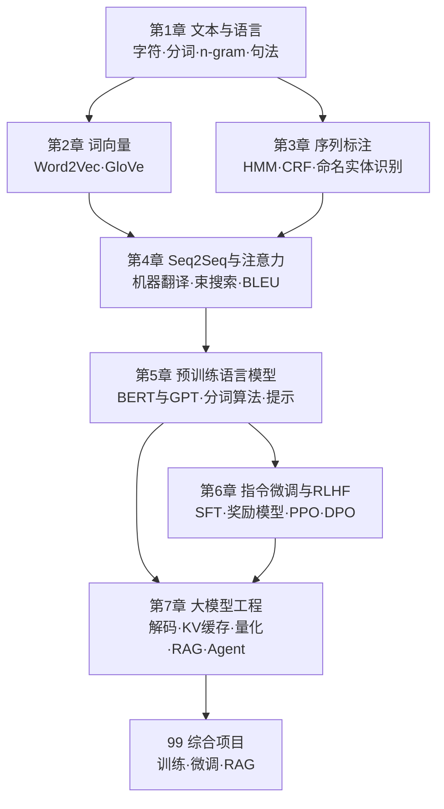
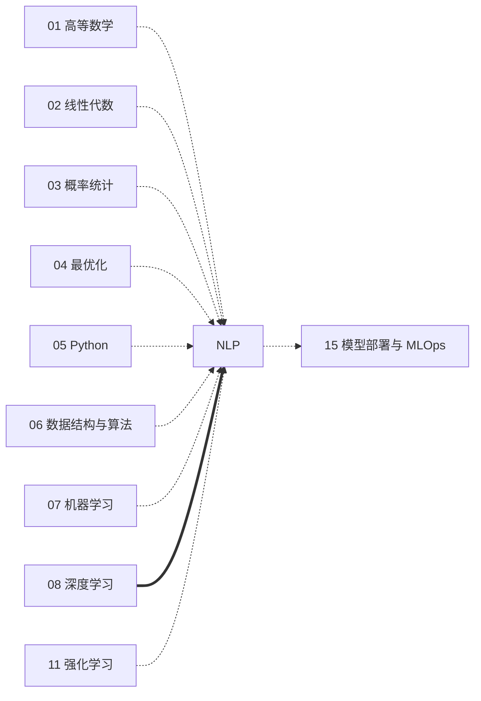

# 自然语言处理（课程导览）

> **本课程定位**：自然语言处理（Natural Language Processing, NLP）是人工智能核心模块中的方向课程之一。它把《机器学习》《深度学习》中建立的通用方法论（损失函数、反向传播、注意力机制、预训练）落到"语言"这一最复杂的结构化信号上，并一路推进到大语言模型（LLM）时代的指令微调、RLHF 与工程实践。

## 0.1 课程定位：语言智能是大模型时代的中心舞台

为什么这门课值得你花一整个学期？

**第一，NLP 是当代人工智能成果最显眼的出口。** 聊天助手、代码生成、机器翻译、搜索与推荐、智能体（Agent）——这些改变普通人使用计算机方式的系统，其核心都是对自然语言（Natural Language）的建模。而它们的技术底座——Transformer 与大规模预训练——恰恰是在 NLP 中诞生的（Vaswani et al., 2017；Devlin et al., 2019；Brown et al., 2020）。今天我们说"大模型"，默认指的就是大语言模型。

**第二，语言是检验学习算法的最苛刻试金石。** 图像的像素是连续、局部、平移不变的；而语言是离散、组合、层级结构的：一个字符的改动可以把"我看他心情不好"变成"我看他心情不好？"完全相反的意思；一个词的意思取决于上下文（"苹果发布了新品"与"我吃了一个苹果"）。在这门课里你会看到，NLP 的每一步技术演进——n-gram 到词向量、HMM/CRF 到 Seq2Seq、静态表示到上下文表示、监督训练到指令对齐——都是对"语言的离散性与组合性"的一次更深刻的回应。

**第三，NLP 的方法论已经反向输出到整个 AI。** 注意力机制起源于机器翻译的对齐问题；RLHF 的对齐范式、RAG 的检索增强架构、提示工程（prompt engineering），如今都被视觉、语音、生物信息等领域借用。学好 NLP，等于掌握了大模型时代的一套"通用语法"。

一个简短的技术史鸟瞰，也是本课程的叙事主线：

| 时代 | 代表方法 | 对语言的核心假设 | 本课程章节 |
|---|---|---|---|
| 统计时代（1990s–2013） | n-gram、HMM、CRF、SVM | 语言是离散符号的马尔可夫过程 | 第 1–3 章 |
| 表示学习时代（2013–2017） | Word2Vec、GloVe、Seq2Seq+注意力 | 词义分布在低维连续空间中 | 第 2、4 章 |
| 预训练时代（2018–2020） | ELMo、BERT、GPT-2/3 | 上下文决定语义；规模带来涌现 | 第 5 章 |
| 对齐与工程时代（2021–至今） | SFT、RLHF/DPO、RAG、Agent | 语言模型是可以对齐、可编程推理的系统 | 第 6–7 章 |

## 0.2 知识地图与章节安排

本课程共 7 章 + 综合项目，按"符号 → 分布式表示 → 结构化预测 → 端到端生成 → 预训练 → 对齐 → 工程"的递进展开：

各章一句话简介：

1. **[第 1 章 文本与语言：从字符到句法](/xiaoshus-blog/textbooks/ai/ai-core/nlp/01/)** —— 文本如何变成数字：Unicode 与规范化、中英文分词、n-gram 语言模型与平滑、困惑度的严格定义、词性与句法概览、编辑距离。这是全书的地基：后面每一章的"输入端"都从这里出发。
2. **[第 2 章 词向量：分布式表示的开端](/xiaoshus-blog/textbooks/ai/ai-core/nlp/02/)** —— 从 one-hot 到稠密向量：Skip-gram 完整推导（softmax、负采样、层次 softmax）、GloVe 目标函数、词类比评估，以及静态向量的局限——它正是第 5 章上下文表示诞生的动机。
3. **[第 3 章 序列标注与经典任务](/xiaoshus-blog/textbooks/ai/ai-core/nlp/03/)** —— 给序列中每个词打标签：HMM 三大问题与前向算法推导、线性链 CRF 与条件似然、命名实体识别完整流水线与实体级 F1、错误分析。这是"结构化预测"思想的代表。
4. **[第 4 章 Seq2Seq 与注意力机制](/xiaoshus-blog/textbooks/ai/ai-core/nlp/04/)** —— 变长到变长的映射：编码器-解码器、teacher forcing 与曝光偏差、Bahdanau/Luong 注意力、束搜索与长度惩罚、BLEU 的精确定义。注意力在此从"翻译技巧"升级为"通用机制"，直接通向 Transformer。
5. **[第 5 章 预训练语言模型：BERT 与 GPT](/xiaoshus-blog/textbooks/ai/ai-core/nlp/05/)** —— 两大预训练家族的分野：掩码语言模型 vs 自回归语言模型、WordPiece/BPE 分词从零实现、三种微调方式、上下文学习与提示工程。这是大模型时代的"轴心章"。
6. **[第 6 章 指令微调与 RLHF](/xiaoshus-blog/textbooks/ai/ai-core/nlp/06/)** —— 从"补全器"到"助手"：SFT 数据构建、奖励模型训练、PPO 的 KL 约束目标推导、DPO 的推导与对比、对齐税、评估与数据污染。
7. **[第 7 章 大语言模型工程：解码、推理与 Agent](/xiaoshus-blog/textbooks/ai/ai-core/nlp/07/)** —— 把模型变成可用系统：temperature/top-k/top-p、KV 缓存、量化与推理加速、RoPE 与长上下文、RAG 完整架构与失败模式、ReAct Agent、幻觉的成因与缓解。
8. **[99 综合项目](/xiaoshus-blog/textbooks/ai/ai-core/nlp/99/)** —— 三个贯通式项目：字符级语言模型系统对比、LoRA 指令微调与错误分析、完整 RAG 问答系统。

## 0.3 与其他课程的依赖关系

**硬依赖（必须先修）**：

- [深度学习·第 4 章](/xiaoshus-blog/textbooks/ai/ai-core/deep-learning/04/)（RNN、BPTT、注意力的雏形）与 [第 5 章](/xiaoshus-blog/textbooks/ai/ai-core/deep-learning/05/)（自注意力、多头机制、位置编码）：第 4、5、7 章直接使用其结论。
- [深度学习·第 7 章](/xiaoshus-blog/textbooks/ai/ai-core/deep-learning/07/)（预训练-微调范式）：第 5 章是其概念在 NLP 中的完整展开。
- [机器学习·第 5 章](/xiaoshus-blog/textbooks/ai/ai-core/machine-learning/05/)（概率模型与 EM）：第 3 章 HMM 的学习问题直接调用其结论。
- [机器学习·第 7 章](/xiaoshus-blog/textbooks/ai/ai-core/machine-learning/07/)（评估方法）：第 3 章的实体级 F1、第 6 章的基准评估都在其框架内。
- [概率论·第 1、2 章](/xiaoshus-blog/textbooks/ai/math-foundations/probability-statistics/01/)：条件概率、链式法则、期望——第 1 章语言模型与第 3 章 HMM 的数学语言。
- [线性代数·第 3 章](/xiaoshus-blog/textbooks/ai/math-foundations/linear-algebra/03/)（SVD/内积）：第 2 章词向量评估、第 7 章 RAG 检索的几何基础。
- [数据结构与算法·第 6 章](/xiaoshus-blog/textbooks/ai/programming/data-structures/06/)（动态规划）：第 1 章编辑距离、第 3 章 Viterbi/前向算法都是它的直接应用。
- [强化学习·第 4 章（策略梯度）](/xiaoshus-blog/textbooks/ai/ai-core/reinforcement-learning/00/)：第 6 章 RLHF/PPO 需要"期望回报、策略梯度、优势函数"这些语言。**若你尚未学强化学习，可先跳过第 6 章 PPO 推导细节，只掌握 DPO 与 SFT 部分，回头再补。**

**软依赖（建议同步或后修）**：[最优化·第 5 章](/xiaoshus-blog/textbooks/ai/math-foundations/optimization/05/)（AdamW 等优化器的收敛行为）帮助理解各章训练代码；[Python·第 4 章](/xiaoshus-blog/textbooks/ai/programming/python/04/) 保证你能读懂并调试全书的 NumPy 代码。

**后续被依赖**：本课程的第 7 章（解码策略、量化、推理服务化）是[《模型部署与 MLOps》](/xiaoshus-blog/textbooks/ai/engineering/mlops/00/)推理优化与服务化章节的直接前置；第 6 章的对齐思想会被该课程的"持续训练与评估"部分引用。

## 0.4 建议学时（约 64 学时）

按每周 1 次课（4 学时）× 16 周安排，或按主题压缩为 8 个模块：

| 模块 | 内容 | 学时 | 配套实验 |
|---|---|---|---|
| 1 | 第 1 章：文本处理与 n-gram 语言模型 | 8 | 实现 bigram LM 与困惑度评测；中文分词对比 |
| 2 | 第 2 章：词向量 | 8 | 训练 Word2Vec 并做词类比评测 |
| 3 | 第 3 章：序列标注 | 8 | 完成 CoNLL 风格 NER 小流水线与错误分析 |
| 4 | 第 4 章：Seq2Seq 与注意力 | 8 | 小语料翻译系统；实现并对比 BLEU/束搜索 |
| 5 | 第 5 章：预训练语言模型 | 8 | 从零实现 BPE；微调 BERT 做文本分类 |
| 6 | 第 6 章：指令微调与 RLHF | 8 | LoRA SFT；用合成偏好数据跑通 DPO |
| 7 | 第 7 章：LLM 工程与 Agent | 8 | 解码策略实验；搭建最小 RAG |
| 8 | 综合项目答辩 | 8 | 99 章三个项目选其一深入完成 |

若自学，按"2 学时读正文 + 1 学时推导复现 + 2 学时代码实验 + 0.5 学时整理公式速查卡"的节奏，每章约 12–15 小时。

## 0.5 学习方法：本课程的四条主线

1. **数学语言不断线。** 语言模型本质是概率分布 $p(w_1,\dots,w_n)$ 的建模问题：第 1 章用马尔可夫假设近似它，第 4 章用神经网络参数化它，第 5 章用预训练大规模求解它，第 6 章用对数似然比重定义它。每当看到一个新模型，先问："它的概率模型是什么？损失是哪个分布的（对数）似然？"
2. **从零实现一遍，再调用成熟库。** 每章示例都遵循同一模式：先用几十行纯 Python/NumPy 把机制写出来（编辑距离、前向算法、BLEU、BPE、DPO 损失……），再用 `gensim`/`transformers` 等工业库解决真实问题。只调用库你会变成 API 使用者；只手写你会远离工程现实。两者都要。
3. **工程现实先行。** 每一章都内置了工程视角：分词的 Unicode 陷阱、平滑系数如何虚低困惑度、teacher forcing 的曝光偏差、束搜索的长度惩罚、KV 缓存的显存账、RAG 的失败模式。这些细节是"能跑通的 demo"与"可靠的系统"之间的距离。
4. **用评测数据说话。** 从困惑度、F1、BLEU 到 MMLU 与人工偏好评估，NLP 的每一次范式转移都由评测驱动。学每一章时请同时问："这个指标在奖励什么行为？它有哪些系统性漏洞？"——这个问题在第 6 章（Goodhart 效应与数据污染）会得到最深刻的答案。

**给读者的三条具体建议**：

- **动手环境**：准备 Python ≥ 3.9、`numpy`、`scikit-learn`、`torch`（CPU 可跑完本书全部强制实验）、`transformers`、`datasets`，第 2 章另需 `gensim`、第 1 章可选 `jieba`。综合项目中如需 GPU，可用免费云端算力。
- **建立语料直觉**：随时准备一个"玩具语料"文件夹（几条中英文句子即可），每学一个新算法就在它上面手算一遍——本教材每章的"示例与案例"就是这样设计的。
- **补课地图**：发现知识缺口时按"概率链式法则 → EM → 注意力/Transformer → 策略梯度"的顺序回读前序课程对应章节，不要硬闯。

## 0.6 约定与记号

- 记号沿用全书统一约定：随机变量大写、取值小写；$p(x)$ 表概率分布；$\mathbb{E}$ 表期望；向量默认列向量，词向量记作粗体 $\mathbf{u}, \mathbf{v}$；序列 $w_{1:n} = w_1 w_2 \cdots w_n$。
- 文本示例：英文用空格分词的原始句子；中文示例尽量标注分词边界，如「自然 语言 处理」。
- 代码默认在文件开头 `import` 所需库；需要额外安装的库会在代码块前的说明中给出 `pip install` 命令。
- 数据集：第 3 章可使用 CoNLL-2003 英文 NER 数据；第 4 章可使用 IWSLT/Tatoeba 小语料；第 5–7 章使用 Hugging Face Hub 上的公开数据集与开源模型。所有数据与模型均在代码注释中说明获取方式。

准备好了，就从 [第 1 章：文本与语言](/xiaoshus-blog/textbooks/ai/ai-core/nlp/01/) 开始——在能谈论"智能"之前，先让机器真正"看见"文本。

## 拓展阅读（课程级）

- Dan Jurafsky & James H. Martin, *Speech and Language Processing*（第 3 版在线草稿，https://web.stanford.edu/~jurafsky/slp3/ ，持续更新）—— 本课程第 1–4 章的最佳 companion，免费且权威。
- Yoav Goldberg, *Neural Network Methods for Natural Language Processing*（Morgan & Claypool, 2017）—— 从词向量到结构化预测的神经网络 NLP 统一视角，适合配合第 2–3 章精读。
- Stanford CS224n: Natural Language Processing with Deep Learning（公开课，讲义与视频均免费）—— 与本课程第 2、4、5 章高度互补，作业质量极高。
- 高翌栋等中译讲义与邱锡鹏《神经网络与深度学习》（机械工业出版社, 2020）—— 中文读者可对照阅读，其中 NLP 章节与本课程第 2–5 章对应。
