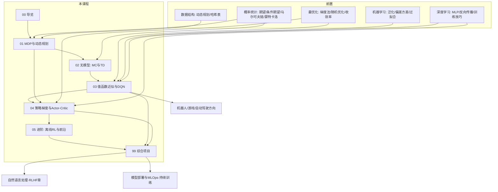

# 强化学习 · 课程导览

> **课程定位**：本课程是整个人工智能专业体系中**唯一以"序贯决策"（sequential decision making）为研究对象**的课程。《机器学习》《深度学习》回答"如何从数据中预测"，本课程回答"如何在与环境的持续交互中行动"。从 AlphaGo 击败人类棋手，到 ChatGPT 的 RLHF 对齐，再到机器人控制与自动驾驶规划，背后都是同一套数学框架——马尔可夫决策过程（MDP）与它的各类求解算法。

## 0.0 课程学习目标

学完本课程，你能够：

1. 用 MDP 五元组建模真实决策问题，推导并手算贝尔曼方程（Bellman equation），实现策略迭代与价值迭代；
2. 区分模型已知（动态规划）与模型未知（Monte Carlo、时序差分）两类设定，实现 SARSA 与 Q-learning 并解释 on-policy 与 off-policy 的本质差异；
3. 解释"致命三要素"（deadly triad），实现带经验回放与目标网络的 DQN，并说出每个组件分别解决什么问题；
4. 完整推导策略梯度定理、基线（baseline）修正与 PPO 的 clip 目标函数，实现 REINFORCE 与 PPO；
5. 说清离线 RL、多智能体、基于模型的 RL、AlphaZero、RLHF 各前沿方向的核心思想与开放问题；
6. 具备从零实现环境（gymnasium 接口）、实现算法、设计对比实验的完整强化学习工程能力。

## 0.1 为什么是现在：从"预测"到"决策"

在《机器学习》与《深度学习》中，你处理的问题有一个共同形态：给定输入 $x$，预测输出 $y$，损失在**一次前向**中结清。监督学习的世界里，"对的答案"是给定的。

强化学习面对的世界完全不同：

- **没有标准答案**，只有延迟的、往往是稀疏的奖励信号（下赢一盘棋才知道对错）；
- **数据不是给定的**，而是由智能体自己的行为产生的——你探索到哪里，就采集到哪里的数据（这与《概率统计》中独立同分布样本的假设根本冲突）；
- **每个决策影响后续所有决策**——这是序贯决策的本质，也是为什么需要"价值"这个跨时间累积的概念。

过去十年，强化学习完成了两次"出圈"：第一次是 **2013–2015 年的深度强化学习**（DQN 用一个网络玩 Atari 超越人类，AlphaGo 击败李世石）；第二次是 **2022 年至今的 RLHF**——基于人类反馈的强化学习（Reinforcement Learning from Human Feedback）成为大语言模型对齐（alignment）的核心技术。**ChatGPT 的最后一步训练用的是本课程第 4 章的 PPO 算法**。因此，在 2020 年代学习强化学习，不再是"机器人方向的专业选修"，而是理解现代大模型技术栈的必修课。

## 0.2 知识地图

各章职责一览：

| 章 | 核心问题 | 关键概念 | 对应代码能力 |
|---|---|---|---|
| 01 | 序贯决策的数学语言是什么？ | MDP、回报、贝尔曼方程、策略/价值迭代 | 网格世界从零实现 + 可视化 |
| 02 | 模型未知时如何学习？ | MC、TD、SARSA、Q-learning、探索-利用 | Cliff Walking 经典对比实验 |
| 03 | 状态太多表格存不下怎么办？ | 函数近似、半梯度、致命三要素、经验回放、目标网络 | PyTorch DQN 训练 CartPole |
| 04 | 能否直接学策略？ | 策略梯度定理、基线、优势、Actor-Critic、PPO | REINFORCE + PPO 训练 CartPole |
| 05 | 数据、对手、模型、层级——更复杂的世界 | 离线 RL、CQL、MARL、Dyna、MCTS、RLHF 技术栈 | 最小奖励模型 + 前沿概览 |
| 99 | 综合运用 | 环境、算法、实验、RLHF 流水线 | 三个毕设级项目 |

贯穿全课程的一条主线：**贝尔曼方程是强化学习的"常数函数"**——正如《高等数学》中一切函数的微积分都建立在常数与幂函数之上，本课程的一切算法（DP、MC、TD、DQN、Actor-Critic）都是对贝尔曼方程这一条等式的不同逼近方式。学每一章时请不断自问：**它在近似贝尔曼方程的哪一边？**

## 0.3 与其他课程的依赖关系

**前置（必须先修）**：

- [《概率论与数理统计》](/xiaoshus-blog/textbooks/ai/math-foundations/probability-statistics/00/)：**第 3 章**多元分布与条件期望——价值函数 $v^\pi(s)=\mathbb{E}[G_t \mid S_t=s]$ 的定义语言；**第 4 章**贝叶斯推断——"用新证据更新估计"的思想贯穿 TD 学习；**第 6 章**采样方法与蒙特卡洛——MC 回报估计、策略梯度中"期望的梯度 = 梯度的期望"的合法性来源；马尔可夫链——MDP 的特例，收敛到平稳分布的思想预示了策略迭代的收敛；
- [《最优化方法》](/xiaoshus-blog/textbooks/ai/math-foundations/optimization/00/)：**第 2 章**梯度法与收敛率——值迭代的收敛证明就是压缩映射论证；**第 5 章**随机优化与 SGD 家族——TD 更新、DQN、策略梯度全部是随机逼近（stochastic approximation）的实例，Robbins-Monro 步长条件在两门课中同形；
- [《机器学习》](/xiaoshus-blog/textbooks/ai/ai-core/machine-learning/00/)：**第 1 章**泛化与偏差-方差——值函数近似的过拟合、致命三要素的分析框架；**第 5 章**概率模型——softmax 策略与交叉熵的联系；
- [《深度学习》](/xiaoshus-blog/textbooks/ai/ai-core/deep-learning/00/)：**第 1 章** MLP 与反向传播——DQN 的 Q 网络、Actor-Critic 的策略/价值网络全靠它；**第 2 章**训练的科学与艺术——目标网络、学习率调度、梯度裁剪都是深度 RL 的日常工具；
- [《数据结构与算法》第 6 章](/xiaoshus-blog/textbooks/ai/programming/data-structures/06/)：动态规划的一般思想——本章的 DP 是它在"带随机性与自引用"情形下的升级版；
- [《Python 程序设计》](/xiaoshus-blog/textbooks/ai/programming/python/00/)：NumPy 向量化与类的设计——第 99 章自写 gymnasium 环境的载体。

**后继（本课程知识将被这样使用）**：

- 《自然语言处理》**第 6 章（指令微调与 RLHF）**：直接使用本课程第 4 章的 PPO 推导与第 5 章的 RLHF 技术栈总览（奖励模型 + KL 正则 + PPO 微调）；
- 《模型部署与 MLOps》：强化学习系统的"非平稳数据 + 在线学习"特性是持续训练（continuous training）一节最有挑战性的案例；第 99 章的项目将实践实验管理与可复现性规范；
- 方向课（机器人、游戏 AI、自动驾驶）：第 3、4 章的深度 RL 算法栈（DQN/PPO/ SAC 一族）是这些方向的标准工具。

## 0.4 建议学时（约 48 学时）

| 单元 | 章节 | 讲授 | 实验 | 合计 |
|---|---|---|---|---|
| 一、数学框架 | 00 + 01 | 8 | 4 | 12 |
| 二、无模型学习 | 02 | 6 | 4 | 10 |
| 三、深度强化学习 | 03 | 6 | 4 | 10 |
| 四、策略梯度 | 04 | 8 | 4 | 12 |
| 五、前沿与项目 | 05 + 99 | 2 | 2 | 4 |

**配套节奏建议**：本课程学时比深度学习少，但每一章的实验密度更高——**强化学习是"做"出来的学科**，只看推导不动手，会在第一次自己跑实验时全面崩塌（训练不收敛是常态而非例外）。

## 0.5 学习方法：每个算法在网格世界从零实现

1. **"网格世界—经典控制—论文复现"三级火箭**。每个算法先用纯 numpy 在自建的网格世界（第 1 章实现，之后反复使用）上验证，此时一切可见可调试；再迁移到 gymnasium 经典控制环境（`pip install gymnasium[classic-control]`），体会"观测是连续的、奖励是稀疏的"带来的新问题；最后在 99 章做综合性项目。
2. **每个算法先问三个问题**：它估计的是 $v$ 还是 $q$？它用哪条更新规则逼近贝尔曼方程的哪一边？它的数据是 on-policy 还是 off-policy 的？这三个问题能穿透一切新算法（包括你未来遇到的任何新论文）。
3. **跑实验必看曲线、必设随机种子**。强化学习实验的方差远大于监督学习——同一算法同一超参跑 5 个种子，结果可能天差地别（第 3 章会亲身体验）。从第一次实验起就记录种子、超参与完整训练曲线，这是《实验设计与评估》的预演。
4. **数学先行，但用代码校验数学**。贝尔曼方程、策略梯度定理、PPO 的 clip 目标都要求完整推导；推完立刻用代码验证（如用数值差分校验策略梯度），推导与实现互相解锁。
5. **警惕"能跑 ≠ 学对了"**。Q-learning 在 Cliff Walking 上"看起来收敛"但走悬崖边，DQN "偶尔崩溃"，PPO "看似上升实则方差爆炸"——每章"常见误区"一节都来自这些真实失败。

## 0.6 常见误区（课程层面的忠告）

1. **把强化学习当成"调库跑实验"**：不推贝尔曼方程、不手写 TD 更新，遇到 DQN 不收敛时完全无从下手。本课程强制每个算法从零实现。
2. **低估探索的重要性**：$\varepsilon$-greedy 的 $\varepsilon$ 从 0.1 调到 0.05 可能让整个实验从成功变失败——探索-利用权衡不是细节，是强化学习的第一性问题。
3. **用监督学习的直觉理解 RL**：监督学习的数据分布固定、损失凸性尚可；RL 的数据由策略自己产生、目标非平稳（第 3 章"致命三要素"专讲此事）。带着旧直觉进场是新手的最大陷阱。
4. **跳过第 1 章直接学 DQN/PPO**：深度 RL 的一切组件（回报、折扣、价值函数、贝尔曼残差）都在第 1 章定义；跳章学习的结果是"会调包但不会思考"。
5. **忽视方差问题**：策略梯度的方差大到需要基线、优势函数、多样本平均层层压制（第 4 章主线）。看不懂这些技巧的动机，等于没看懂策略梯度。

## 0.7 拓展阅读

- **Richard S. Sutton & Andrew G. Barto, *Reinforcement Learning: An Introduction* (2nd ed.), MIT Press, 2018（官网提供免费电子版）**——本课程的"教材中的教材"，几乎所有章节的体系与之对应；每章学完对照精读对应章节（第 1–13 章）。
- **OpenAI, "Spinning Up in Deep RL" 教程（openai_spinningup，免费在线，2018）**——深度 RL 的最佳入门实践教程，伪代码规范；第 3、4 章动手前建议通读对应算法页。
- **Sergey Levine, *Decision Making and Intelligence*（UC Berkeley CS285 讲义与视频课，2019–2024 持续更新）**——研究生水准的深度 RL 课程，第 3–5 章的进阶视角来源。
- **David Silver, UCL 课程 *Reinforcement Learning*（2015）**——AlphaGo 主设计师的公开课，与 Sutton & Barto 互补，动态规划与 MCTS 部分尤佳。

## 0.8 进阶方向

- **大模型对齐（RLHF 及其后继）**：从本课第 4、5 章出发，补奖励模型训练、DPO 等无 RL 的对齐方法——《自然语言处理》第 6 章的主线；
- **离线强化学习与数据驱动决策**：CQL、IQL、Decision Transformer——需第 5 章概览 + 《机器学习》泛化理论；
- **具身智能与机器人学习**：sim-to-real、模仿学习、扩散策略——需本课程全部内容 + 《计算机视觉》感知模块；
- **多智能体与博弈论**：从 MARL 到机制设计——需第 5 章概览 + 博弈论基础（自修）。

## 0.9 课后思考与练习

1. 用你自己的话（不超过 200 字）解释"预测问题"与"决策问题"的本质区别，并各举一个监督学习适合、强化学习必须的例子。
2. 查阅资料：为什么 AlphaGo 的成功（2016）比 Atari DQN（2015）影响力大得多？从搜索、自我博弈、决策空间三个角度各写一句分析。
3. 列出你已修课程中与"序贯性"沾边的三个主题（如马尔可夫链、BPTT、EM 算法），并猜测它们各自与本课程哪个概念同构。
4. 阅读 Sutton & Barto 第 1 章，对照本课程知识地图，列出"他们讲了我们不讲"与"我们讲了他们 2018 年版本没有展开"的各两个主题（提示：后者如 RLHF、Decision Transformer）。
5. 安装 `gymnasium[classic-control]`，运行官方 CartPole 示例 10 个 episode，记录随机策略的平均步数——这个数字是你在第 3、4 章要超越的基线。
6. （开放思考）"强化学习是唯一真正研究 AI 核心难题——自主决策——的分支"，你是否同意这句话？写 300 字论证，要求至少引用一个反例或限定条件。
7. （挑战题）预判：为什么强化学习算法的论文几乎都要报告"多个随机种子的均值 ± 标准差"而监督学习论文常常只报一次结果？从数据生成机制的角度给出解释（第 3 章学完后回来自评）。
