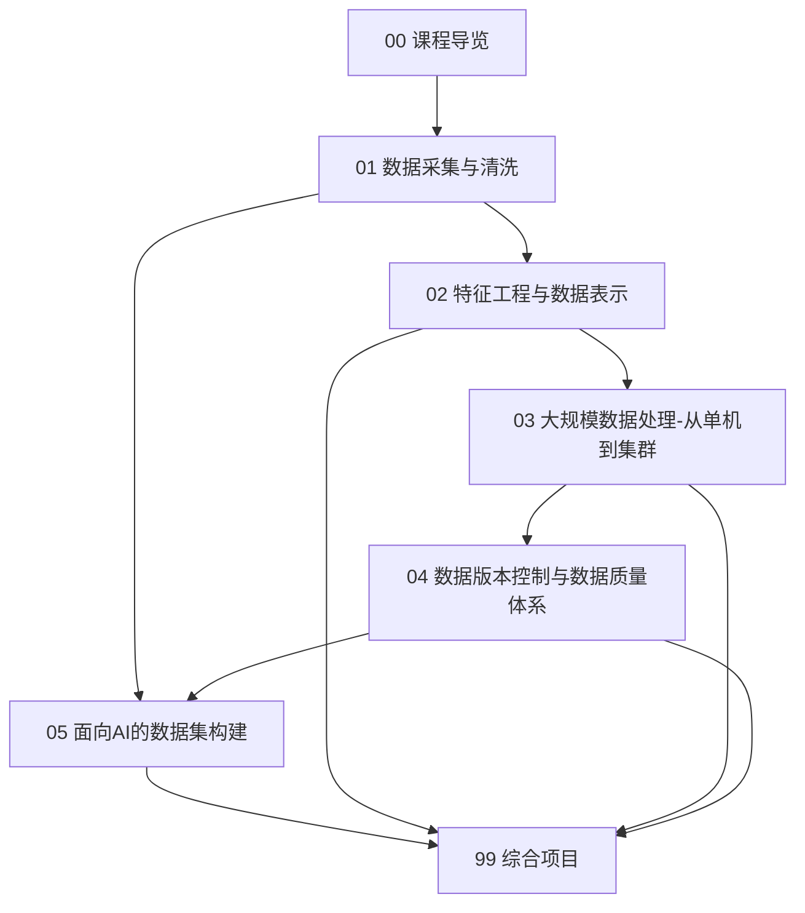

# 数据工程 · 课程导览

> **本导览的作用**：说明本课程在整部教材中的位置、章节之间的依赖关系、建议学时与学习方法。请先读完本页再进入正文各章。

## 一、课程定位：垃圾进垃圾出（Garbage In, Garbage Out）

机器学习教材通常从模型讲起，但真实项目中决定模型上限的往往不是模型，而是**数据**。业界多项调查（如 Anaconda 的 State of Data Science 系列报告）反复确认一个事实：数据科学家约有一半甚至更多的时间花在数据准备（加载、清洗、整理）上，而真正用于建模的时间占比很小；如果把"采集、清洗、标注、构建数据集、监控数据质量"都算作数据工程，则一个 ML 项目 80% 左右的工程时间消耗在数据侧。模型只是从数据中提取规律的装置——**模型的上限由数据决定，算法的作用是逼近这个上限**。

这就是"垃圾进，垃圾出"（Garbage In, Garbage Out）的完整含义：

- 训练数据里混进了未来信息，模型指标虚高，上线即崩（数据泄漏，leakage）；
- 训练数据的分布和线上分布不一致，模型泛化失败（分布偏移，distribution shift）；
- 标注质量差、口径混乱，再强的模型也只是在拟合噪声；
- 数据无法复现，实验结果无法相信，团队协作陷入混乱。

本课程的目标是把你在《机器学习》中学到的算法，放到真实数据的地基上：学会**采集、清洗、表示、规模化处理、版本化管理数据，并最终构建出可信的数据集**。它是《实验设计与评估》和《模型部署与 MLOps》的直接前置课程——没有可靠的数据流水线，实验评估无从谈起，线上监控更无物可监控。

## 二、知识地图

各章核心问题一览：

| 章 | 核心问题 | 关键产出 |
|---|---|---|
| 01 数据采集与清洗 | 数据从哪里来？脏数据如何变干净？泄漏如何预防？ | 一套可复用的清洗流程与泄漏检查清单 |
| 02 特征工程与数据表示 | 如何把原始数据表示成模型能学的形态？如何防止特征泄漏？ | 用 sklearn Pipeline 组织的可复现特征流程 |
| 03 大规模数据处理 | 数据大到单机装不下怎么办？为什么 Parquet 比 CSV 快？ | 数据格式基准测试与"从单机到集群"的技术地图 |
| 04 数据版本控制与数据质量体系 | 模型迭代了，数据怎么追溯？质量怎么持续保证？ | DVC 流水线 + 断言式质量校验 + 标注一致性度量 |
| 05 面向 AI 的数据集构建 | 如何科学地划分数据？如何应对不平衡、小样本、隐私与大模型语料？ | 一个经过去重与质量过滤的可训练数据集 |
| 99 综合项目 | 把五串珠子连成一条端到端流水线 | 2–3 个可写进简历的完整项目 |

## 三、与其他课程的依赖关系

**前置课程（用到其具体结论）：**

- 《Python 程序设计》：第 5 章 Pandas 的 DataFrame 操作、缺失值处理；第 3 章迭代器与生成器（流式读取的基础）；第 7 章软件工程实践（代码质量、测试思想直接迁移到数据测试）。
- 《数据结构与算法》：第 1 章复杂度分析（IO 瓶颈分析的尺子）；第 2 章哈希（去重、哈希编码、布隆过滤器）；第 7 章流式算法（Count-Min Sketch、蓄水池采样——大数据章直接引用其结论）。
- 《概率论与数理统计》：第 5 章参数估计与假设检验（异常值检验、分布漂移检验的基础）；第 6 章采样方法（分层抽样、差分隐私的随机化思想）。
- 《机器学习》：第 1 章泛化与偏差方差（数据质量为什么决定上限）；第 7 章模型评估（交叉验证与数据划分的衔接）。

**后续课程（本章知识将被它们使用）：**

- 《实验设计与评估》：假设检验、消融实验、可复现性协议——本课程的 DVC 版本管理与泄漏预防是其前提。
- 《模型部署与 MLOps》：线上数据监控、训练-服务一致性、持续训练（CT）——本课程第 4 章的数据质量体系直接为其铺垫。

## 四、建议学时（约 32 学时）

按每周 2 学时、共 16 周设计，含上机与项目周：

| 周 | 内容 | 学时 |
|---|---|---|
| 1 | 课程导览 + 01 数据采集与清洗（来源、爬虫、API） | 2 |
| 2 | 01 数据清洗与数据泄漏（上机：清洗脏数据集） | 2 |
| 3–4 | 02 特征工程与数据表示（含 Pipeline 上机） | 4 |
| 5–6 | 03 大规模数据处理（格式实验 + DuckDB/Polars 上机） | 4 |
| 7 | 03 分布式范式与湖仓架构（概念 + 迷你 MapReduce 实验） | 2 |
| 8–9 | 04 数据版本控制与数据质量体系（DVC + 质量校验上机） | 4 |
| 10 | 04 标注管理与标注一致性（kappa 手算与代码） | 2 |
| 11–12 | 05 面向 AI 的数据集构建（划分/不平衡/去重上机） | 4 |
| 13–16 | 99 综合项目（选题、开发、评审、答辩） | 8 |

## 五、学习方法

1. **先跑通再优化**。每章的上机代码请先原样跑通，再改动参数观察行为变化——数据工程的直觉来自"看到"数据的脏与快慢。
2. **用真实脏数据练习**。不要只在干净的教科书数据集上做。Kaggle 的比赛数据自带真实噪声；或自己爬一个小站、调一个公开 API，体会"从原始到可用"的完整落差。
3. **把清洗代码当软件写**。回想《Python 程序设计》第 7 章的规范：函数化、参数化、写测试。复制粘贴改出来的 notebook 清洗脚本，两周后连你自己都不敢信。
4. **建立数据检查清单**。每章的"常见误区与陷阱"是前人踩坑的结晶，建议整理成自己的 checklist，每个新数据集到手先过一遍。
5. **量化每一步**。清洗前后行数变化多少？去重删掉了多少？质量过滤对下游模型指标影响几何？第 5 章和综合项目会反复要求你**报告数字而不是感觉**。

## 六、环境准备

- Python ≥ 3.10，`numpy`、`pandas`、`scikit-learn`、`scipy`、`matplotlib`、`requests`。
- 大数据章：`duckdb`、`polars`、`pyarrow`（均为单机 pip 可装的库，无需集群）。
- 版本控制章：`dvc`（`pip install dvc`），并安装 Git。
- 综合项目：一个 GitHub 仓库 + 一个远程存储（DVC 支持 S3/GS/OSS/本地目录，课程项目用本地或 OSS 即可）。

## 七、拓展阅读

- Joe Reis & Matt Housley, *Fundamentals of Data Engineering*, O'Reilly, 2022 —— 本课程的"骨架书"，数据工程生命周期（生成→存储→摄取→转换→服务）框架与本书高度一致，建议开课前通读第 1–2 章。
- Martin Kleppmann, *Designing Data-Intensive Applications*, O'Reilly, 2017 —— 想深入第 3 章存储引擎与分布式范式的底层原理时读。
- Kaggle Learn（kaggle.com/learn）的 Data Cleaning、Feature Engineering 免费课程 —— 动手导向，与第 1、2 章互为练习场。
