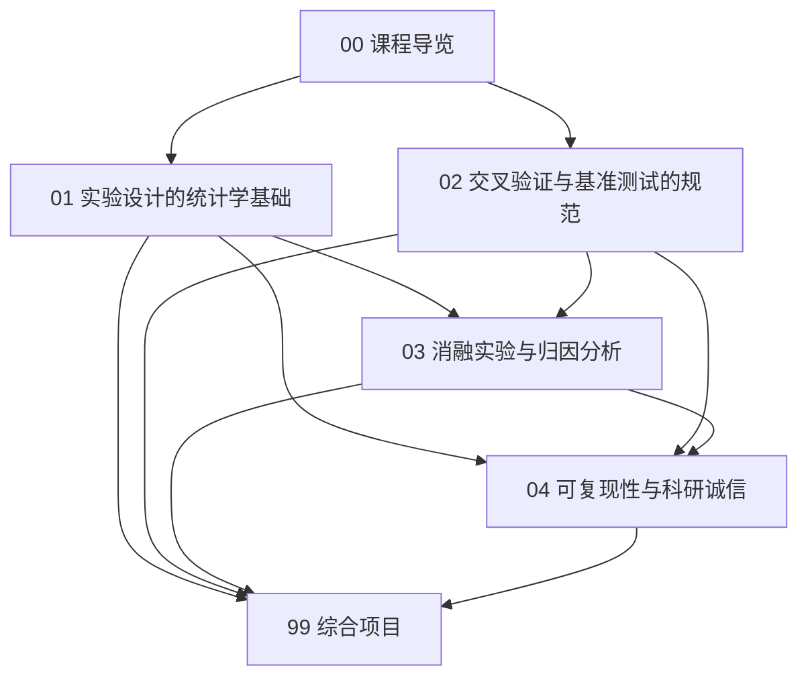

# 实验设计与评估 · 课程导览

> **本导览的作用**：说明本课程在整部教材中的位置、章节之间的依赖关系、建议学时与学习方法。请先读完本页再进入正文各章。

## 一、课程定位：从"调参侠"到"科研工作者"的分水岭

先看一个你一定经历过（或即将经历）的场景：你改了一行代码，指标从 87.3% 变成了 87.4%，于是你宣布"我的方法有效"。三个月后你才发现，换个随机种子，原方法也能跑到 87.5%——你为一个噪声涨落写了一整节"创新点"。

**会不会做实验、会不会评估，是"调参侠"与"科研工作者"的分水岭。** 调参侠的操作循环是：改代码 → 跑一次 → 数字变好就留下，变坏就回滚。科研工作者的操作循环是：提出假设 → 设计对照实验 → 控制与量化噪声 → 用统计工具判断差异是否超出噪声 → 归因 → 可复现地记录 → 谨慎外推。两者的差距不在模型能力，而在**对"证据"的处理方式**。

这门课的核心论点是一句话：**可信的实验是 AI 进步的货币**。深度学习领域大量"进步"后来被证明是幻觉：

- Lucic 等人（ICML 2018）对 GAN 变体的大规模研究发现，在公平调参后，多个"更强"的 GAN 变体与原始 WGAN 的差距基本消失；
- Henderson 等人（AAAI 2018）发现在深度强化学习中，代码级细节与随机种子带来的波动，常常大于论文里比较的算法间差异；
- Recht 等人（ICML 2019）构建 ImageNet-v2 发现，在原测试集上"刷"了七年的模型，到新测试集上掉了 10 个百分点以上——评测集本身被过拟合了。

这些论文共同指向一个结论：**没有实验设计与评估的训练，我们甚至无法回答"方法 A 是否优于方法 B"这个最基本的问题**。本课程就是要把回答这个问题的能力系统化地交给你。

本课程处在整部教材的"工程实践"模块，是《数据工程》的直系后续、毕业研究与《模型部署与 MLOps》的直接前置。学完本课，你应当能独立完成一次"统计上站得住、工程上可复现、报告上说得清"的实验研究——这正是研究生阶段与工业界研究岗的日常。

## 二、知识地图

各章核心问题一览：

| 章 | 核心问题 | 关键产出 |
|---|---|---|
| 01 统计学基础 | "提升 0.5%"是真实的还是噪声？多少次重复才够？ | 一套模型比较的统计检验流程（配对检验、多重比较校正、效应量、功效分析） |
| 02 交叉验证与基准测试 | 该怎么切数据？该信哪个排行榜？ | 切分方式决策树 + 泄漏案例集 + 评测集选择与污染检查规范 |
| 03 消融与归因 | "我的模块带来了提升"这句话如何证成？ | 因子实验设计方法 + 多种子方差实验 + "0.1% 提升判定流程" + 消融报告模板 |
| 04 可复现性与诚信 | 三个月后你还能得到同一个数字吗？ | 种子/环境/数据/代码四位一体的复现工程 + hydra/MLflow/Docker 工具链 + 论文复现方法论 |
| 99 综合项目 | 把四章连成一次完整的研究实践 | 复现报告、严谨的模型比较实验、个人实验追踪系统 |

四章的逻辑关系是一条"证据链"：第 1 章给你**判断证据强度的数学工具**；第 2 章保证证据的**来源（数据划分与评测集）没有作弊**；第 3 章保证证据能**归因到具体的设计决策**；第 4 章保证证据**可被任何人重新获得**，并以科研诚信兜底。

## 三、与其他课程的依赖关系

**前置课程（本课程直接使用其结论）：**

- 《概率论与数理统计》：第 5 章参数估计与统计推断（点估计、置信区间、假设检验的 Neyman–Pearson 框架）是第 1 章的直接地基，第 1 章只做"迁移到 ML 场景"的工作而非重讲；第 6 章采样方法与蒙特卡洛（bootstrap、随机化的思想）在第 1 章的置信区间与第 3 章的多种子实验中反复使用。
- 《最优化方法》：第 6 章（尤其 6.5 节超参数搜索与自动调参概览）给出的网格/随机/贝叶斯三类搜索与"评估昂贵且带噪声"的问题刻画，是第 3 章超参敏感性分析的前置。
- 《机器学习》：第 7 章模型评估选择与理论基础——交叉验证、指标选择、5×2cv 配对 t 检验、McNemar 检验与"最低标准实验报告清单"均已在彼处建立；本课程第 1、2 章在此基础上**深化**（数据集级检验、多重比较、嵌套 CV、基准测试规范），不再重复基本定义。
- 《Python 程序设计》：第 7 章软件工程实践（函数化、类型注解、pytest 测试）直接迁移到第 4 章的实验代码工程；第 4 章 NumPy 随机数生成器（`Generator` 与 seed）在第 3、4 章的种子控制中大量使用。
- 《数据工程》：第 4 章数据版本控制与数据质量体系（DVC、数据卡片）在第 4 章"可复现性四件套"中直接接管数据侧；第 5 章面向 AI 的数据集构建（"先切分后变换"、划分方式论证）是第 2 章泄漏防控的前置结论。

**后续课程（本章知识将被它们使用）：**

- 《模型部署与 MLOps》（编写中）：其"实验追踪与模型注册"主题直接复用第 4 章的 MLflow/W&B 与配置管理工作流；其"监控与漂移检测"一节是第 2 章评测思想的线上延伸——评测从"上线前一次性"变为"上线后持续性"；其"持续训练（CT）"流水线的触发条件（指标退化多少才重训）就是第 1 章假设检验的线上版本。
- 全部方向课程（《计算机视觉》《自然语言处理》《强化学习》等）的实验部分：你在那些课程里做任何实验，都应执行本课程的报告标准。

## 四、建议学时（约 24 学时）

按每周 2 学时、共 12 周设计，含上机与项目周：

| 周 | 内容 | 学时 |
|---|---|---|
| 1 | 课程导览 + 01 从"跑一次"到"可信结论"、三原则映射 | 2 |
| 2 | 01 假设检验、效应量与功效分析（上机：scipy 检验流程） | 2 |
| 3 | 02 交叉验证族与泄漏案例集（上机：GroupKFold 泄漏演示） | 2 |
| 4 | 02 嵌套 CV + 基准测试规范与"作弊"史 | 2 |
| 5 | 03 消融设计与因子实验（上机：2×2 因子分析） | 2 |
| 6 | 03 种子与方差、超参敏感性、"0.1% 判定流程"（上机） | 2 |
| 7 | 04 可复现性三层次 + 种子/环境/数据/代码工程（上机：自研 tracker） | 2 |
| 8 | 04 hydra + MLflow + Docker（上机） | 2 |
| 9 | 04 论文复现方法论与科研诚信 | 2 |
| 10–12 | 99 综合项目（选题、实验、报告、答辩） | 6 |

## 五、学习方法

1. **每章上机代码先跑通，再"破坏"它**。例如跑通泄漏演示后，故意把标准化移出 Pipeline 观察指标虚高——你亲手制造的每一个虚高数字，都是未来你避免的一次事故。
2. **建立自己的 checklist**。第 1 章的检验流程、第 2 章的切分决策树、第 3 章的"0.1% 判定流程"、第 4 章的复现清单，建议合并成一页"实验发车前检查单"，每次实验前过一遍。
3. **用怀疑的眼光重读你以前的实验**。学完第 1 章后，回去检查你《机器学习》课程项目里"均值 ± 标准差"来自几次运行？学完第 2 章后，检查你的数据划分是否真正隔离了"组"（用户/病人/会话）？
4. **报告数字，而非形容词**。"效果显著提升"是形容词；"8 个数据集上配对 Wilcoxon 检验 $p = 0.031$，平均提升 0.62%（95% CI $[0.15, 1.09]$），效应量 $d_z = 1.8$"是证据。本课程所有作业按此标准评分。
5. **复现是最好的精读**。第 4 章和第 99 章会要求你复现一篇论文——复现过程中你被迫回答论文没写的每一个细节，这是读一百篇 paper 也换不来的训练。
6. **诚实面对负面结果**。实验设计的成熟标志之一，是你能坦然写下"我们未能复现 X 的提升，可能原因是……"。这在科研上是贡献，不是失败。

## 六、环境准备

- Python ≥ 3.10；`numpy`、`scipy`、`scikit-learn`、`pandas`、`matplotlib`（全部为本教材通用的库）。
- 第 4 章工具链：`hydra-core`、`mlflow`（均可 `pip install`）、Docker Desktop（可选，无 Docker 也能完成主体内容）。
- 第 99 章项目：Git、（可选）DVC（`pip install dvc`，与《数据工程》共用配置）、一台有 GPU 的机器或 Colab/Kaggle 免费额度。

## 七、拓展阅读

- Xavier Bouthillier et al., *Accounting for Variance in Machine Learning Benchmarks*, MLSys 2021 —— 本课程的"精神坐标"之一：把实验方差分解到数据、初始化、数据顺序等来源并给出计算预算建议，第 1、3 章多处回指它。
- Joelle Pineau et al., *Improving Reproducibility in Machine Learning Research: A Report from the NeurIPS 2019 Reproducibility Program*, JMLR 2021 —— NeurIPS 可复现性计划的官方总结，第 4 章的复现标准与可复现性清单直接来自它。
- 其余真实文献在正文各章的"拓展阅读"小节逐章给出。
