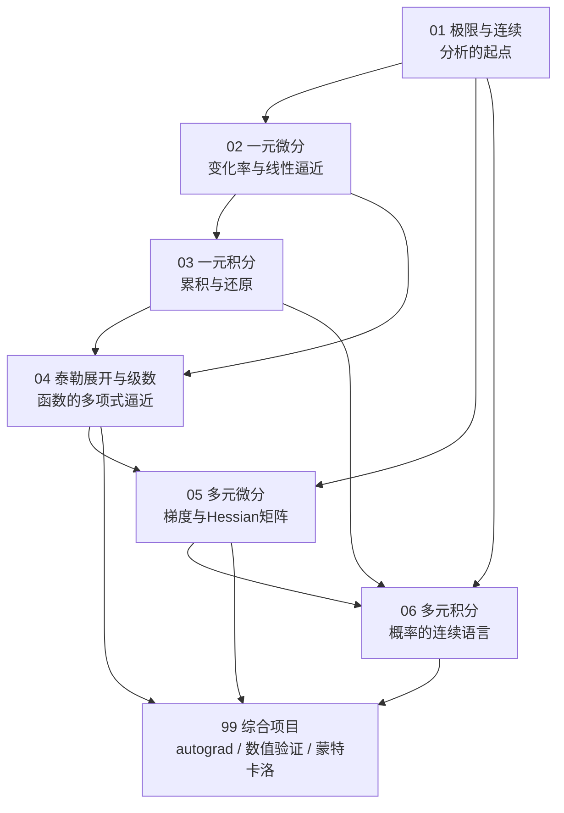

# 高等数学 · 课程导览

> **课程定位**：本课程是整部教材的第一门课，为后续的《线性代数》《概率论与数理统计》《最优化方法》以及《机器学习》《深度学习》提供分析学语言与分析工具。前置要求仅为基础的高中数学；完成本课程后，读者应能读懂梯度下降收敛性分析、反向传播推导与概率密度计算中的每一步。

## 0.0 课程学习目标

完成本课程后，你应当能够：

1. 用 $\varepsilon$-$N$ 与 $\varepsilon$-$\delta$ 语言陈述极限与连续的定义，并完成简单证明（第 1 章）。
2. 用导数与中值定理分析函数行为，写出梯度下降的一维收敛论证（第 2 章）。
3. 用牛顿-莱布尼茨公式、换元与分部积分法计算定积分与广义积分，并解释积分与期望的关系（第 3 章）。
4. 用泰勒展开对数值算法做误差定阶，陈述级数收敛判别法（第 4 章）。
5. 计算梯度与 Hessian，用多元链式法则手推简单网络的反向传播，用拉格朗日乘数法解等式约束优化（第 5 章）。
6. 用累次积分、雅可比行列式与坐标变换完成概率密度的归一化、边缘化与变量变换（第 6 章）。
7. 从零实现一个 naive autograd，建立数值梯度验证与蒙特卡洛误差分析的工程习惯（第 99 章）。

## 一、为什么 AI 学习者要学高等数学

许多初学者的疑问是："深度学习框架已经把求导、求和都封装好了，为什么还要手推极限、积分与泰勒展开？"答案有三层。

**第一层：AI 的每一个核心概念都是微积分概念。**

| AI 中的概念 | 本质上是 |
|---|---|
| 损失函数的最小化 | 多元函数的（局部）极值问题，依赖导数、梯度与 Hessian |
| 反向传播（backpropagation） | 多元复合函数的链式法则（chain rule）的系统化应用 |
| 学习率与收敛速度 | 泰勒展开的二阶近似 + 极限过程（步长 $\eta$ 何时使损失下降） |
| 交叉熵、KL 散度、期望损失 | 积分（对概率密度的加权累积） |
| 梯度裁剪、归一化、softmax | 指数函数与对数函数的分析性质 |
| 数值稳定性（如 `log-sum-exp` 技巧） | 泰勒展开与浮点误差分析 |
| 蒙特卡洛方法 | 积分的随机近似与误差阶估计 |

**第二层：严格的分析语言决定你能走多远。** 读懂一篇优化论文，需要能看懂 "当 $f$ 是 $L$-光滑（$L$-smooth）函数时，梯度下降以 $O(1/k)$ 收敛" 这类陈述。$L$-光滑的定义是 $f(y) \le f(x) + \nabla f(x)^\top(y-x) + \frac{L}{2}\|y-x\|^2$，它正是一元泰勒展开（本课程第 4 章）与多元泰勒展开（第 5 章）的直接推论。没有微积分的训练，这类语句只能被当作咒语死记；有了它，每一步都可见。

**第三层：从零实现是本教材的方法论，而微积分是"从零"的第一站。** 本课程大量使用 Python 做数值实验：用割线逼近切线来"看见"导数，用黎曼和逼近积分来"看见"累积，用有限差分验证梯度公式，用蒙特卡洛估计 $\pi$。亲手做过这些实验后，"自动微分不过是链式法则的记账系统"这句话才不再是抽象口号。

一句话总结：**机器学习是函数逼近的艺术，而微积分是研究函数的通用语言。**

## 二、知识地图：6 章 + 1 个综合项目

本课程共 6 个内容章与 1 个综合项目章，依赖关系为线性递进，中途不分支：

各章内容与使命：

| 章 | 主题 | 核心使命 | 直接服务的后续课程 |
|---|---|---|---|
| 01 | 极限与连续 | 掌握 $\varepsilon$-$\delta$ 语言，建立"无限过程可以精确谈论"的观念 | 一切收敛性证明；概率论中的连续性定理 |
| 02 | 一元微分 | 导数=瞬时变化率=线性逼近的斜率；中值定理与凸性 | 最优化（一维搜索、凸函数判别） |
| 03 | 一元积分 | 积分=累积=微分的逆运算；牛顿-莱布尼茨公式 | 概率论（期望、归一化常数）；机器学习的期望风险 |
| 04 | 泰勒展开与级数 | 用多项式逼近函数并控制误差 | 最优化（梯度法收敛率、牛顿法）；数值稳定性 |
| 05 | 多元微分 | 梯度、方向导数、Hessian、多元泰勒、拉格朗日乘数法 | **全课程最重要的一章**：反向传播、最优化方法的直接前置 |
| 06 | 多元积分 | 重积分、雅可比行列式、坐标变换 | 概率论（联合密度归一化、边缘密度、变换公式） |
| 99 | 综合项目 | 自动微分、数值梯度验证、蒙特卡洛 | 深度学习（autograd 机制）、实验设计与评估 |

**跨课程依赖关系**（引用其他课程时请使用相对路径，如 `[线性代数·课程导览](/xiaoshus-blog/textbooks/ai/math-foundations/linear-algebra/00/)`）：

- 本课程 → [线性代数](/xiaoshus-blog/textbooks/ai/math-foundations/linear-algebra/00/)：本课程第 5 章引入的"梯度是向量、Hessian 是矩阵、链式法则是矩阵乘法"的图像，是线代课程中矩阵微积分（Jacobian、链式法则的矩阵形式）的动机来源。两门课建议并行学习。
- 本课程 → [概率论与数理统计](/xiaoshus-blog/textbooks/ai/math-foundations/probability-statistics/00/)：第 3 章（积分=期望）、第 6 章（密度归一化与变量替换）是随机变量、连续分布两章的数学前置。
- 本课程 → [最优化方法](/xiaoshus-blog/textbooks/ai/math-foundations/optimization/00/)：第 2 章（极值条件、凸性）、第 4 章（泰勒余项→收敛率）、第 5 章（梯度/Hessian/拉格朗日乘数）几乎逐条映射到该课程的前四章。
- 本课程 → [深度学习](/xiaoshus-blog/textbooks/ai/ai-core/deep-learning/00/)：反向传播 = 第 5 章链式法则的工程化；学习率调度与收敛率 = 第 4 章；数值稳定性 = 第 4 章。

## 三、建议学时：约 72 学时

按每周 4 学时、共 18 教学周（含复习与项目周）安排：

| 周次 | 内容 | 学时 |
|---|---|---|
| 1–2 | 第 1 章 极限与连续 | 8 |
| 3–5 | 第 2 章 一元微分 | 10 |
| 6–7 | 第 3 章 一元积分 | 8 |
| 8–10 | 第 4 章 泰勒展开与级数 | 10 |
| 11–14 | 第 5 章 多元微分（含期中复习 2 学时） | 14 |
| 15–16 | 第 6 章 多元积分 | 8 |
| 17 | 综合项目（99 章，三选一至二） | 4 |
| 18 | 项目汇报与期末复习 | 4 |
| 合计 | | **72**（另建议 1:1 配比的自习与编程时间） |

**优先级提示**：若时间紧张，第 5 章（多元微分）是绝对不可压缩的一章；第 1 章的 $\varepsilon$-$\delta$ 证明可以"先读懂再会写"，但极限的直观与极限运算法则必须完全掌握。

## 四、学习方法建议

1. **三遍读法**：第一遍只读直觉与图像（每个定义前的"你已经在……见过"段落）；第二遍逐行推公式，补全每一步依据；第三遍合上书复述定义与定理条件。数学的准确性藏在"条件"里——洛必达法则的条件、泰勒余项的适用范围，都是考试与工程中真实出错的地方。
2. **每章必跑代码**。本课程的代码示例只依赖 `numpy`/`scipy`/`matplotlib`。建议把每个示例改成参数扫描实验（如把 $n$ 从 10 加大到 $10^6$，观察误差如何缩小），误差阶不是背出来的，是打印出来的。
3. **公式速查表是你的复习手册**。每章"关键公式速查"一节按"公式 + 适用条件"成对给出；建议做成 Anki 卡片，正面写公式、背面写条件与一个反例。
4. **与[《Python 程序设计》](/xiaoshus-blog/textbooks/ai/programming/python/00/)并行**。本课程用到 NumPy 广播、简单绘图与递归；不熟悉时回查该课程相应章节即可，不需要先修完。
5. **建立"AI 翻译表"**。学到每个数学对象时，问一句"它在 AI 里叫什么？"：导数→梯度的分量；多元链式法则→反向传播；拉格朗日乘数法→约束优化/对偶；积分→期望。本书每章"与前后章节的联系"一节就是为这个翻译表准备的素材。

## 五、示例与案例：一次完整的"数学 → AI"翻译

以 softmax 回归的损失函数为例，看看本课程六章的工具如何逐层登场——这正是"每章学的东西在 AI 里叫什么"的完整示范：

1. **极限与连续（第 1 章）**：softmax 的输出向量随输入变化连续变化，训练时"迭代序列收敛"的表述需要极限语言；$\mathrm{e} = \lim(1+\frac1n)^n$ 是 softmax 中指数函数的严格来源。
2. **一元微分（第 2 章）**：sigmoid 的导数 $\sigma'(x) = \sigma(x)(1-\sigma(x)) \le \frac14$——一个"乘积法则 + 链式法则"的五分钟计算，却是理解梯度消失的第一步。
3. **一元积分（第 3 章）**：连续标签分布下的期望损失 $\mathbb{E}[\ell] = \int \ell \,\mathrm{d}P$；交叉熵 $H(p,q) = -\int p \ln q$。
4. **泰勒展开（第 4 章）**：softmax 的稳定实现（减最大值）、log-sum-exp、以及学习率 $\eta$ 为何受 $L$-光滑约束，全部是泰勒余项的应用。
5. **多元微分（第 5 章）**：损失对 logits 的梯度恰好是 $\mathrm{softmax}(z) - y$——一次多元链式法则的手推；全部参数的梯度由反向传播（链式法则的逆序记账）给出。
6. **多元积分（第 6 章）**：输入特征服从某分布 $p(x)$ 时，期望损失是对 $(x,y)$ 联合密度的二重积分；正态先验的归一化常数 $\sqrt{2\pi}$ 来自极坐标技巧。

学完本课程，请回到这个例子，检查上述每一条你都能独立复现——它就是本课程的"结业自测题"。

## 六、常见误区与陷阱（学习层面）

1. **只看视频/只读定义，不做题不跑代码**。微积分是"手艺"，识别 $\varepsilon$-$\delta$ 证明的套路、找 $N$ 与 $\delta$ 的技巧只能通过动手获得；本教材每章代码务必运行并改造。
2. **跳章**。本课程的依赖是显式设计的：第 4 章大量引用第 2 章中值定理与第 3 章对数函数的定义；第 5 章直接复用第 4 章余项工具。跳章的代价在第 5 章（全课程枢纽）集中爆发。
3. **把"会算"当"会证"**。能求极限不等于能用 $\varepsilon$-$\delta$ 语言陈述定义；本课程考核的最低标准是"定义—条件—结论"三件套能默写。
4. **忽视反例**。每个定理的条件都对应一个反例（可导必连续但反之不然；幂级数收敛未必还原原函数）。收集反例是形成"定理条件敏感度"的最快路径，也是进入最优化/概率论后避免误用的保险。
5. **数学与工程两张皮**。学完梯度下降却没读过框架文档里的优化器章节，学完链式法则却没手写 autograd——本教材的立场是：第 99 章的三个项目是"及格线"而非"附加题"。

## 七、符号约定（全书统一）与关键公式总索引

- 自变量集合：$\mathbb{R}$ 实数轴，$\mathbb{R}^n$ 为 $n$ 维列向量空间；向量默认列向量，如 $x \in \mathbb{R}^n$。
- 范数：$\|x\|_2 = \sqrt{\sum_i x_i^2}$（默认），$\|x\|_1$、$\|x\|_\infty$ 见第 5 章。
- 导数记号：一元用 $f'(x)$ 或 $\frac{\mathrm{d}f}{\mathrm{d}x}$；多元偏导用 $\frac{\partial f}{\partial x_i}$，梯度记 $\nabla f$，Hessian 记 $\nabla^2 f$ 或 $H$。
- 小量记号：$o(\cdot)$ 与 $O(\cdot)$ 的严格定义在第 1 章引入，第 4 章起大量使用。
- 期望记号：$\mathbb{E}[X] = \int x f_X(x)\,\mathrm{d}x$（第 3、6 章给出积分论基础，概率课程给出测度论视角）。

**六章关键公式速查总索引**（各章正文末有完整版，此表供总复习时定位）：

| 章 | 最重要的 2–3 条公式 / 定理 |
|---|---|
| 01 | $\varepsilon$-$N$/$\varepsilon$-$\delta$ 定义；夹逼定理；$\lim_{x\to0}\frac{\sin x}{x}=1$；$\lim(1+\frac1n)^n=\mathrm{e}$ |
| 02 | 线性逼近 $f(x_0+h)=f(x_0)+f'h+o(h)$；Lagrange 中值定理；凸函数一阶刻画；一步下降量 $-\eta(1-\frac{L\eta}2)[f']^2$ |
| 03 | 牛顿-莱布尼茨公式；变上限求导；分部积分；$\mathbb{E}[X]=\int x f_X\,\mathrm{d}x$；p-积分判别 |
| 04 | Peano/Lagrange 余项泰勒公式；麦克劳林展开表；比值判别法；中心差分误差 $O(h^2)$；牛顿法二阶收敛 |
| 05 | 可微性 $o(\|\mathbf{h}\|)$ 定义；$D_\mathbf{u}f=\nabla f^\top\mathbf{u}$；链式法则 $\nabla_t L = J^\top\nabla_g L$；多元二阶泰勒；拉格朗日乘数条件 |
| 06 | Fubini 累次积分；换元 $\|\det J\|$；极坐标 $\mathrm{d}A = r\,\mathrm{d}r\mathrm{d}\theta$；$\int_{\mathbb{R}^2}\mathrm{e}^{-(x^2+y^2)/2}=2\pi$；密度变换公式 |

## 八、与前后章节的联系

- **向后**：本导览之后的第 1 章从数列极限开始。请确保你带着两个问题进入第 1 章：什么是"无限接近"的精确定义？为什么连续性在算法中重要（提示：迭代法的收敛点通常是某个连续映射的不动点）？
- **并行**：建议同时开始 [Python 程序设计](/xiaoshus-blog/textbooks/ai/programming/python/00/) 的学习，本课程所有数值实验都假设你已会用 NumPy 数组与 `matplotlib` 画简单折线图。

## 九、拓展阅读

- 同济大学数学系：《高等数学（第七版）》，高等教育出版社，2014。国内最通行的教材，习题丰富；适合作为本课程的"刷题伴侣"。
- Walter Rudin：《数学分析原理》（Principles of Mathematical Analysis，McGraw-Hill，第 3 版，1976；中译本机械工业出版社）。想彻底吃透 $\varepsilon$-$\delta$ 与一致连续时读第 1–5 章。
- Michael Spivak：《Calculus》（第 4 版，Publish or Perish，2008）。以习题驱动重建整个微积分，适合假期精读。
- 3Blue1Brown：《微积分的本质》（Essence of Calculus）视频系列（YouTube/Bilibili，2017）。开课第一周先看完，建立几何直觉。
- Gilbert Strang：《Calculus》（Wellesley-Cambridge Press，1991），配套 MIT OpenCourseWare 18.01/18.02 公开课。讲解视角面向应用，与本书"服务 AI"的取向一致。

## 十、进阶方向

完成本课程后的自然延伸路径（均在本教材体系内，括号内为所需本章知识）：

1. **凸优化入门**（第 2、4、5 章）：直接进入[最优化方法](/xiaoshus-blog/textbooks/ai/math-foundations/optimization/00/)，从凸集、凸函数的矩阵化定义读到梯度法收敛率——你会发现该课程前四章几乎是本课程第 2、4、5 章的"向量语言重写"。
2. **实分析深造**（第 1 章）：若你被 $\varepsilon$-$\delta$ 证明吸引，读 Rudin《数学分析原理》第 1–7 章，建立测度论前夜的分析功底；这是统计学习理论（泛化界证明）的语言。
3. **数值分析**（第 3、4 章）：数值积分、数值线性代数、误差分析的系统化，是科学机器学习（PINN、可微仿真）的基础设施。
4. **概率测度论**（第 3、6 章）：读完[概率论与数理统计](/xiaoshus-blog/textbooks/ai/math-foundations/probability-statistics/00/)后，若想理解大数定律与中心极限定理的"为什么成立"，进入基于测度论的概率论（如 Durrett《Probability: Theory and Examples》）。

## 十一、课后思考与练习

1. 列出你已知的三个 AI 概念，尝试为每个概念找到本导览表格中对应的微积分对象；若找不到，带着这个问题进入后续章节。
2. 用你自己的话（不超过三句）解释：为什么"导数是线性逼近"这个观点比"导数是瞬时变化率"更贴近最优化？
3. 编程热身：用 Python 打印 $(1+\tfrac{1}{n})^n$ 在 $n = 1, 10, 100, \dots, 10^6$ 处的值，观察其趋势并猜测极限（这是第 1 章第一个数值实验）。
4. 翻阅第 5 章目录，圈出你完全不认识的名词（如"Hessian""隐函数定理"）；学完本课程后回看，确认全部消除。
5. 开放思考：如果不学极限的概念，你在使用深度学习框架时会在哪些具体场景下"知道怎么做但不知道为什么"？
