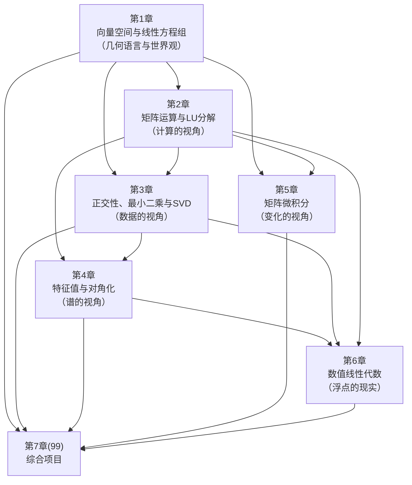

# 线性代数 · 课程导览

> **课程定位**：线性代数是整个人工智能知识体系的"语言"——数据以矩阵存储、模型以线性变换表达、学习过程以矩阵分解与矩阵微积分刻画。本课程是《高等数学》之后的第二门数学课，直接通向《最优化方法》《机器学习》《深度学习》。

## 一、课程定位：为什么 AI 需要线性代数

如果只用一句话概括本课程在 AI 体系中的位置，那就是：

- **数据是矩阵**。一张 $224 \times 224$ 的彩色图像是一个 $224 \times 224 \times 3$ 的张量；一段文本经过嵌入（embedding）后是一个向量序列；一个批量为 64 的训练批次是一个 $64 \times d$ 的矩阵。没有矩阵，就没有数据的统一表示。
- **模型是矩阵变换**。一个线性层就是 $y = Wx + b$；一个注意力层核心是 $\mathrm{softmax}(QK^\top/\sqrt{d})V$，其中每一步都是矩阵乘法。深度网络无非是"矩阵变换 + 非线性"的复合。
- **学习是矩阵分解**。主成分分析（PCA）是协方差矩阵的特征分解或 SVD；推荐系统的矩阵补全是低秩近似；LoRA 微调大模型的思想正是"权重更新是低秩矩阵"。甚至"训练"本身——梯度下降——其收敛速度也由 Hessian 矩阵的条件数决定。

因此，本课程的目标不是培养"会算行列式的人"，而是培养**能用线性代数的语言阅读 AI 论文、能用矩阵视角诊断工程问题**的人。学完本课程，当你再看到 `torch.matmul`、`np.linalg.svd`、梯度公式 $\frac{\partial L}{\partial W} = \delta x^\top$ 时，看到的应当是熟悉的几何与代数结构，而不是陌生的符号。

**前置要求**：

- 《高等数学》（`../01-高等数学/00-课程导览.md`）：一元与多元微积分、偏导数与梯度。本课程第 5 章（矩阵微积分）将直接建立在多元链式法则之上。
- 《Python 程序设计》（`../../二、程序设计/01-Python程序设计/00-课程导览.md`）：NumPy 基本用法。本课程所有代码示例基于 NumPy（个别处用 SciPy/Matplotlib）。

需要说明的是：即使你尚未学完多元微积分，第 1–4 章也可以完全正常学习；第 5 章开始才需要微积分工具。

## 二、知识地图：6 章的依赖关系

本课程共 6 章正文 + 1 个综合项目章，章与章之间是显式依赖的，建议按顺序学习：

各章一句话概括与"下游消费者"：

| 章 | 文件 | 核心问题 | 下游主要消费者 |
|---|---|---|---|
| 1 | `01-向量空间与线性方程组-AI的几何语言.md` | 数据如何成为向量？向量空间的结构是什么？ | 一切课程的底层语言；机器学习的特征空间 |
| 2 | `02-矩阵运算与LU分解-计算的视角.md` | 矩阵乘法到底是什么？如何在计算机上高效、稳定地解方程？ | 深度学习前向传播；最优化方法的牛顿法 |
| 3 | `03-正交性最小二乘与SVD.md` | 如何"最优地"投影与拟合？矩阵的"紧凑表示"是什么？ | PCA、推荐系统、LoRA、岭回归 |
| 4 | `04-特征值与对角化-谱视角.md` | 矩阵的"固有方向"是什么？ | 谱聚类、图神经网络、PageRank、PCA |
| 5 | `05-矩阵微积分-反向传播的数学基础.md` | 矩阵函数如何求导？反向传播公式从何而来？ | 深度学习反向传播；所有梯度类优化 |
| 6 | `06-数值线性代数-稳定性与浮点现实.md` | 理论公式在浮点计算机上还成立吗？ | 一切工程实践；模型部署与 MLOps |
| 99 | `99-综合项目.md` | 综合运用：PCA、PageRank、最小二乘三法对比 | 机器学习课程实验的预热 |

三条贯穿全课程的暗线（与全书方法论一致）：

1. **几何直觉线**：每个代数对象都配一个几何图像（向量是箭头、矩阵是变换、特征向量是不动方向、SVD 是旋转-缩放-旋转）。
2. **从零实现线**：LU、Gram-Schmidt、幂法、反向传播都要求亲手实现一遍，再对照 NumPy/SciPy 的成熟实现。
3. **工程现实线**：每章都讨论复杂度与数值稳定性，第 6 章将其系统化。

## 三、建议学时：约 64 学时

按"讲课 + 上机练习 = 2:1"的节奏分配（1 学时 = 45 分钟）：

| 章 | 讲课 | 上机/练习 | 合计 | 建议周数 |
|---|---|---|---|---|
| 第 1 章 向量空间与线性方程组 | 8 | 4 | 12 | 2 周 |
| 第 2 章 矩阵运算与 LU 分解 | 8 | 4 | 12 | 2 周 |
| 第 3 章 正交性、最小二乘与 SVD | 10 | 5 | 15 | 2.5 周 |
| 第 4 章 特征值与对角化 | 8 | 4 | 12 | 2 周 |
| 第 5 章 矩阵微积分 | 6 | 4 | 10 | 1.5 周 |
| 第 6 章 数值线性代数 | 4 | 3 | 7 | 1 周 |
| 综合项目（第 99 章） | 2 | 6 | 8 | 1 周（可跨到假期） |
| **合计** | **46** | **30** | **76 → 约合 64 标准学时** | 约 11 周 |

> 说明：表中合计 76 为"讲课+上机"原始学时，按 45 分钟标准学时折算并考虑部分上机与讲课合并进行，课程大纲按 **64 学时（4 学分）** 设计。若学时紧张，可压缩第 6 章（并入第 3、4 章的数值注记），但**不可压缩第 5 章**——它是《深度学习》反向传播的直接数学基础。

学习节奏建议：每章按"三遍法"学习——第一遍通读建立直觉（可配合可视化视频），第二遍精读推导并手算至少一个完整算例，第三遍完成编程练习并回填"关键公式速查"为自制卡片。

## 四、学习方法

**1. 几何图像优先，符号随后。** 遇到新概念，先问"它在 $\mathbb{R}^2$ 或 $\mathbb{R}^3$ 里长什么样"。例如"线性无关"是"没有向量落在其他向量张成的平面/直线上"，然后才是"$c_1 v_1 + \cdots + c_k v_k = 0$ 仅有零解"。3Blue1Brown 的《线性代数的本质》系列（见第 1 章拓展阅读）是建立图像的最佳材料，但它不能替代严格定义与证明——两者缺一不可。

**2. 手算是理解机制的最低成本方式。** 本课程每章都有"示例与案例"节，其中手算算例请务必**用纸笔完整做一遍**再对照代码输出。例如 3 阶矩阵的 LU 分解、2 阶矩阵的 SVD，手做一次胜过看十遍。

**3. 从零实现，再对照库。** 每章编程练习分两层：先用纯 Python/NumPy 从零实现算法（如幂法、Gram-Schmidt、反向传播），再调用 `np.linalg` 的成熟实现并比较结果与性能。只调库的人知其然，只手写的人不知其所以然——两层都做才完整。

**4. 时刻带着"复杂度与稳定性"两问。** 看到任何公式都问：这在 $n = 10^6$ 时还算得动吗（复杂度）？在浮点数下还算得对吗（条件数）？这两问贯穿第 2、3、6 章，也是工程师与"教科书读者"的分水岭。

**5. 主动建立跨课程连接。** 每章末尾的"与前后章节的联系"节给出了显式的指针（例如：第 3 章的低秩近似将被《机器学习》的 PCA 与《自然语言处理》的 LoRA 使用）。学到那里时，请翻回去重读对应章节——线性代数的知识在后续课程中会被**反复兑现**，这是本教材"不要跳章"设计的根本原因。

**6. 练习分三档，至少完成"基础 + 1 道进阶"。** 每章练习分为基础（巩固正文）、进阶（跨章综合）、挑战（研究生层次，如收敛性证明、论文复现）。按全书规范，每章至少做 3 道练习；有志于科研的读者请挑战最后一题。

## 五、与其他课程的依赖关系

**上游依赖**：

- 《高等数学》：第 5 章矩阵微积分直接使用其"多元函数偏导数、链式法则、梯度与方向导数、泰勒展开"等内容；第 6 章的误差分析用到极限与级数的基本直觉。
- 《Python 程序设计》：全部编程内容假定读者会用 NumPy 的数组操作、广播机制与向量化写法。

**下游输出**（线性代数知识在各门课中的兑现点）：

| 后续课程 | 使用本课程哪些内容 |
|---|---|
| 《概率论与数理统计》 | 随机向量、协方差矩阵（第 1、4 章）；多元正态分布的二次型（第 4 章正定矩阵） |
| 《最优化方法》 | Hessian 与正定性判别凸性（第 4、5 章）；条件数与收敛速度（第 6 章）；共轭梯度法（第 3、4 章） |
| 《机器学习》 | 最小二乘与线性回归（第 3 章）；PCA 与谱聚类（第 3、4 章）；支持向量机的对偶（第 2 章分块矩阵） |
| 《深度学习》 | 线性层与矩阵乘法（第 2 章）；反向传播（第 5 章）；LoRA 低秩微调（第 3 章）；参数初始化与谱归一化（第 4 章） |
| 《计算机视觉》 | 图像即矩阵（第 1 章）；SVD 图像压缩（第 3 章） |
| 《自然语言处理》 | 词向量空间（第 1 章）；注意力机制的矩阵视角（第 2 章）；LoRA（第 3 章） |
| 《模型部署与 MLOps》 | 量化与低秩分解加速推理（第 3、6 章） |

## 六、延伸资源总览

各章末尾均有针对性拓展阅读，这里只列**贯穿全课程**的三件套：

1. **Gilbert Strang, *Introduction to Linear Algebra*, 6th ed., Wellesley-Cambridge Press, 2023**，配套 MIT 18.06 公开课（OCW 上免费）。本课程的整体骨架（四大基本子空间、$Ax = b$ 的消元视角）深受其影响；适合作为平行教材同步阅读。
2. **Gene H. Golub & Charles F. Van Loan, *Matrix Computations*, 4th ed., Johns Hopkins University Press, 2013**——数值线性代数的圣经；第 2、3、6 章的算法细节与误差分析若想深究，查它。
3. **3Blue1Brown《线性代数的本质》（Essence of Linear Algebra）系列视频**（YouTube/Bilibili，免费）——建立几何直觉的第一站；适合在每章第一遍通读时配合观看对应集数。

## 七、写给读者的一句话

线性代数不是一门"背公式"的课，而是一次**视角的更换**：从"一个个数"换成"一整块变换"。AI 的所有模型——从线性回归到 GPT——都活动在这套语言之中。请带着"这段数学将在哪个模型里出现"的问题学习每一章，64 学时之后，你会发现自己读论文的眼光已经不同。

下一站：[第 1 章 向量空间与线性方程组](/xiaoshus-blog/textbooks/ai/math-foundations/linear-algebra/01/)。
