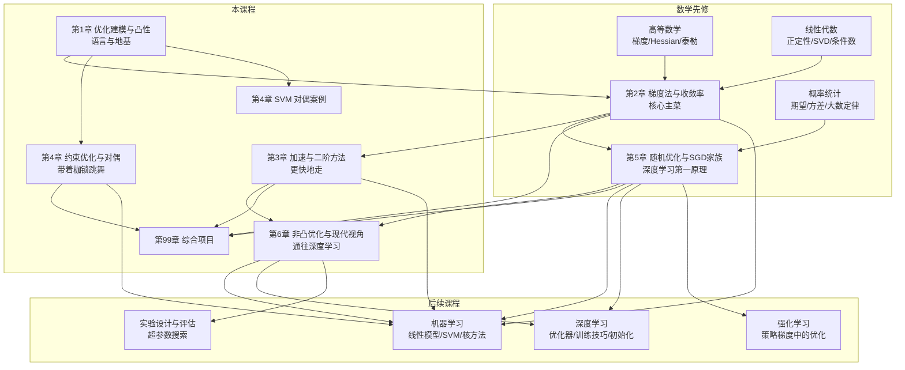

# 最优化方法 · 课程导览

> **课程定位**：本课程是数学基础模块的收官课程。训练任何一个机器学习模型——包括神经网络——本质上都是在求解一个大规模（非凸）优化问题。本课程把《高等数学》《线性代数》《概率论与数理统计》的语言汇聚成"如何让机器从数据中找到好的参数"这一核心能力，是通向《机器学习》《深度学习》《强化学习》的必经桥梁。前置要求：三门先修数学课全部完成；后续《机器学习》的线性模型/SVM/核方法、《深度学习》的优化器与训练技巧直接依赖本课程。

## 0.1 课程定位：为什么 AI 专业必须学最优化

先给出一个贯穿全课程的论断：

> **训练神经网络 = 求解一个大规模非凸优化问题。**

更具体地：当你在 PyTorch 中写下 `loss.backward(); optimizer.step()` 时，背后发生的事情是——

1. 你定义了一个**损失函数** $L(\theta)$：把"模型参数 $\theta$ 有多差"量化成一个可微函数（这是《高等数学》第 5 章多元微分学的直接应用）；
2. 你通过反向传播计算出梯度 $\nabla_\theta L$（这是《线性代数》第 5 章矩阵微积分的直接应用）；
3. 你用某个**优化算法**（SGD、Momentum、Adam……）沿着（近似）负梯度方向迭代更新参数，直到损失足够小。

前两步将在《深度学习》课程中详细展开；而**第三步的全部数学基础，就是本课程的内容**。深度学习工程实践中大部分"调参"——学习率、优化器选择、warmup、调度器、批量大小——都是在与本课程的概念打交道：

| 工程 "黑话" | 本课程中的数学 |
|---|---|
| 学习率太大 "炸了" / 太小 "不动" | 步长选择与收敛条件（第 2 章） |
| SGD 训练曲线后期震荡 | 噪声地板与学习率调度（第 5 章） |
| Adam 是默认优化器 | 自适应步长的矩估计推导（第 5 章） |
| warmup、cosine 调度 | 学习率调度策略（第 5 章） |
| loss 曲面 "坑太多" | 鞍点、平坦区与损失景观（第 6 章） |
| SVM 为什么可以核化 | 对偶理论与 KKT 条件（第 4 章） |
| 病态损失、参数间耦合 | 条件数与 zigzag 现象（第 2 章） |

因此本课程的位置可以用一句话概括：**最优化是连接数学与机器学习的桥梁**——上游是三门数学课，下游是整个 AI 核心模块。

## 0.2 与先修课程的依赖关系

本课程会显式引用以下结论（学习时如感生疏，请回查对应章节）：

| 先修内容 | 在本课程中的用途 | 主要出现在 |
|---|---|---|
| 梯度、Hessian、一阶/二阶泰勒展开（[高等数学·第5章](/xiaoshus-blog/textbooks/ai/math-foundations/calculus/05/)、[第4章](/xiaoshus-blog/textbooks/ai/math-foundations/calculus/04/)） | 梯度法 = 一阶泰勒近似 + 下降；牛顿法 = 二阶泰勒近似 + 求根；收敛率证明中反复使用泰勒展开 | 第 2、3 章 |
| 拉格朗日乘数法初步（[高等数学·第5章](/xiaoshus-blog/textbooks/ai/math-foundations/calculus/05/)） | 升级为完整的拉格朗日对偶理论与 KKT 条件 | 第 4 章 |
| 正定性、特征值分解（[线性代数·第4章](/xiaoshus-blog/textbooks/ai/math-foundations/linear-algebra/04/)） | 凸性的二阶判别、强凸性、二次函数收敛的谱分析 | 第 1、2、3 章 |
| SVD 与条件数（[线性代数·第3章](/xiaoshus-blog/textbooks/ai/math-foundations/linear-algebra/03/)、[第6章](/xiaoshus-blog/textbooks/ai/math-foundations/linear-algebra/06/)） | 病态问题、zigzag 现象的几何解释、最小二乘求解 | 第 1、2、3 章 |
| 矩阵微积分（[线性代数·第5章](/xiaoshus-blog/textbooks/ai/math-foundations/linear-algebra/05/)） | 各机器学习损失函数梯度的显式计算 | 第 1、5 章 |
| 期望、方差、大数定律、条件期望（[概率统计·第3章](/xiaoshus-blog/textbooks/ai/math-foundations/probability-statistics/03/)） | 随机梯度 = 梯度的无偏估计 + 噪声；SGD 收敛分析 | 第 5 章 |
| 极限与收敛阶（[高等数学·第1章](/xiaoshus-blog/textbooks/ai/math-foundations/calculus/01/)） | 收敛率 $O(1/k)$、$O(\rho^k)$、$O(1/k^2)$ 的严格含义 | 第 2、3 章 |

## 0.3 知识地图



一条主线贯穿始终：**"先确定基准（梯度法 + 收敛率），再不断放松假设、加速迭代"**——从凸到非凸、从确定到随机、从一阶到二阶。每引入一个新方法，都要回答三个问题：它在什么假设下收敛？比基准快多少？代价是什么？

## 0.4 章节大纲与建议学时（共 48 学时）

| 章 | 文件 | 内容 | 学时 |
|---|---|---|---|
| 导览 | `00-课程导览.md` | 课程定位、知识地图、学习方法 | 1 |
| 第 1 章 | `01-优化问题建模与凸性.md` | 标准形式、凸集/凸函数、凸性判别、常见凸函数库、三个机器学习问题的优化表述 | 6 |
| 第 2 章 | `02-梯度法与收敛率.md` | 梯度下降、线搜索、$O(1/k)$ 严格证明、强凸线性收敛、病态与 zigzag | **10**（全课程核心） |
| 第 3 章 | `03-无约束优化的加速与二阶方法.md` | 动量、Nesterov 加速、牛顿法、DFP/BFGS/L-BFGS、高斯-牛顿/LM、方法选择决策表 | 6 |
| 第 4 章 | `04-约束优化与对偶理论.md` | 拉格朗日函数、对偶、弱/强对偶、Slater、KKT 完整推导、SVM 贯穿案例 | 8 |
| 第 5 章 | `05-随机优化与SGD家族.md` | 期望/经验损失、SGD、噪声下收敛、调度器、Momentum/AdaGrad/RMSProp/Adam、批量-学习率权衡 | 8 |
| 第 6 章 | `06-非凸优化与现代视角.md` | 鞍点/平坦区、SGD 逃离鞍点、损失景观、过参数化与隐式偏差、超参数搜索 | 5 |
| 综合项目 | `99-综合项目.md` | 优化器轨迹可视化对比、从零实现 Adam、cvxpy 求 SVM 对偶并验证 KKT | 4 |

学时分配体现重心：**第 2 章与第 5 章合计近一半学时**——前者是全部收敛分析的范式源头，后者是深度学习训练的第一原理。若自学时间紧张，保底掌握这两章 + 第 4 章的 SVM 案例。

## 0.5 学完本课程你将获得什么

到课程结束，你应该能够：

1. 把线性回归、逻辑回归、SVM、神经网络训练统一写成"最小化损失函数"的优化问题，并分析其凸性与光滑性；
2. 对任意一个新优化器，读懂它的收敛性声明（什么假设、什么率、什么度量），而不是只看营销式的"更快"；
3. 从零实现并正确调参 SGD、Momentum、AdaGrad、RMSProp、Adam，理解每个超参数的数学含义；
4. 独立完成 SVM 的对偶推导并用代码验证 KKT 条件；
5. 面对训练失败（不收敛、震荡、卡住）时，用本课程的语言定位原因并给出修正方案。

## 0.6 学习方法

1. **推导亲手过一遍**。本课程的灵魂是第 2 章的 $O(1/k)$ 证明：下降引理 → 切线不等式 → 裂项求和，三步各只有几行，但合起来是整个现代优化分析范式的模板。请用纸笔完整抄写推导，再尝试不看书法复述。
2. **每个算法都跑一次"玩具实验"**。在二维或低维问题上把迭代轨迹画出来（等高线 + 折线），几何直觉比十页推导更持久。课程所有代码只依赖 numpy/matplotlib（个别项目用 cvxpy），笔记本即可运行。
3. **建立"假设—结论"卡片**。每章的收敛定理都长这样："若 $f$ 满足 A（光滑）+ B（凸/强凸），步长取 C，则 D（收敛率）"。把 A/B/C/D 整理成表，你会发现所有定理其实是同一张表的填充游戏。
4. **用工程现象反推数学**。遇到"训练炸了""loss 不降""后段震荡"，强迫自己用本章概念写出一句诊断（如"学习率超过 $2/L$，二次函数上发散"），再验证。这是把知识变成能力的唯一路径。
5. **先修查漏**。本课程对三门前置课的引用是显式的（见 0.2 节表格）；碰到陌生引用，先回查再继续，不要带着缺口往前走。

## 0.7 每章学习闭环与节奏安排

**单章闭环**（建议 4–6 学时/章，按 0.4 节学时分配放大核心章）：

1. **预读**（15 分钟）：只读"本章定位"与"学习目标"，带着问题进入正文；
2. **精读推导**（60–120 分钟）：纸笔跟写全部关键推导（第 2 章的定理 2.4 是必过项），在每个"依据"处自问"换我写得出吗"；
3. **跑代码**（30–60 分钟）：把本章示例代码运行并至少修改一处参数观察变化，形成"动手实验"的记录；
4. **公式速查卡**（15 分钟）：把"关键公式速查"抄成自己的卡片，补上每条公式的适用条件——条件比公式本身更常考也更常用；
5. **练习**（60 分钟）：至少 3 题（概念 1 + 计算/编程 2），挑战题视余力；
6. **回望**（10 分钟）：重读"与前后章节的联系"，在知识地图上标注本章位置，写下一句"本章给下一章留下了什么钩子"。

**课程整体节奏**（按 16 周学期 × 每周 3 学时估算；若自学压缩见 99 章的时间表）：

| 周 | 内容 | 里程碑 |
|---|---|---|
| 1 | 导览 + 第 1 章前半 | 能把三个 ML 问题写成标准形式 |
| 2 | 第 1 章后半 | 凸性判别"元件表"内化 |
| 3–4 | 第 2 章前半（算法与步长） | 手推定理 2.4 |
| 5 | 第 2 章后半（强凸与几何） | zigzag 实验完成 |
| 6 | 第 3 章 | Rosenbrock 对比实验完成 |
| 7–8 | 第 4 章 | SVM 对偶全链条独立推导 + cvxpy 验证 |
| 9–10 | 第 5 章 | 五优化器从零实现完成 |
| 11 | 第 6 章 | 损失景观切片实验完成 |
| 12 | 综合项目与汇报 | 三个项目至少完成两个 |

## 0.8 全书方法论在本课程中的体现

全书三条主线在本课程的具体形态：

1. **数学语言主线**：本课程是三门数学课的"总装车间"。你会反复经历"同一个对象换名字"的时刻：《线性代数》的条件数在《最优化》里叫病态度、《概率统计》的梯度噪声估计在 SGD 里叫随机逼近、《高等数学》的泰勒展开在收敛率证明里是唯一的局部工具。把这些等价关系写成你自己的对照表，是本课程最重要的一次知识整合。
2. **从零实现主线**：本课程全部算法（GD、动量、Adam、投影梯度、对偶验证）都能在 50 行 numpy 内实现——这个刻意选择是为了让"每个超参数都有数学含义"变得可触摸。调库（scipy/cvxpy）放在每个主题的收尾，作为工程对照。
3. **工程现实主线**：每章的"常见误区与陷阱"一节都是真实工程失败的抽象：学习率爆炸（第 2 章）、Adam 后期停摆（第 5 章）、QP 数值病态（第 4 章）、切片图误导（第 6 章）。学习时请把"陷阱"当成"故障排查手册"来读。

## 0.9 环境准备

全部代码在 Python 3.9+ 下验证，依赖：

```bash
pip install numpy matplotlib scipy scikit-learn   # 全课程正文
pip install cvxpy                                  # 第 4 章案例与综合项目 3
```

绘图统一使用 matplotlib 的等高线函数 `contour`/`contourf`；随机实验请固定随机种子（如 `np.random.seed(0)`）以保证结果可复现。

## 0.10 常见问题（FAQ）

**Q1：可以跳过第 2 章的证明直接学第 5 章的 Adam 吗？**
不推荐。第 5 章所有结论都是第 2 章定理的"随机化版本"，跳过前者后你只能死记 Adam 的超参默认值，无法理解"为什么学习率要衰减""为什么批量大了学习率可以大"。第 2 章的三步证明是全课程唯一必须手推的内容。

**Q2：需要先学完《概率论与数理统计》吗？**
第 1–4 章不需要（只用期望/方差的初等性质）；第 5 章起需要期望、方差、独立性与大数定律（其第 3 章）。理想节奏是两门课并行，最优化先修到第 4 章。

**Q3：本课程与《机器学习》里的"训练模型"有什么分工？**
本课程回答"给定损失函数，怎么降下去、降多快、有什么保证"；《机器学习》回答"损失函数应该怎么设计、解的性质（泛化）如何"。SVM 是典型的交叉地带：本课程第 4 章给出对偶与 KKT 的数学，《机器学习》给出间隔、软间隔与核方法的统计动机。

**Q4：练习做不出挑战题怎么办？**
挑战题定位在研究生层次（下界证明、论文复现），设计上就允许"读文献后复述骨架"。完成基础题（6–10 题中的 3 题以上）即可通过本章；挑战题的价值在于给你一个"向上够"的把手。

**Q5：代码报错/结果对不上理论，先检查什么？**
顺序：随机种子是否固定 → 数值稳定写法（`logaddexp`、除零保护）→ 学习率是否在稳定区间（第 2 章 2.3 的 $2/L$ 上界）→ 梯度解析式是否正确（有限差分验证，99 章项目一任务 A 的标准动作）。99 章 0.6 节有完整的故障排查表。

**Q6：学完本课程能直接看懂深度学习论文的优化部分吗？**
优化器、调度器、批量-学习率、初始化与鞍点相关内容（第 2、3、5、6 章）可以直接读懂；收敛性证明类论文（如 AMSGrad、ONORM）还需要补 Lyapunov 分析与更现代的非凸 SGDT 理论（各章"进阶方向"已给出路径）。

## 0.11 课程自测基线

开始学习前，建议确认以下问题都能不查书答出（均为前置课程内容）：

1. 写出 $f:\mathbb{R}^n \to \mathbb{R}$ 在 $x$ 处的一阶、二阶泰勒展开；梯度的定义与几何意义是什么？
2. 什么是对称矩阵的正定性？如何用特征值判定？
3. 条件数 $\kappa(A)$ 的定义是什么？它如何影响线性方程组求解的数值稳定性？
4. 什么是无偏估计？样本均值估计期望的方差与样本量是什么关系？
5. 拉格朗日乘数法处理的是哪一类约束问题？它的驻点条件是什么？

若第 1、2 题答不出，请先复习[高等数学·第5章](/xiaoshus-blog/textbooks/ai/math-foundations/calculus/05/)与[线性代数·第4章](/xiaoshus-blog/textbooks/ai/math-foundations/linear-algebra/04/)——本课程第 2 章起将默认这些内容。

## 0.12 符号约定（全书统一）

| 符号 | 含义 | 首次出现 |
|---|---|---|
| $x, w, \theta$ | 决策变量 / 线性模型权重 / 神经网络参数（粗体小写为向量） | 第 1、5 章 |
| $f, L, \hat{L}$ | 一般目标函数 / 期望风险 / 经验风险 | 第 1、5 章 |
| $\nabla f(x)$, $\nabla^2 f(x)$ | 梯度 / Hessian 矩阵 | 第 2 章 |
| $\| \cdot \|$ | 默认欧氏范数 $\|\cdot\|_2$；其他范数带下标 | 第 1 章 |
| $A \succeq 0$，$A \succ 0$ | 对称矩阵半正定 / 正定 | 第 1 章 |
| $L$, $\mu$ | 光滑常数（曲率上界）/ 强凸参数（曲率下界），$\kappa = L/\mu$ | 第 2 章 |
| $\eta_k$（有时写 $t_k$） | 第 $k$ 步的学习率/步长 | 第 2 章 |
| $\odot$ | 向量（矩阵）逐元素乘（Hadamard 积） | 第 5 章 |
| $\mathbb{E}[\cdot]$，$\mathrm{Var}[\cdot]$ | 期望 / 方差（对哪个随机源取期望在下标或上下文说明） | 第 5 章 |
| $g(\lambda, \nu)$, $p^\star$, $d^\star$ | 对偶函数 / 原问题最优值 / 对偶问题最优值 | 第 4 章 |
| s.t. | subject to（约束为） | 第 1 章 |
| $O(\cdot)$，$O(\rho^k)$ | 渐近上界 / 线性收敛因子 $\rho$ | 第 2 章 |

各章首次出现的新术语一律附英文原词；机器学习侧的名词（如 support vectors、momentum）在《机器学习》课程中有更系统的术语表。

## 0.13 与经典教材的章节对照

自学或查证时，可按下表把本课程各章映射到两本经典教材（均在各章"拓展阅读"中给出完整书目信息）：

| 本课程 | Boyd & Vandenberghe《Convex Optimization》 | Nocedal & Wright《Numerical Optimization》 | Nesterov《Introductory Lectures》 |
|---|---|---|---|
| 第 1 章 凸性 | 第 2–3 章 | — | 第 1 章 |
| 第 2 章 梯度法与收敛率 | 第 9.3 节 | 第 3 章 | 第 2.1 节 |
| 第 3 章 加速与二阶方法 | 第 9.5 节（牛顿法） | 第 6–7 章 | 第 2.2 节 |
| 第 4 章 对偶与 KKT | 第 4–5 章 | — | 第 3 章 |
| 第 5 章 SGD 家族 | — | — | 第 2 章（对照） |
| 第 6 章 非凸视角 | — | 第 9 章（导数免费的trust-region思想） | — |

注意本课程为 AI 读者做了取舍：凸集拓扑细节（分离定理、锥）与线搜索的 Wolfe 条件等"教材完整性"内容压缩为一句话指引，读者可按需回查上表。

## 0.14 考核与自查建议

- **过程分**（建议 50%）：每章练习 ≥ 3 题 + 代码实验记录；
- **项目分**（建议 40%）：99 章三个项目至少完成两个，按其验收标准逐项自查；
- **概念分**（建议 10%）：能对 0.1 节表格中的每条"工程黑话"给出数学解释。

一份可靠的"学成"信号：给你一个从未见过的训练曲线（loss vs step）与超参数记录，你能在 15 分钟内用本课程的语言写出三条诊断假设与对应验证动作。

## 0.15 三种学习者路径

| 路径 | 适用读者 | 建议取舍 |
|---|---|---|
| 完整路径 | 数学/理论方向 | 全部章节 + 全部推导 + 3 个综合项目；挑战题至少完成 2 题 |
| 工程优先路径 | 尽快上手深度学习 | 第 1 章快速过（重例题轻证明）→ 第 2 章精读 → 第 3 章只学动量与决策表 → 第 4 章只学 SVM 案例链 → 第 5 章精读 → 第 6 章通读；项目一、二 |
| 理论优先路径 | 准备读研/读论文 | 完整路径基础上，补 Nesterov 书第 2 章与 Bubeck《Convex Optimization: Algorithms and Complexity》第 3–5 章，完成各章挑战题 |

无论哪条路径，第 2 章的定理 2.4 证明与第 5 章的 Adam 推导都是不可省略的核心；它们分别代表"确定性收敛分析"与"随机优化工程"两个能力面。

## 0.16 学习资源索引

**视频课程**：斯坦福 EE364a（凸优化，Boyd）；CMU 10-725（Optimization，Tibshirani/Kolter 版本，与本课程第 2–5 章高度重合）；吴恩达深度学习专项课程的"优化"周（工程视角的第 5 章速成版）。

**工具文档**：cvxpy 官方文档（DCP 规则的权威表述，配合第 1 章 1.5 节阅读）；scipy.optimize 文档（`minimize` 的各方法对照 3.6 节决策表）；PyTorch `torch.optim` 文档（每个优化器的更新式都能在第 3、5 章找到原型）。

**书内资源**：各章"关键公式速查"是复习手册；"常见误区与陷阱"是排错手册；99 章 0.6 节是故障排查总表。三者构成你的"随身工具箱"。

**社区资源**：Boyd 书官网附习题答案；Nesterov 书的勘误表作者主页可查；遇到论文中的优化术语（如 "PL 条件" "Polyak step size"），先回本课程对应章找概念锚点再读原文。

## 0.17 高频术语中英对照速查

| 中文 | 英文 | 中文 | 英文 |
|---|---|---|---|
| 凸集/凸函数 | convex set / function | 强凸 | strong convexity |
| 局部/全局最优 | local / global optimum | 光滑性 | smoothness |
| 梯度下降 | gradient descent | 条件数 | condition number |
| 线搜索 | line search | 鞍点 | saddle point |
| 动量 | momentum | 学习率 | learning rate / step size |
| 牛顿法 | Newton's method | 病态问题 | ill-conditioned problem |
| 拉格朗日函数 | Lagrangian | 对偶 | duality |
| KKT 条件 | Karush–Kuhn–Tucker conditions | 互补松弛 | complementary slackness |
| 支持向量 | support vector | 影子价格 | shadow price |
| 随机梯度下降 | stochastic gradient descent (SGD) | 小批量 | mini-batch |
| 偏差修正 | bias correction | 学习率调度 | learning rate schedule |
| 损失景观 | loss landscape | 隐式偏差 | implicit bias |
| 过参数化 | overparameterization | 贝叶斯优化 | Bayesian optimization |
