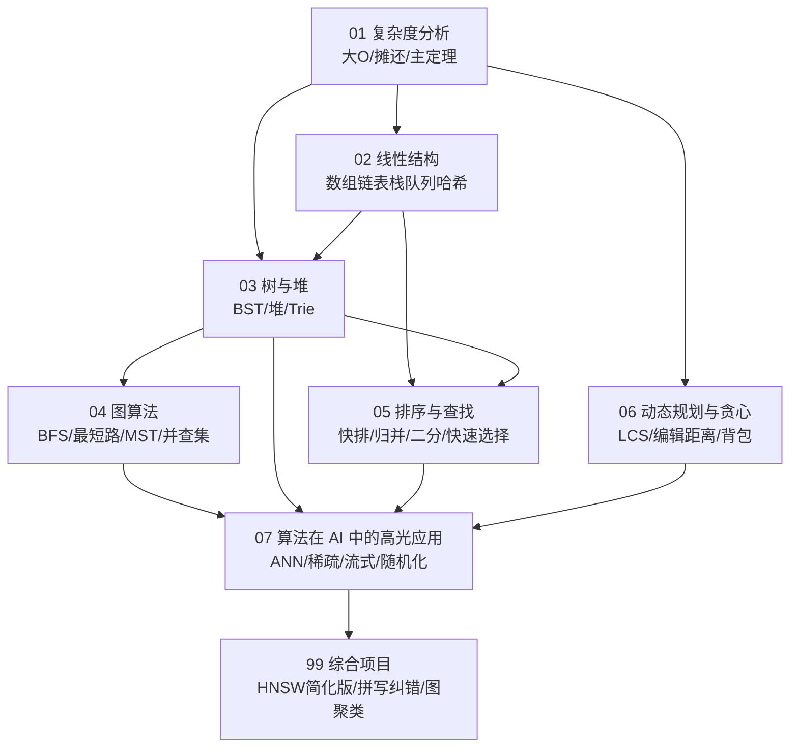

# 数据结构与算法 · 课程导览

> **本章定位**：本文件是《数据结构与算法》课程的导览图。前序课程为《Python 程序设计》（语言核心、NumPy），后续课程《机器学习》《深度学习》《数据工程》《模型部署与 MLOps》中的大量工程手段都建立在本课程的抽象与复杂度意识之上。请先读本文件再进入正章。

## 0.1 课程定位：为什么 AI 学习者必须认真学算法

很多同学第一次觉得"算法无用"，是因为练习停留在排序与刷题，看不到它和模型的联系。我们换一个视角：**算法思维决定你能优化的深度**。看三个真实场景：

- **场景一：Data Loader。** 训练一个视觉模型时，GPU 的利用率常常卡在 40%。瓶颈往往不在计算，而在数据供给：如何按长度/尺寸分桶组 batch（排序）、如何在十亿级样本中无偏采样（蓄水池采样）、如何缓存去重（哈希与布隆过滤器）——这些都是纯算法问题。数据供给速度上不去，再大的显卡也在空转。
- **场景二：ANN 检索。** 推荐系统与 RAG 的核心一环是"从一亿个向量里找出与查询向量最近的 K 个"。暴力比对是 $O(nD)$，一亿次浮点乘加要花数百毫秒；而 HNSW 等近似最近邻（ANN）索引利用跳表式的分层图结构，把它降到近似 $O(\log n)$——工程上 1000 倍的加速差，全部来自图结构 + 贪心搜索 + 优先队列这些"老"算法。
- **场景三：图算法。** 深度学习框架执行反向传播前，必须先对计算图做**拓扑排序**；知识图谱问答本质是图上的子图匹配与路径搜索；图神经网络的数据预处理依赖邻接表、度分布统计与采样。不懂图，就不懂框架在替你做什么。

因此本课程的目标不是"背诵经典算法"，而是建立三种可迁移的能力：

1. **算账能力**：拿到任何方案，能立刻估算"数据规模 × 复杂度 = 运行时间/内存"，判断它在真实数据量下是否可行。
2. **抽象能力**：把一个 AI 工程问题识别为线性结构、树、图、哈希、DP 中哪一类已知问题，从而调用（或改造）成熟解法。
3. **证明与权衡意识**：知道"这个算法为什么正确、那个优化牺牲了什么"（如 ANN 牺牲召回率换速度、贪心牺牲最优性换效率）。

## 0.2 知识地图

本课程共 8 个正章 + 1 个综合项目章，按"分析工具 → 基础结构 → 非线性结构 → 设计范式 → AI 应用"层层递进：

各章一句话摘要：

| 章 | 主题 | 对 AI 的直接落点 |
|---|---|---|
| 01 | 复杂度分析：大 O/Ω/Θ、摊还分析、主定理 | 估算训练/推理时间与显存，判断方案可行性 |
| 02 | 数组、链表、栈、队列、哈希表；双指针与滑动窗口 | 词表（vocab）查找、Embedding 查表、批处理窗口 |
| 03 | 二叉树、BST、平衡树思想、堆、B 树、Trie | 优先队列调度、前缀匹配（分词器/自动补全） |
| 04 | 图表示、BFS/DFS、拓扑排序、最短路、MST、并查集 | 计算图与自动微分、知识图谱查询、图聚类 |
| 05 | 快排/归并/堆排、下界、二分、快速选择 | 按长度分桶 batching、Top-K 检索 |
| 06 | 动态规划与贪心：LCS、编辑距离、背包、交换论证 | WER/CER 评测、对齐、序列决策 |
| 07 | 近邻搜索（KD 树/HNSW）、稀疏矩阵、流式与随机化算法 | RAG 检索、大词表 Embedding、流式数据工程 |
| 99 | 综合项目 | 把以上内容串成可验证的工程作品 |

## 0.3 与其他课程的依赖关系

**前置依赖：**

- 《Python 程序设计》：你需要熟练使用列表/字典/集合、切片、`collections` 模块（`deque`、`Counter`、`defaultdict`）、`heapq`，以及 NumPy 的向量化写法。本课程默认这些已掌握，不再重复讲授。
- 《高等数学》《线性代数》：01 章的复杂度函数分析需要基本的函数增长与求和知识；07 章的向量检索需要向量内积与余弦相似度。不要求精通，遇到回看即可。

**后续去向（本章知识将被哪门课的哪个主题使用）：**

- **《机器学习》**：第 2 章哈希表 → 特征哈希（feature hashing / hashing trick）；第 5 章排序与快速选择 → KNN 的 Top-K 与决策树特征划分；第 7 章近邻搜索 → KNN 与核方法在大数据下的可行性。
- **《深度学习》**：第 4 章拓扑排序 → 反向传播的计算图求值顺序；第 2 章哈希表 → 词表与 Embedding 查表；第 1 章复杂度 → attention $O(n^2)$ 瓶颈与各种线性注意力的动机。
- **《自然语言处理》**：第 3 章 Trie → BPE 分词器的前缀匹配；第 6 章编辑距离 → 词错误率（WER）评测与拼写纠错。
- **《知识表示与推理》**：第 4 章图算法 → 知识图谱存储（邻接表/稀疏矩阵）与多跳查询。
- **《数据工程》**：第 5 章排序 → 外部排序与 shuffle；第 7 章流式算法 → 超大规模数据的去重、计数与采样。
- **《模型部署与 MLOps》**：第 7 章 ANN 索引 → 向量数据库；第 3 章堆 → batching 调度与请求优先级。

## 0.4 建议学时与学习节奏

全课程约 **64 学时**（每学时 45 分钟），分配建议：

| 章 | 讲授 | 实验/练习 | 合计 |
|---|---|---|---|
| 00 课程导览 | 1 | 0 | 1 |
| 01 复杂度分析 | 5 | 2 | 7 |
| 02 线性结构 | 6 | 3 | 9 |
| 03 树与堆 | 6 | 3 | 9 |
| 04 图算法 | 7 | 3 | 10 |
| 05 排序与查找 | 6 | 2 | 8 |
| 06 动态规划与贪心 | 7 | 3 | 10 |
| 07 算法在 AI 中的高光应用 | 5 | 2 | 7 |
| 99 综合项目 | 0 | 3+课外 | 3 |
| **合计** | | | **64** |

以一学期 16 周计，平均每周 4 学时：2 学时讲授 + 2 学时上机。第 8–10 周（图算法与 DP）是难度高峰，请预留课外时间。

## 0.5 学习方法

1. **先算账，再写码。** 每写一个函数前，先在注释里写下它的时间/空间复杂度和你预期的数据规模。养成"规模意识"：$n=10^4$ 时 $O(n^2)$ 是 1 亿次操作，约 10 秒；$n=10^8$ 时同样写法就是天文数字。
2. **从零实现一遍，再用标准库。** 本教材每章都提供"手写版"（理解机制）与"库版"（工程用法），例如自己写二叉堆，再用 `heapq`。只停留在调用库，你永远不知道 `heapq` 为什么是"最小堆"以及为什么它不是线程安全的。
3. **把证明当代码读。** 算法的正确性证明（如 Dijkstra 的贪心选择性质、交换论证）和代码一样有严格的"类型检查"。第一遍可跳过，第二遍务必精读——它是你面对新问题时唯一可靠的推理工具。
4. **练习三档分层**：基础题（巩固正文）→ 进阶题（跨章综合）→ 挑战题（论文复现级）。每周至少完成 3 题，编程题必须在真实解释器里跑通并核对输出。
5. **建立复杂度直觉卡片**：把"每秒约 $10^8$ 次基本 Python 操作（解释器层面，非 NumPy）、$10^9$ 次机器级操作"作为换算基准，随时心算任何方案是否可行。这是工程师与调包侠的分水岭。
6. **用 AI 场景驱动刷题**：如果你做 LeetCode，请带着本教材的映射表去练——滑动窗口对应"流式数据的定长统计"，快速选择对应"Top-K 检索"，编辑距离对应"WER 评测"。同样的题，视角不同，收获不同。

## 0.6 约定与符号

- 复杂度记号：$O$（上界）、$\Omega$（下界）、$\Theta$（紧界），严格定义见第 1 章；默认以 $n$ 表示输入规模，$\log$ 均以 2 为底（差一个常数因子，不影响大 O）。
- 代码环境：Python 3.10+，允许 `numpy`；个别示例使用 `scipy`、`matplotlib` 时会在开头注明。所有代码可独立运行，预期输出写在注释中。
- 交叉引用使用相对路径，如 [第 4 章 图算法](/xiaoshus-blog/textbooks/ai/programming/data-structures/04/)。
- 伪代码与实现冲突时，以可运行的 Python 实现为准。

## 0.7 拓展阅读

- Cormen, Leiserson, Rivest, Stein.《算法导论》（Introduction to Algorithms, 4th Edition, MIT Press, 2022）。——本课程的理论骨架，复杂度与证明部分与其对齐；什么时候读：想深挖任何一章的严格证明时。
- Sedgewick & Wayne.《算法（第 4 版）》（Algorithms, 4th Edition, Addison-Wesley, 2011）。——实现视角最佳，配套 Java 代码与可视化（本书的 Python 化尝试可参考其官网 algs4.cs.princeton.edu）。
- Skiena.《算法设计手册》（The Algorithm Design Manual, 3rd Edition, Springer, 2020）。——"算法战争故事"部分是理解工程现实（含 AI 数据管线）的绝佳读物。
- LeetCode（leetcode.cn）与 Codeforces（codeforces.com）。——什么时候刷：每章学完刷对应专题 10–15 题；Codeforces 用于训练"限时算账与实现"能力。

## 0.8 进阶方向

- **高级数据结构**：跳表、LSM 树、Rope——从第 2/3 章出发需要补磁盘 I/O 模型与缓存友好性分析。
- **算法博弈论与在线算法**：竞价广告、缓存替换（LRU 的竞争比分析）——需要补竞争比（competitive ratio）框架。
- **参数化复杂度与近似算法**：面对 NP 难的图问题（如最大团）时的工程出路——需要补归约与近似比证明。
- **面向 AI 系统的算法**：FlashAttention（IO 感知的精确注意力）、量化感知的数据结构——从第 1 章的"算账能力"出发，补显存层级（HBM/L2/SRAM）模型后即可入门。

## 0.9 课后思考与练习

1. 用你自己的话解释"算法思维决定你能优化的深度"，并各举一个本导览未提到的 AI 场景。
2. 查一查你手头电脑的 CPU 主频，估算"一秒钟能执行多少次基本操作"，并据此判断 $O(n^2)$ 方案在 $n=10^5$、$n=10^7$ 时分别是否可行。
3. 阅读 Python `dict` 的官方文档，思考：它的"平均 $O(1)$ 查找"是本章哪一节将要严格分析的对象？
4. 在《Python 程序设计》中你用过 `collections.deque`，请猜测它为什么被实现为双向链块（块状链表）而不是单链表或纯数组。
5. 找出最近一次你训练模型（哪怕是小模型）时 GPU 利用率不高的经历，用本章"场景一"的视角写出三个可能的算法层原因。
6.（开放）为自己制定本课程的刷题计划：每周 3 题、共 16 周，写出你打算覆盖的知识点分布，并与各章"课后练习"对照校准。
