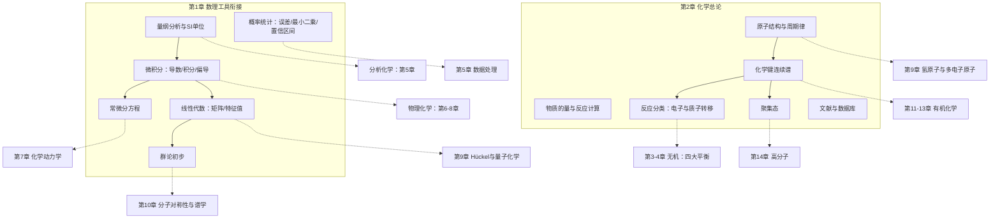

# 模块一 数理基础与化学总论（模块导览）

> **模块定位**：全书的"地基"。模块一把化学专业本科生在后续七个模块中将反复调用的数理工具（微积分、微分方程、线性代数、群论、概率统计、量纲分析）一次备齐，并建立"物质由什么构成、如何结合、如何变化"的统一总论图像；此后每一章遇到数学工具时都显式回引本模块，而不是在用到时临时补课。

---

## 一、本模块在全书中的位置

化学是一门**定量**的科学：热力学要求你会积分与偏导数，动力学要求你会解常微分方程，结构化学要求你会矩阵与群论，分析化学要求你会统计与最小二乘。传统教学把这些数学分散在四年里"用到才学"，结果是学生每次遇到新工具都要中断化学主线。本模块反其道而行——

- **第 1 章（化学中的数理工具衔接）**：把"化学要用的数学"按化学场景组织，每个工具都配一个真实化学情境的完整算例，并注明它将在全书哪一章被使用。
- **第 2 章（物质的组成、结构与化学总论）**：给出化学的统一图像——原子（电子结构）→ 化学键（作用力连续谱）→ 反应（电子与质子的转移）→ 聚集态（分子的集体行为）→ 文献（人类化学知识的组织方式），为后续所有模块"埋钩子"。

## 二、知识地图与依赖关系

**关键依赖关系一览**（第 1 章每个工具的去向）：

| 工具 | 直接服务的化学场景 | 将在第几章正式用到 |
|---|---|---|
| 导数/反应速率 | 速率的定义、平衡常数的热力学导出 | 第 6、7 章 |
| 积分/积分速率方程 | 浓度–时间的预测与半衰期 | 第 7 章 |
| 偏导数/偏摩尔量 | 化学势、相平衡、Gibbs–Duhem | 第 6 章 |
| 常微分方程 | 一级/二级速率方程、连串反应、稳态近似 | 第 7、8 章 |
| 矩阵/特征值 | Hückel 久期方程、多组分同时测定、正则振动分析 | 第 5、9、10 章 |
| 群论 | 点群判定、红外/拉曼活性选择定则、轨道对称性 | 第 10、11 章 |
| 概率统计 | 误差分析、置信区间、显著性检验、校准曲线 | 第 5 章（全章） |
| 量纲分析 | 一切计算的正确性检查、无因次准数 | 全书通用 |

**第 2 章为后续模块埋下的钩子**：原子结构 → 第 9 章量子力学严格解；化学键连续谱 → 第 4、10、11 章的三大键理论；四大反应类型 → 第 3 章四大平衡；聚集态 → 第 6 章相平衡、第 14 章高分子；文献检索 → 全书的科研训练。

## 三、使用建议

1. **顺序**：先第 1 章后第 2 章（第 1 章的统计与量纲分析会立即在第 2 章的例题中用到）。第 1 章可以"先通读、后回查"——不必一次吃透群论，但要知道书里哪里有它。
2. **与《AI教材》联动**：需要更深的数学推导时，用相对路径查阅同工作区的 AI 教材，例如线性代数的完整理论见 [AI教材·线性代数](/xiaoshus-blog/textbooks/ai/math-foundations/linear-algebra/00/)，最小二乘与统计推断见 [AI教材·概率统计](/xiaoshus-blog/textbooks/ai/math-foundations/probability-statistics/05/)。本模块只讲"化学怎么用"，不重复数学本身的完整推导。
3. **做题策略**：每章末思考练习题按难度递增排列，务必先做后看答案册（`98-习题答案册.md`）；所有计算题都要执行"列式 → 代数 → 量纲检查 → 校验值"四步，把量纲检查变成肌肉记忆。
4. **深浅取舍**：群论只学到"会判定点群、知道为什么谱学需要它"即可，严格定义留给第 10 章；微分方程只要求会解可分离变量与一阶线性方程，二阶方程（振动、量子）在第 9 章用到时再引入。

## 四、学完本模块你应当达到的自检标准

- 拿到任何一个化学公式，能在 30 秒内完成量纲检查并说出每一项的单位来源。
- 看到"反应速率方程"四个字，能不假思索地写出一级与二级的微分形式、积分形式与半衰期表达式。
- 能用矩阵方法解一个双组分光度分析方程组，并说明这与 Hückel 久期方程在数学上的同构性。
- 能对 H₂O、NH₃、BF₃、苯四个分子判定点群，并解释为什么群论能预言红外活性。
- 能对一组 5 次平行测定数据算出平均值、标准偏差与 95% 置信区间。
- 能计算反应进度 ξ、判断限量试剂、算出理论产量与产率，并对 Cr、Cu 写出正确的电子排布。
