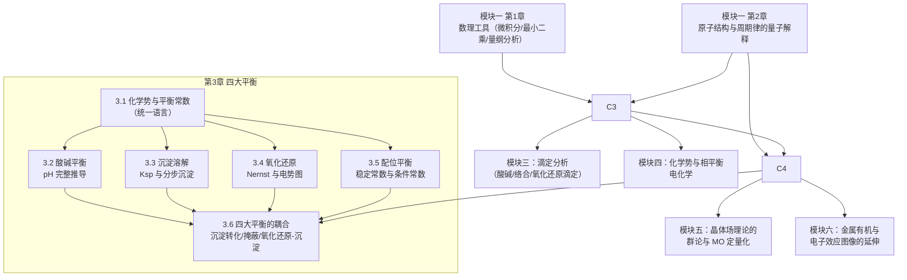

# 模块二 无机化学（模块导览）

> **模块定位**：无机化学模块承接[模块一](/xiaoshus-blog/textbooks/chemistry/01-foundations/00/)的数理工具与原子结构、周期律图像，把化学知识从"总论"推进到"具体物质的世界"；其核心成果——四大平衡的定量处理与配位化学——将被[模块三（分析化学）](/xiaoshus-blog/textbooks/chemistry/03-analytical/01/)的滴定分析直接调用，其热力学语言由[模块四（物理化学）](/xiaoshus-blog/textbooks/chemistry/04-physical/01/)进一步深化，其电子结构解释由模块五（结构化学与量子化学）完成定量化。

本模块共两章：

| 文件 | 章号 | 主题 |
|---|---|---|
| [01-四大平衡的统一热力学处理](/xiaoshus-blog/textbooks/chemistry/02-inorganic/01/) | 第 3 章 | 酸碱、沉淀、氧化还原、配位四大平衡的统一热力学处理与定量计算 |
| [02-元素化学与配位化学](/xiaoshus-blog/textbooks/chemistry/02-inorganic/02/) | 第 4 章 | s/p/d/f 区元素的系统化学、配位化学三大理论、异构与机理、生物无机 |
| [98-习题答案册](/xiaoshus-blog/textbooks/chemistry/02-inorganic/98/) | — | 两章全部思考练习题的解答 |

## 一、两章的知识地图与依赖关系

**阅读顺序建议**：先读第 3 章 3.1 节建立"平衡常数 = 热力学"的统一视角，再按 3.2 → 3.5 顺序学习；第 4 章可与第 3 章并行，但 4.6 节（配位化学深化）应在读完第 3 章 3.5 节之后学习，因为稳定常数与晶体场稳定化能要互相印证。

## 二、学习方法：元素化学如何避免死记硬背

元素化学是最容易变成"事实清单"的领域——几十种元素、上百种化合物、无数反应式。本模块坚持两条主线，把"清单"还原为"逻辑"：

### 主线一：结构 → 性质 → 反应 → 应用

每一个元素的每一种行为，都从它在周期表中的**位置**（价层电子构型、原子半径、电负性）出发，经**成键图像**解释，落到**反应**与**用途**。例如：

- 为什么 HF 是弱酸而其余氢卤酸是强酸？→ 从 H–F 键短而强、F 极小且高度水合（负熵项）出发，而不是"背下来 HF 特殊"；
- 为什么 KMnO4 是强氧化剂而 K2MnO4 不是？→ 从 Mn 的 Latimer 电势图读出，再从 d⁰ 高价态的电子结构理解；
- 为什么 Cu²⁺ 的配合物总是拉长八面体？→ d⁹ 电子组态的 Jahn–Teller 效应，一步推得。

第 4 章每个区、每种元素都走这条路线。**当一条"事实"与周期律推论矛盾时，那里必然藏着一个值得注意的次级效应**（如镧系收缩、惰性电子对效应、d 轨道的晶体场分裂）——这些"反常"正是本章的精髓，而不是需要死记的例外。

### 主线二：热力学驱动——"反应会不会发生"只有一个裁判

第 3 章将证明：酸碱、沉淀、氧化还原、配位四大平衡在热力学上是**同一个问题**——都是 $\Delta_\mathrm{r}G_\mathrm{m}^\ominus = -RT\ln K^\ominus$ 的具体化。由此：

- 判断"反应能否发生"，永远回到比较 $Q$ 与 $K$（或 $\Delta_\mathrm{r}G$ 的符号）；
- 判断"多重竞争反应谁胜出"，把各步平衡常数相乘或相除即可（如 AgCl 溶于氨水：$K = K_\mathrm{sp}\cdot\beta_2$）；
- 判断"元素某氧化态是否稳定"，看电势图上 $E^\ominus(\text{右}) > E^\ominus(\text{左})$ 即歧化。

学会这两条主线后，元素化学的"记忆量"会缩小到两类东西：**真实数据**（电势、$K_\mathrm{sp}$、稳定常数——查表可得）与**少数结构性反常**（缺电子、惰性电子对、镧系收缩、Jahn–Teller——理解一次终身受用）。

## 三、与其他模块的接口清单

| 接口 | 方向 | 内容 |
|---|---|---|
| 化学势与平衡常数 | 回引模块一第 1 章（数学工具）、第 2 章（反应分类总览） | 第 3 章 3.1 节 |
| 周期律的量子解释（电负性、半径、电离能） | 回引模块一第 2 章 2.1 节 | 第 4 章各区元素的起点 |
| 滴定可行性判据（$\lg cK' \ge 6$）、莫尔法 | 前向模块三（分析化学） | 第 3 章 3.5、3.3 节埋设 |
| 化学势、活度、实际气体与溶液 | 前向模块四第 6 章（热力学） | 第 3 章 3.1 节只给操作定义 |
| 可逆电池与 Nernst 方程 | 前向模块四第 8 章（电化学） | 第 3 章 3.4 节先按"半反应视角"使用 |
| 群论、分子轨道定量化 | 前向模块五 | 第 4 章晶体场理论先给"结果级"推导 |
| 金属有机、硼氢化反应 | 前向模块六（有机化学） | 第 4 章 p 区缺电子性埋设 |

## 四、真实数据的使用约定

本模块所有标准电极电势（25 °C、标准压力下）、$K_\mathrm{sp}$、稳定常数均取自公认数据（NBS Tables、Lange's Handbook、IUPAC Stability Constants）；不同手册间有效数字略有差异处，正文会注明"取××值"。**所有练习题的最终数值都给出校验值**，解答详见 [98-习题答案册](/xiaoshus-blog/textbooks/chemistry/02-inorganic/98/)。建议读者自行用计算器复算一遍——四大平衡计算是全书最容易"看懂但算错"的地方。

## 五、拓展阅读（真实教材）

1. 北京师范大学、华中师范大学、南京师范大学无机化学教研室编，《无机化学》（第四版，上、下册），高等教育出版社——国内经典，元素化学叙述与本书第 4 章路线一致。
2. 大连理工大学无机化学教研室编，《无机化学》（第六版），高等教育出版社——热力学处理平衡的方式与第 3 章接近，习题丰富。
3. F. A. Cotton, G. Wilkinson, C. A. Murillo, M. Bochmann, *Advanced Inorganic Chemistry*, 6th ed., Wiley, 1999——配位化学与 d 区元素化学的权威参考。
4. C. E. Housecroft, A. G. Sharpe, *Inorganic Chemistry*, 5th ed., Pearson, 2018——结构-性质分析路线的优秀范本，插图极佳。
5. M. Weller, T. Overton, J. Rourke, F. Armstrong, *Shriver & Atkins' Inorganic Chemistry*, 6th ed., Oxford University Press, 2018——晶体场/配位场理论表述严谨，可作第 4 章 4.6 节的深化读物。
