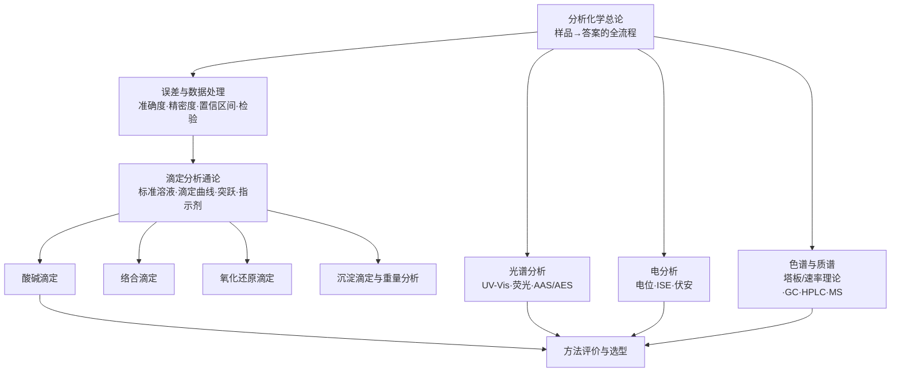

# 模块三 分析化学

> **模块定位**：本模块回答化学中最朴素也最苛刻的问题——"这个样品里有什么？有多少？这个数字可信吗？"。它上承模块一的数理统计工具与模块二的四大化学平衡，下启模块四的物化深化，是把"化学知识"变成"化学证据"的关键一环。

## 三.0 模块定位：从"测得准"到"测得懂"

化学是一门以测量为基础的科学。无论合成出多么漂亮的分子、验证了多么优雅的理论，最终都要落到一组数字上：产率多少？纯度多高？浓度几何？**分析化学就是给化学装上"尺子"和"秤"的学科**，它包含两个互补的侧面：

- **成分分析**（测什么）：定性分析（qualitative analysis）回答"有什么"，结构分析回答"长什么样"；
- **含量分析**（有多少）：定量分析（quantitative analysis）回答"有多少"，并且要回答"这个数有多可信"。

本模块尤其强调一个贯穿全书的观念转变：**从"测得准"到"测得懂"**。

- "测得准"是经典化学分析（滴定法、重量法）的核心追求：用误差理论控制不确定度，用化学计量学把体积、质量换算成含量。它建立在对**化学平衡的精确定量**之上——这正是模块二第 3 章四大平衡的直接应用。
- "测得懂"是现代仪器分析的核心追求：利用分子、原子对光的吸收与发射、对电场的响应、在两相间的分配行为，把化学信息转译成光谱、电位、色谱图。它建立在对**微观结构与宏观信号之间映射关系**的理解之上——为模块五（结构化学与谱学）埋下伏笔。

一个合格的化学家必须同时是**方法的批判者**：知道每种方法的检出限、选择性、成本与失效条件，才能为具体问题选对工具。这就是 5.12 节"方法评价与选型"存在的意义。

## 三.1 章节知识地图

本模块由一章构成（对应全书第 5 章），但内部是一条完整的逻辑链：

各节与全书其他模块的接口：

| 本模块内容 | 依赖（回引） | 输出（钩子） |
|---|---|---|
| 误差与数据处理 | [模块一第 1 章 §1.5](/xiaoshus-blog/textbooks/chemistry/01-foundations/01/)：正态分布、最小二乘、置信区间 | 全书一切实验数据的"合法性审查"工具 |
| 四大滴定 | [模块二第 3 章](/xiaoshus-blog/textbooks/chemistry/02-inorganic/01/)：四大平衡的 $K$、$\alpha$、能斯特方程 | 模块四第 8 章电化学：能斯特方程的电池化深化 |
| UV-Vis / 荧光 | 模块一 §1.5.2 最小二乘（校准曲线） | 模块五第 10 章：分子光谱与结构测定 |
| 电位分析（ISE） | 模块二第 3 章：能斯特方程的初等形式 | 模块四第 8 章：可逆电池、膜电位的完整理论 |
| 色谱 | 模块二第 3 章：分配平衡 | 模块四第 6 章：分配系数的热力学本源（$\Delta G=-RT\ln K$） |
| 质谱 | 模块六第 11–13 章（碎裂规律与官能团） | 模块五第 9 章：同位素丰度与分子轨道电离 |

## 三.2 学习方法

1. **先建立"误差意识"，再学任何方法。** 没有不确定度陈述的测量结果是不完整的。学完 5.2 节后，应当对每一个数字本能地追问：几位有效数字？置信区间多宽？有没有可疑值？——这套习惯来自[模块一 §1.5](/xiaoshus-blog/textbooks/chemistry/01-foundations/01/)，本章把它落成可操作的工作流程。
2. **用"统一图像"学四大滴定，不要当成四门课。** 酸碱、络合、氧化还原、沉淀滴定共享同一副骨架：一个平衡常数 + 一个浓度 → 一条 S 形滴定曲线 → 一个突跃 → 一个在突跃内变色的指示剂。差别只在平衡常数的"条件化"方式（酸效应、离子强度、沉淀效应）。建议对照[模块二第 3 章](/xiaoshus-blog/textbooks/chemistry/02-inorganic/01/)的统一热力学处理同步复习。
3. **仪器分析记"三件事"：信号是什么、怎么产生、如何定量。** 例如 AAS：信号是基态原子对共振线的吸收；产生于空心阴极灯发出的锐线光穿过原子蒸气；定量靠 $A = kc$（校准曲线）。每学一种仪器都强制自己填这张三行表。
4. **算例动手核算，不看答案想当然。** 本章所有例题的数据均可独立验算，练习题的最终校验值仅供核对——过程必须自己走通，量纲必须自己检查（模块一 §1.6 的量纲分析习惯在这里每天都用得上）。
5. **对照真实仪器。** 有条件时去实验室看一次滴定管、一台 UV-Vis、一台 HPLC；没有条件时，把每种方法想象成"一个物理过程 + 一个信号读出装置"，警惕把仪器分析学成"按钮说明书"。

## 三.3 模块文件目录

- [第 5 章 定量分析与仪器分析](/xiaoshus-blog/textbooks/chemistry/03-analytical/01/) —— 分析总论、误差与数据处理、四大滴定、光谱/电分析/色谱/质谱入门、方法评价与选型。
- [98-习题答案册](/xiaoshus-blog/textbooks/chemistry/03-analytical/98/) —— 本章全部思考练习题的完整解答。
