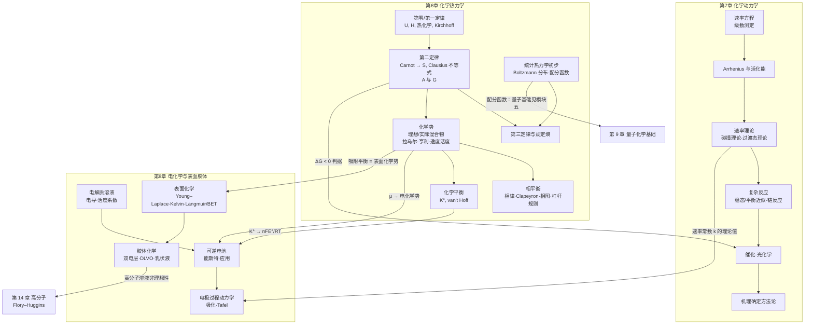

# 模块四 物理化学 · 模块导览

> **模块定位**：物理化学是化学的"理论物理"内核——用统一的数学语言回答三个根本问题：**反应能不能发生、进行到什么程度**（能量，热力学）；**发生得有多快、经过什么路径**（速率，动力学）；**电与表界面上发生了什么**（电荷转移与界面现象）。前置依赖：[模块一·数理基础与化学总论](/xiaoshus-blog/textbooks/chemistry/01-foundations/00/)（微积分、微分方程、最小二乘、量纲分析）与 [模块二·无机化学](/xiaoshus-blog/textbooks/chemistry/02-inorganic/00/)（四大平衡的热力学语言）；后续被 [模块五·结构化学与量子化学](/xiaoshus-blog/textbooks/chemistry/05-structural-quantum/00/)（配分函数的量子基础、光谱）与 [模块七·高分子化学](/xiaoshus-blog/textbooks/chemistry/07-polymer/00/)（Flory–Huggins 溶液理论）直接引用。

## 一、为什么物理化学是"理论物理"内核

无机化学告诉你"有什么、有什么性质"，分析化学告诉你"有多少、怎么测"，而物理化学回答的是**为什么**与**何时**：

1. **能量视角（热力学）**：只问始末态，不问路径与时间。用状态函数（$U,H,S,A,G,\mu$）判断方向与限度，给出平衡常数、相图、电池电动势这些可测量的统一来源。
2. **速率视角（动力学）**：专问路径与时间。热力学说"金刚石→石墨"是自发的，动力学说"你等不到"——速率方程、活化能、机理是动力学三件套。
3. **电与表界面视角**：化学反应能在电极上以电流形式可逆地进行（电化学），也能在表面上被吸附、催化、分散成胶体（表面与胶体化学）。这里热力学（能斯特方程、吸附平衡）与动力学（过电势、Tafel 方程）交汇，是三大视角的汇合处。

全书方法论"热力学–动力学–结构三大视角"中，本模块贡献前两个，并把第三个（结构）作为输入接收进来——配分函数就是把量子化的能级结构翻译成宏观热力学量的桥梁。

## 二、三章知识地图

三张图的关系一句话概括：**第 6 章给出"判据与限度"，第 7 章给出"路径与快慢"，第 8 章把两者嫁接到电极与界面上**。

## 三、学习方法：两种必须练成"肌肉记忆"的思维方式

### 3.1 状态函数法（热力学的核心思维）

状态函数的改变量只由始末态决定，与路径无关；$q$ 与 $w$ 是过程量，离开具体路径毫无意义。由此产生热力学解题的万能套路：

1. **写始末态**——哪怕是"不可行的"状态变化（如过冷水结冰）。
2. **自设可逆路径**——用一系列可计算的可逆步骤（变温、可逆相变、恒温变压）把始末态连起来；虚拟路径上 $\Delta S,\Delta H,\Delta G$ 与真实过程相同。
3. **沿路径积分**——对每一步用定义式计算。
4. **用不等式收尾**——把状态函数差与过程量（实际热、实际功）结合，用 Clausius 不等式 $ \Delta S \ge \sum \delta q/T $ 或 $\Delta G_{T,p}\le 0$ 判断自发性。

第 6 章例题（过冷水结冰、过热水汽化）与练习题 6-3、6-4 都在刻意训练这套流程。

### 3.2 微元分析（动力学的核心思维）

动力学的所有速率方程都来自"对微元时间列守恒方程"：

$$\text{组分 A 的消耗速率} \;=\; -\frac{1}{V}\frac{dn_A}{dt} \;=\; \sum(\text{消耗它的基元步骤}) - \sum(\text{生成它的基元步骤})$$

- 简单反应：直接分离变量积分 $\dfrac{dc}{c^n}=-k\,dt$（微分方程解法回引[模块一·第 1 章](/xiaoshus-blog/textbooks/chemistry/01-foundations/00/)）。
- 复杂反应：对中间产物列 $dc_I/dt$，再用**稳态近似** $dc_I/dt\approx 0$ 代数化——这是第 7 章最重要的一步操作，酶催化（Michaelis–Menten）、链反应、多相催化的速率公式全部由它产生。
- 电极过程：把"微元"换成电流密度 $j$，Tafel 方程就是稳态下的 Butler–Volmer 方程近似。

### 3.3 配套习惯

- **量纲检查**：每道计算题先写出待求量的单位表达式（如 $\Lambda_m=\kappa/c$ 的单位是 $\mathrm{S\cdot m^{-1}}/(\mathrm{mol\cdot m^{-3}})=\mathrm{S\cdot m^2\cdot mol^{-1}}$），算完再验。本模块每道例题与练习都执行此流程。
- **数据真实可核算**：正文常数（$R=8.314\ \mathrm{J\cdot K^{-1}\cdot mol^{-1}}$，$F=96\,485\ \mathrm{C\cdot mol^{-1}}$，$N_A=6.022\times10^{23}\ \mathrm{mol^{-1}}$）与热力学数据均取自公认手册值；所有例题、练习的校验值均可复算。
- **先做后看**：每章末 6–8 道练习题的完整解答在 [98-习题答案册.md](/xiaoshus-blog/textbooks/chemistry/04-physical/98/)，正文只给最终校验值。

## 四、与其他模块的衔接（显式清单）

| 方向 | 内容 | 位置 |
| --- | --- | --- |
| 回引 模块一 | 一阶常微分方程（速率方程积分）、最小二乘（Arrhenius 图、Lineweaver–Burk 图、级数判定）、量纲分析 | 第 7 章多处 |
| 回引 模块二 | 四大平衡常数（$K_a,K_{sp},K_w,K_f$）统一为 $\Delta_rG_m^\circ=-RT\ln K^\circ$；能斯特方程在酸碱/沉淀/配位平衡中的先期使用 | 第 6、8 章 |
| 埋钩 模块五 | 配分函数中的能级来自量子解（平动/转动/振动）；转动能级间距由光谱测得的转动常数 $\tilde B$ 确定 | 第 6 章 §6.9 |
| 埋钩 模块五 | 光化学第一定律与电子激发态、荧光/磷光，需量子图像支撑 | 第 7 章 §7.7 |
| 埋钩 模块七 | 高分子溶液是非理想溶液的极端案例，活度偏离理想 → Flory–Huggins 格子理论；高分子属于胶体体系 | 第 6 章 §6.6、第 8 章 §8.6 |

## 五、拓展阅读（真实教材）

- 天津大学物理化学教研室编，《物理化学》（上、下册，第六版），高等教育出版社。
- 傅献彩、沈文霞、姚天扬、侯文华编，《物理化学》（上、下册，第五版），高等教育出版社。
- P. Atkins, J. de Paula, J. Keeler, *Physical Chemistry*, 11th ed., Oxford University Press, 2018.
- I. N. Levine, *Physical Chemistry*, 6th ed., McGraw-Hill, 2009.

各章正文末还会给出针对该章的补充阅读。