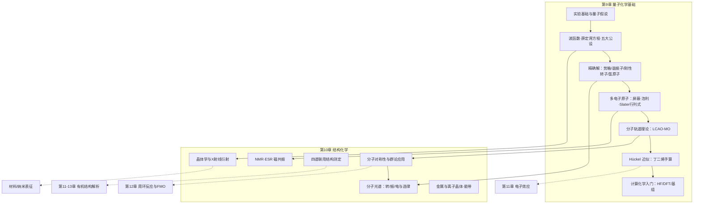

# 模块五 结构化学与量子化学（模块导览）

> **模块定位**：全书的"理论根基"。前四个模块回答"分子如何变化、如何被测出来"，本模块回答更根本的问题——**电子在哪里、为什么这样排布、这如何决定物质的波谱行为与晶体结构**。模块九（第 9 章）给出电子结构的量子力学语言，第 10 章把这套语言兑现为可测量的对称性选择定则、光谱指纹与晶体衍射图谱，并直接为模块六（有机反应性、NMR 解析）铺路。

---

## 一、为什么"电子排布决定一切"——本模块在全书中的位置

回望全书：模块二用周期律组织元素化学，模块四用热力学与动力学描述变化，但周期律从哪里来？为什么 C₂、N₂、O₂ 的键级是 2、3、2？为什么 H₂O 是 V 形而 CO₂ 是直线形？为什么羰基的 IR 在 1740 cm⁻¹ 而芳环质子的 NMR 在 δ 7 附近？——这些问题的统一答案都在**电子的波动方程**里。

本模块两章的分工：

- **第 9 章（量子化学基础）**：从三个经典物理学无法解释的实验（黑体辐射、光电效应、氢原子光谱）出发，建立波函数与薛定谔方程，用五大公设给出量子力学的化学表述；然后一口气解出四个精确体系——势箱（共轭多烯）、谐振子（振动）、刚性转子（转动）、氢原子（原子轨道）——它们分别对应化学家日常使用的三类能级（平动/振转/电子）；再推进到多电子原子（屏蔽与泡利）与分子（MO 理论、Hückel 近似），最后落点到计算化学（HF/DFT）——今天的热力学数据、过渡态结构、反应能垒，很多已经由这些方法"算出来"。
- **第 10 章（结构化学）**：量子力学给了能级，群论给出"哪些跃迁允许"的规则——于是分子光谱变成可解读的：转动谱给键长、振动谱给力常数、电子谱给解离能；NMR/ESR 给核与电子的局部环境；四谱联用即可从零确定一个未知物结构。在"分子以上"的尺度，晶体的周期性让 X 射线衍射成为原子的"放大镜"——Bragg 方程、结构因子与系统消光把粉末衍射图变成物相鉴定工具；最后用堆积模型、能带理论与点阵能解释金属与离子晶体的宏观性质。

**一句话**：第 9 章造"望远镜"，第 10 章用它看分子和晶体。

## 二、知识地图与依赖关系

**上游依赖（务必先备齐）**：

| 前序内容 | 在本模块的用途 | 回引位置 |
|---|---|---|
| 第 1 章 矩阵与特征值 | 久期方程 = 特征值问题；Hückel 手算是矩阵对角化 | 9.6 节 |
| 第 1 章 群论初步 | 点群判定、特征标表、选律推导 | 10.1 节 |
| 第 1 章 二阶常微分方程 | 薛定谔方程（势箱/谐振子）的解 | 9.2–9.3 节 |
| 第 1 章 概率统计 | 波函数的概率诠释、谱峰强度统计权重 | 9.2、10.2 节 |
| 第 2 章 原子结构与周期律 | 量子数、构造原理在量子力学中的严格化 | 9.4 节 |
| 模块二 配位化学（晶体场理论） | d 轨道分裂的轨道图像与能级来源 | 10.1 节深化 |
| 模块四 统计热力学 | 配分函数 q 的输入正是本模块的能级公式（势箱/振转） | 10.2 节与第 6 章 |

**向下游埋的钩子**：HOMO/LUMO 与键级 → 第 11 章电子效应与第 12 章前沿分子轨道（FMO）理论；Hückel 芳香性判据（4n+2）→ 第 12 章芳环化学；NMR 化学位移与偶合 → 第 13 章蛋白质等生物大分子结构；能带理论 → 第 14 章高分子导电材料。

## 三、学习方法：抽象图像如何"落地"

量子化学最大的学习障碍不是数学，而是**图像的缺失**。三条建议：

1. **每学一个精确解，立刻问"这条能级公式被谁用了"**。势箱 → 共轭多烯的紫外吸收（你将在有机化学里算 λmax）；谐振子 → IR 峰位与力常数；刚性转子 → 微波谱测键长；氢原子 → 整个原子光谱与元素周期表。能级公式不是数学装饰品，而是谱学仪器的"翻译词典"。
2. **数学推导读三遍：第一遍跟着走，第二遍自己补，第三遍只看结果复述物理图像**。例如势箱推导中，"边界条件 ψ(0)=ψ(L)=0 逼出 kL=nπ"这一步就是"量子化为什么发生"的全部答案——不是薛定谔方程本身，而是**边界条件**造就量子化。抓这类关键步，其余都是代数。
3. **对称性思维优先于计算思维**。第 10 章的群论给了你一个"免费午餐"：不用解方程，光凭分子对称性就能预知 IR/Raman 峰的数目、MO 的组合方式、晶体的消光规律。养成习惯：拿到分子先判点群，再谈别的。
4. **做题执行四步**：列式 → 代数（SI 单位）→ 量纲检查 → 校验值对照。本模块计算题的单位换算（J ↔ eV ↔ cm⁻¹ ↔ kJ/mol）最易出错，答案册的每道计算题都示范了量纲检查环节。

**常用换算卡**（建议抄在笔记本扉页）：

| 量 | 数值 |
|---|---|
| h | 6.62607015×10⁻³⁴ J·s |
| ħ = h/2π | 1.054572×10⁻³⁴ J·s |
| c | 2.99792458×10⁸ m/s |
| mₑ | 9.109384×10⁻³¹ kg |
| a₀（Bohr 半径） | 52.9177 pm |
| hcN_A | 11.9627 J·cm·mol⁻¹（即 1 cm⁻¹ = 11.9627 J/mol） |
| 1 eV | 96.485 kJ/mol（每分子 1.602×10⁻¹⁹ J） |
| hc | 1239.84 eV·nm（λ/nm ↔ E/eV 换算） |

## 四、学完本模块你应当达到的自检标准

- 能从黑体辐射、光电效应、氢原子光谱三个实验各自"逼出"哪条量子假说，各用一句话说清。
- 能完整推导一维无限深势箱的能级，并用它解释为什么**边界条件**（而非方程本身）导致量子化。
- 能手算丁二烯的 Hückel 能级、系数、π 电荷密度与 π 键级，并说出键级 0.894/0.447 对应的化学含义。
- 能对 H₂O 判定 C₂v 点群、写出 Γ₃ₙ 并约化为 2A₁+B₂，从而预言其三个振动全部红外活性。
- 能由 CO 转动谱线间距 3.86 cm⁻¹ 算出键长 112.8 pm，由 NaCl 粉末图前四条线定出 a = 564 pm 并指认 fcc 消光规律。
- 能说出 Born–Landé 公式里每一项（马德隆常数、Born 指数、r₀）的物理来源，并用 Born–Haber 循环校验点阵能。

---

**阅读顺序**：[第 9 章 量子化学基础](/xiaoshus-blog/textbooks/chemistry/05-structural-quantum/01/) → [第 10 章 结构化学](/xiaoshus-blog/textbooks/chemistry/05-structural-quantum/02/)；全部练习题解答见[习题答案册](/xiaoshus-blog/textbooks/chemistry/05-structural-quantum/98/)。
