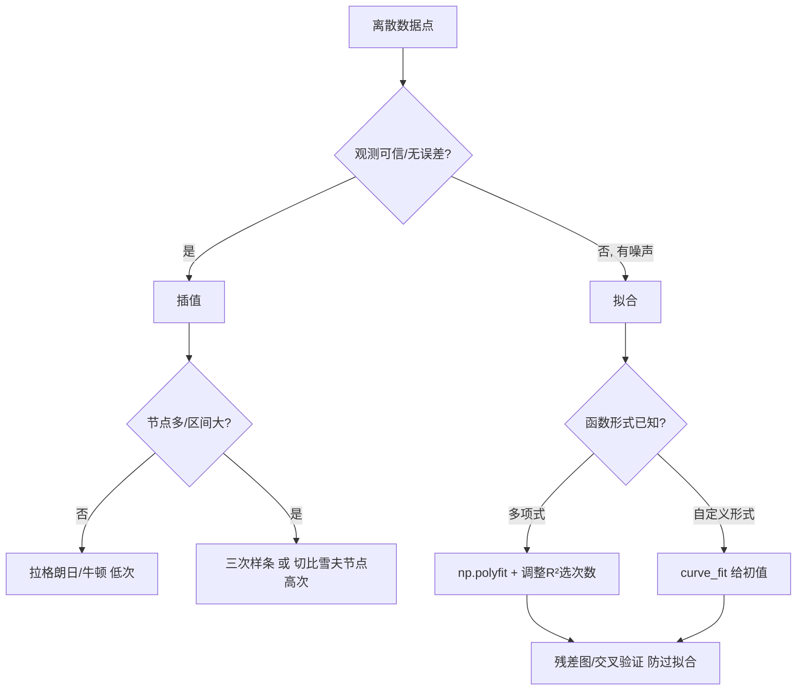

# 第 9 章 插值与拟合

> **本章定位**：插值与拟合是"把离散数据变成连续函数"的两把基础工具——几乎每类赛题都会用到：采样点重建连续曲线、缺失值填补、把经验公式化、预测前的数据光滑，以及为[第 6 章](/xiaoshus-blog/textbooks/modeling/02-methods/06/)综合评价或[第 7 章](/xiaoshus-blog/textbooks/modeling/02-methods/07/)预测模型做前处理。二者常被混用，但前提完全不同：**观测无误差用插值，观测有误差用拟合**。前置要求：微积分与泰勒展开（[第 2 章](/xiaoshus-blog/textbooks/modeling/01-foundations/02/)）、最小二乘与回归基础（[第 4 章](/xiaoshus-blog/textbooks/modeling/01-foundations/04/)）。需要降维预处理时见[第 11 章](/xiaoshus-blog/textbooks/modeling/02-methods/11/)。

## 9.0 本章学习目标

学完本章，你应当能够：

1. 区分"插值"与"拟合"的适用前提，面对散点数据先判断该用哪一个；
2. 解释拉格朗日/牛顿插值的等价性，用 scipy 做分段线性与三次样条插值；
3. 说清**龙格现象**的成因，并会用"切比雪夫节点"或"分段低次"两种策略规避；
4. 用 `np.polyfit` 做多项式最小二乘拟合、用 `scipy.optimize.curve_fit` 做任意形式的非线性拟合；
5. 用 $R^2$/调整 $R^2$、残差图判断拟合是否过拟合，完成一个"插值 vs 拟合 vs 样条"对比的完整案例；
6. 在竞赛中正确外推并交代风险，不把"插值曲线"误当成"预测模型"。

## 9.1 问题界定：插值 vs 拟合

给定一组点 $(x_i, y_i),\ i=1,\dots,n$。两种诉求：

- **插值（Interpolation）**：假设这些点**精确无误**，要求构造的函数 $P(x)$ 严格穿过每个点，即 $P(x_i)=y_i$。典型场景：由实验精确读数重建函数、查表补全、数值积分/微分的前置。
- **拟合（Fitting）**：假设 $y_i$ 带有观测误差/噪声，只要求函数 $g(x)$ **整体上贴近**数据（某种意义下误差最小），不要求穿过每个点。典型场景：从带噪声的散点提炼经验公式、预测。

一句话判断：**数据可信→插值；数据有噪声→拟合。** 把带噪声数据强行插值，等于把噪声也当成了"真相"，是竞赛高频扣分项。

## 9.2 插值法（无误差观测）

### 9.2.1 拉格朗日插值

对 $n+1$ 个互异节点，存在唯一的次数 $\le n$ 的多项式穿过全部点：

$$
L_n(x)=\sum_{k=0}^{n} y_k\,\ell_k(x),\qquad \ell_k(x)=\prod_{\substack{j=0\\ j\ne k}}^{n}\frac{x-x_j}{x_k-x_j}
$$

基函数 $\ell_k(x)$ 满足 $\ell_k(x_j)=\delta_{kj}$。**高次**（节点多）不一定好——见 9.2.4 龙格现象。

### 9.2.2 牛顿插值（差商形式）

等价但更适合"逐点加节点"：

$$
N_n(x)=f[x_0]+f[x_0,x_1](x-x_0)+f[x_0,x_1,x_2](x-x_0)(x-x_1)+\cdots
$$

其中差商 $f[x_i,x_{i+1}]=\frac{f(x_{i+1})-f(x_i)}{x_{i+1}-x_i}$，高阶差商递推定义。牛顿形式与拉格朗日形式给出**同一个多项式**，只是表达不同；牛顿法在"新增节点时不用重算全部系数"上有优势。

### 9.2.3 分段低次与三次样条

高次全局插值振荡严重，工程上几乎总用**分段**思路：

- **分段线性**：每段用直线连接相邻节点。简单、绝对稳定，但一阶不连续（折线感强）。
- **三次样条（Cubic Spline）**：在每相邻节点间用三次多项式，并要求**函数值、一阶导、二阶导在节点处连续**（自然边界二阶导为 0）。结果是 $C^2$ 光滑的"柔顺曲线"，是插值类事实上的默认选择。scipy 中 `CubicSpline(x, y)` 一行即得。

### 9.2.4 龙格现象与节点选择

经典反例：在等距节点上用高次多项式插值龙格函数 $f(x)=\frac{1}{1+25x^2}$（$x\in[-1,1]$），次数越高，区间**两端**振荡越剧烈，最大偏差反而发散——这就是**龙格现象**。

两条规避路线：

1. **分段低次**：用样条代替全局高次（首选，见 9.6 实测）；
2. **非等距节点**：用**切比雪夫节点** $x_k=\cos\frac{(2k+1)\pi}{2(n+1)}$ 取代等距节点，能把高次插值的振荡压到极小（9.6 实测偏差从 1.92 降到 0.11）。

> 竞赛提示：凡要"高次多项式插值"，先想龙格现象；除非节点本来就是切比雪夫分布，否则一律改用样条。

## 9.3 曲线拟合（有误差观测）

### 9.3.1 最小二乘多项式拟合

设模型为 $m$ 次多项式 $g(x)=a_0+a_1x+\cdots+a_mx^m$，最小化残差平方和

$$
S=\sum_{i=1}^{n}\bigl(y_i-g(x_i)\bigr)^2
$$

对 $a_j$ 求偏导置零得到正规方程 $(X^TX)\mathbf a=X^T\mathbf y$，解之即得系数。实践中不必手解：`np.polyfit(x, y, m)` 直接返回降幂系数。

> **数值提醒**：当 $m$ 较大（尤其 $m\ge 8$）时正规方程病态，`np.polyfit` 可能给出 `RankWarning` 且系数对噪声极敏感。若本意是插值（点数 = 次数 + 1），更稳妥的做法是用 `scipy.interpolate.barycentric_interpolate`（重心插值，数值稳定）；若是拟合，优先降低次数或先用切比雪夫多项式基（`numpy.polynomial.chebyshev.chebfit`）。

### 9.3.2 非线性拟合：`curve_fit`

当模型不是 $x$ 的多项式（如指数 $ae^{bx}$、幂律、logistic），用 `scipy.optimize.curve_fit` 做非线性最小二乘：

```python
from scipy.optimize import curve_fit
def model(x, a, b, c):
    return a * np.exp(-b * x) + c
popt, pcov = curve_fit(model, xdata, ydata, p0=[1, 1, 0])
```

`p0` 给初值很重要——非线性拟合对初值敏感，初值给差可能收敛到局部极小。

### 9.3.3 过拟合与模型选择

多项式次数 $m$ 越大，训练误差越小，但**测试/外推误差**会先降后升——这就是过拟合。用以下工具选 $m$：

- **调整 $R^2$**：$R^2_{adj}=1-(1-R^2)\frac{n-1}{n-m-1}$，惩罚多余参数；
- **残差图**：好模型的残差应是无结构的随机散布；若出现喇叭形/趋势，说明函数形式选错；
- **交叉验证**：把数据分成训练/验证两段，选验证误差最小的 $m$。

## 9.4 选型决策树



## 9.5 关键公式与方法速查

| 方法 | 适用场景 | 关键公式 / 调用 | 坑 |
|---|---|---|---|
| 拉格朗日插值 | 节点少、需严格过点的光滑函数 | $L_n(x)=\sum y_k\ell_k(x)$ | 高次→龙格振荡 |
| 牛顿插值 | 需动态加节点 | 差商递推 $N_n(x)$ | 与拉格朗日同结果 |
| 三次样条 | 插值默认选择 | `CubicSpline(x,y)` | 边界条件需合理 |
| 多项式拟合 | 数据有噪声、形式近多项式 | `np.polyfit(x,y,m)` | 次数过高→过拟合 |
| 非线性拟合 | 指数/幂律/logistic 等 | `curve_fit(model,x,y,p0)` | 初值敏感、局部极小 |

## 9.6 典型例题与样例程序

**题目**：已知某函数在一组节点上的精确采样值，要求（1）用高次多项式插值重建并评估在区间上的偏差；（2）改用三次样条与低次拟合对比；（3）演示用切比雪夫节点抑制龙格现象。

**模型假设**：节点采样值精确无观测误差（插值前提）；以龙格函数充当"未知真值"，用于事后检验。

**符号说明**：$(x_i,y_i)$ 为插值节点（$i=0,\dots,10$）；$x_q$ 为密集查询点；评价指标 $\varepsilon_{\max}=\max_{x_q}|g(x_q)-f(x_q)|$，即重建函数与真值的最大偏差。

建模要点：以龙格函数 $f(x)=\frac{1}{1+25x^2}$ 为"未知真值"造数，在 $[-1,1]$ 上取 11 个等距节点。分别用"等距 10 次插值""三次样条""3 次拟合""切比雪夫 10 次插值"重建，并在 400 个密集查询点上与真值比最大偏差。

```python
import numpy as np
from scipy.interpolate import CubicSpline

def f(x):
    return 1.0 / (1 + 25 * x**2)

# 等距节点
xe = np.linspace(-1, 1, 11)
ye = f(xe)
xq = np.linspace(-1, 1, 400)          # 密集查询点，用于评估偏差

cs = CubicSpline(xe, ye)              # 三次样条插值
poly10 = np.polyfit(xe, ye, 10)      # 等距 10 次多项式插值
poly3 = np.polyfit(xe, ye, 3)        # 3 次多项式"拟合"视角

err_poly10 = np.max(np.abs(np.polyval(poly10, xq) - f(xq)))
err_cs = np.max(np.abs(cs(xq) - f(xq)))
err_poly3 = np.max(np.abs(np.polyval(poly3, xq) - f(xq)))

# 切比雪夫节点：在区间两端加密，抑制振荡
n = 11
k = np.arange(n)
xc = np.cos((2 * k + 1) / (2 * n) * np.pi)
yc = f(xc)
poly10c = np.polyfit(xc, yc, 10)
err_cheb = np.max(np.abs(np.polyval(poly10c, xq) - f(xq)))

print("等距10次插值 最大偏差 =", round(err_poly10, 4))
print("三次样条     最大偏差 =", round(err_cs, 4))
print("3次多项式拟合 最大偏差 =", round(err_poly3, 4))
print("切比雪夫节点10次插值 最大偏差 =", round(err_cheb, 4))
print("f(-1) =", round(f(-1), 4), " 等距10次(-1) =", round(np.polyval(poly10, -1), 4))
```

**预期输出**（Python 3.13 / numpy 2.x，取整到小数点后 4 位）：

```
等距10次插值 最大偏差 = 1.9156
三次样条     最大偏差 = 0.022
3次多项式拟合 最大偏差 = 0.5157
切比雪夫节点10次插值 最大偏差 = 0.1091
f(-1) = 0.0385   等距10次(-1) = 0.0385
```

**结果解读**：等距高次插值在区间中部还行，但在两端剧烈振荡（最大偏差近 2，远超函数值本身数量级）——龙格现象实锤；三次样条把偏差压到 0.022，是该场景最优解；切比雪夫节点让高次插值偏差降到 0.11，印证了"改节点分布"的有效性。插值类问题优先选样条。

**模型评价**：优点——四种方法在同一节点集、同一评估点上对比，公平且结论有实测支撑。缺点——仅一维单一函数，未考察噪声敏感性；"3 次拟合"在精确数据上只是近似基准而非严格的有噪拟合场景。改进——可补充二维插值实验与"加噪后插值 vs 拟合"对比，进一步印证 9.1 的前提判据。

## 9.7 常见误区与竞赛扣分点

1. **把带噪声数据拿去插值**：强行让曲线穿过每个噪声点，等于放大噪声，评委一眼认出。有误差就拟合。
2. **高次多项式插值不谈龙格现象**：节点多于 ~10 个还用全局高次，两端必炸；改用样条并说明。
3. **外推当成内插**：插值/拟合公式只在观测 $x$ 范围内可靠，超出范围外推误差无界。论文里外推必须给理由 + 灵敏度说明。
4. **用 $R^2$ 选多项式次数导致过拟合**：$R^2$ 随次数单调不减，必须用调整 $R^2$ 或交叉验证。
5. **`curve_fit` 不给初值**：默认初值全 1，遇到量级差异大的参数会发散或陷局部极小；先画图估初值。

## 9.8 拓展延伸

- **岭回归 / Lasso**：拟合阶段的正则化（见[第 10 章](/xiaoshus-blog/textbooks/modeling/02-methods/10/)；与[第 11 章](/xiaoshus-blog/textbooks/modeling/02-methods/11/)降维配合使用可治共线），处理共线与过拟合；
- **样条在轨迹/路径规划**：机器人、无人机路径可用三次样条平滑航点（与[第 12 章](/xiaoshus-blog/textbooks/modeling/02-methods/12/)路径优化互补）；
- **与预测的关系**：插值是"已知区间内的函数重建"，预测是"区间外的推断"，二者不可混淆（选型见[第 7 章](/xiaoshus-blog/textbooks/modeling/02-methods/07/)）；
- **高维插值**：二维及以上用 `scipy.interpolate.griddata` / `RegularGridInterpolator`，思路同出一辙。

## 9.9 课后练习

1. **（手算）** 已知三点 $(0,1),(1,0),(2,1)$，用拉格朗日公式写出穿过它们的二次多项式，并验证 $x=0.5$ 处的值。
2. **（代码）** 用 `CubicSpline` 对一组你自己的实验数据做插值，画出"折线 vs 样条"对比图，标注节点。
3. **（辨析）** 给出一组明显带噪声的散点，分别用 2 次、5 次、9 次多项式拟合，画残差图，说明为何 9 次更差。
4. **（真题改编）** 某水文赛题给出某监测站一年中 12 个不连续日期的实测水位，要求"补全任意日期的水位序列"。请判断该用插值还是拟合，并给出不引发龙格现象的实现方案。
5. **（综合）** 先用本章方法对某指标做缺失值插值补全，再喂给[第 6 章](/xiaoshus-blog/textbooks/modeling/02-methods/06/)的 TOPSIS，讨论插值方式不同是否改变评价排名。
